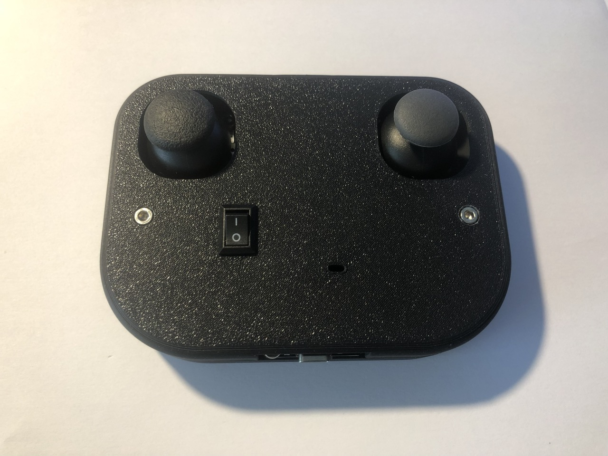

## Introduction

Having two motors to drive on a bot, how can one make it turn left? Or right?
The premisse is quite simple:

- To turn right while going forward, the left motor should drive _faster_ than the right one.
- To turn left while going forward, the right motor should drive _faster_ than the left one.

The inverse happens when the bot is driving backwards and the same can be acheived, just in a different perspective, by driving one motor _slower_ than the other.

The most basic approach to the premisse exposed above would be to, when aiming to turn the bot, drive one motor and stop the other one. In _pseudo code_ would be something like:

```c
// To turn right
motor_left(ON);
motor_right(OFF);

// To turn left
motor_left(OFF);
motor_right(ON);
```

The above idea could somehow work, but it would be extremely unlikely to produce any satisfatory outcome. The driving wouldn't be smooth and it would highly depend on the time the bot has configured to turn.

## Smoother driving

To achieve a smoother driving, the bot would have to be able to turn slowly or quickly, depending on the controller's input.

From now on, let's use a scale of 0 to 100 to materialize the velocity of the motors, where 0 is when a motor is not spinning and 100 is when it's spinning at maximum speed.

Changing just the speed of each motor, it could be possible to take the last _pseudo code_ example and tweak it a bit:

```c
// To turn right
motor_left(100);
motor_right(50);

// To turn left
motor_left(50);
motor_right(100);
```

Instead of turning off the motor, it could remain powered, but spinning less than the other. However, this would result in the same conclusion as in [the previous section](#introduction).

### Using a 2 dimensions axis direction

Ideally, one would want to be able to change the speed of `motor_left` and `motor_right` based on a input. Conceptually speaking, a two axis controller, such a joystick, would fit within the requirements. Both axis, X and Y could be used to tweak the spinning speed of each motor.

Let's take a look at the 2D X and Y axis:


Following what has been said, the small circle in red should lead to a slow forward right turn and the circle in blue should lead to a faster forward right turn.

Essentially, the one in red could have the left motor at full speed and the right one at slightly less speed.


By contrast, the blue example would still have the left motor at full speed, but the right one would be slower. This results in a quicker turn to the right.


### Slow down

The goal has always been to slow down one of the motors, but where should the speed be set from?

By looking at the [2 axis scenario](#using-a-2-dimensions-axis-direction), when the right motor speed decreases, so does the value of Y. Essentially, the speed of the right motor, can be based on something that relies on the axis Y.

Both arrows, the red and blue, materialize the maximum speed of the left motor and can be interpreted as hypotenuses. When one of the hypotenuses has a angle of 90 degress, both motors spin at the same speed. Therefore, the speed of the right motor should be based on the _opposite_ side of a triangle:


The desired opposite side Y value can be measured by:

```c
#define SPEED_VALUE 100

uint8_t motor_left_speed = SPEED_VALUE;

double z = atan2(y, x);
uint8_t motor_right_speed = SPEED_VALUE * sin(z); // Always eq or less than 100
```

> [!info]
>
> The double variable _z_ is in radians, not degrees.

This ensures the bot has a smoother turn and its behaviour is based on a Joystick controller, the direction of the bot is pretty much figured out. However, this is not enough — there is something missing.

### Same direction, different speed

Instead of focusing only on one motor, the focus should be on both. The direction is set: the bot will turn left or right based on a turn angle. But, what if the same turn needs to performed quicker? Or slower?

There is a need for one more Joystick – one which only controllers how fast a angle based turn should be done.


The speed should be based on this newly added joystick, while the direction (how the bot turns) should be managed by the second joystick.

```c
int speed = analogRead(JOYSTICK_1_SPEED);
int direction_y = analogRead(JOYSTICK_2_Y);
int direction_x = analogRead(JOYSTICK_2_X);

double z = atan2(y, x);
uint8_t speed_sin_y = speed * sin(z);
// To turn right
motor_left(speed);
motor_right(speed_sin_y);

// To turn left
motor_left(speed_sin_y);
motor_right(speed);
```

<!-- That's all folks! Have safe drives ;) -->

## Building a bot controller

With all that being said, I jumped into turning all this theory into reality by building a bot controller (e.g. "RC") with two joysticks.


### Hardware

The controller is battery (LiPo) powered and uses the [ESPNow](https://www.espressif.com/en/solutions/low-power-solutions/esp-now) wireless protocol as its communication protocol. Here is the list of components:

- A [ESP32 dev board](https://www.aliexpress.com/item/1005006336964908.html?spm=a2g0o.productlist.main.1.3ed4neKBneKBuG&algo_pvid=bad824ef-1169-4427-93c4-e35e6495c7ac&algo_exp_id=bad824ef-1169-4427-93c4-e35e6495c7ac-0&pdp_npi=4%40dis%21USD%2113.32%214.43%21%21%2195.86%2131.92%21%4021039cae17221643100751581e7a1b%2112000036806447869%21sea%21SE%21939121189%21&curPageLogUid=vA5i9RVmCyqr&utparam-url=scene%3Asearch%7Cquery_from%3A); The dev kit uses a [ESP32-WROOM-32 module](https://www.espressif.com/sites/default/files/documentation/esp32-wroom-32_datasheet_en.pdf).
- Two [joystick](https://www.aliexpress.com/item/1005006403673836.html?spm=a2g0o.productlist.main.5.13895533RH6hXd&algo_pvid=7c5deec1-f07a-452f-878c-9248a4440e84&algo_exp_id=7c5deec1-f07a-452f-878c-9248a4440e84-2&pdp_npi=4%40dis%21USD%214.27%211.40%21%21%2130.74%2110.11%21%402103850917221644320492196ed5e6%2112000037042471248%21sea%21SE%21939121189%21&curPageLogUid=3gPkOW5tIeXQ&utparam-url=scene%3Asearch%7Cquery_from%3A) modules. They are not the best, however, the calibration can be done through software.
- One [TP4096 based charging module](https://www.aliexpress.com/item/1005006585278260.html?spm=a2g0o.productlist.main.1.530439e62hpvgp&algo_pvid=d599414f-9d6d-4a5a-a06f-3fcb7991e20d&algo_exp_id=d599414f-9d6d-4a5a-a06f-3fcb7991e20d-0&pdp_npi=4%40dis%21USD%2114.66%214.69%21%21%21105.44%2133.74%21%40210385db17221644581152944ef676%2112000037732397864%21sea%21SE%21939121189%21&curPageLogUid=VY6EvGKXgMx9&utparam-url=scene%3Asearch%7Cquery_from%3A), capable of charging 3.7V LiPo batteries.
- A [3.7V LiPo battery](https://www.aliexpress.com/item/1005007003031544.html?spm=a2g0o.productlist.main.21.51446849KCc4Tq&algo_pvid=2e2ab1a3-069e-4d1c-a6d1-bebc972702a6&algo_exp_id=2e2ab1a3-069e-4d1c-a6d1-bebc972702a6-10&pdp_npi=4%40dis%21USD%213.48%212.09%21%21%2125.00%2115.00%21%4021039c5917221645201446424e4eb1%2112000039014942184%21sea%21SE%21939121189%21X&curPageLogUid=9bYJEoW8DnMN&utparam-url=scene%3Asearch%7Cquery_from%3A) with 1200mAh capacity. One with a different capacity also fits.
- A [rocker switch](https://www.aliexpress.com/item/1005006117766211.html?spm=a2g0o.productlist.main.1.2a507ddb2D30Jg&algo_pvid=6204abff-ae91-4de2-bd82-a9d678efb9cb&algo_exp_id=6204abff-ae91-4de2-bd82-a9d678efb9cb-0&pdp_npi=4%40dis%21USD%214.61%212.31%21%21%2133.13%2116.56%21%402103853f17221645880518141e6109%2112000035829578264%21sea%21SE%21939121189%21X&curPageLogUid=RgutVUHJ11iZ&utparam-url=scene%3Asearch%7Cquery_from%3A) to turn ON/OFF the controller.

### Software

As stated previously, the joysticks are not the _best_. Their read analog voltage, from both axis, differs from one to another. To mitigate the diference, I've introduced a `CALIBRATION_DELTA`.

```c
#include <Arduino.h>
#include <stdint.h>
#include <esp_now.h>
#include <WiFi.h>

#define GPIO_SPEED GPIO_NUM_36
#define GPIO_DIR_X GPIO_NUM_39
#define GPIO_DIR_Y GPIO_NUM_35
#define GPIO_LED GPIO_NUM_2

#define ADC_RESOLUTION 4096

#define CALIBRATION_DELTA (25) // The lower the Vref, the bigger should be this number.
#define UPDATE_DELTA (5)

struct coor
{
  int8_t speed;
  int8_t y;
  int8_t x;
} __attribute__((packed));

// Note: Attention: the bit 0 of the first byte of MAC address can not be 1.
// For example, the MAC address can set to be “1a:XX:XX:XX:XX:XX”, but can not be “15:XX:XX:XX:XX:XX”.
esp_now_peer_info_t peer_info = {
    .peer_addr = {0x1A, 0xFF, 0x00, 0xFF, 0x00, 0xFF},
    .channel = 0,
    .encrypt = false};

static coor coord;

void setup()
{
  WiFi.mode(WIFI_STA);

  if (esp_now_init() != ESP_OK || esp_now_add_peer(&peer_info) != ESP_OK)
  {
    return;
  }

  pinMode(GPIO_SPEED, INPUT);
  pinMode(GPIO_DIR_Y, INPUT);
  pinMode(GPIO_DIR_X, INPUT);
  pinMode(GPIO_LED, OUTPUT);

  digitalWrite(GPIO_LED, 0);
}

void loop()
{
  int speed = analogRead(GPIO_SPEED);
  int y = analogRead(GPIO_DIR_Y);
  int x = analogRead(GPIO_DIR_X);

  speed = map(speed, 0, ADC_RESOLUTION, -100, 100);
  y = map(y, 0, ADC_RESOLUTION, -100, 100);
  x = map(x, 0, ADC_RESOLUTION, -100, 100);

  // To deal with calibration issues.
  if ((0 < speed && speed < CALIBRATION_DELTA) || (0 > speed && speed > -CALIBRATION_DELTA))
  {
    speed = 0;
  }
  if ((0 < y && y < CALIBRATION_DELTA) || (0 > y && y > -CALIBRATION_DELTA))
  {
    y = 0;
  }
  if ((0 < x && x < CALIBRATION_DELTA) || (0 > x && x > -CALIBRATION_DELTA))
  {
    x = 0;
  }

  if ((abs(coord.speed - speed) > UPDATE_DELTA) || (abs(coord.y - y) > UPDATE_DELTA) || (abs(coord.x - x) > UPDATE_DELTA))
  {
    coord.speed = speed;
    coord.y = y;
    coord.x = x;

    esp_err_t result = esp_now_send(peer_info.peer_addr, (uint8_t *)&coord, sizeof(struct coor));
    if (result != ERR_OK)
    {
      if (result == ESP_ERR_ESPNOW_NO_MEM)
      {
        delay(10);
      }
      digitalWrite(GPIO_LED, 1);
    }
  }
}
```

I've also mapped the read analog voltage from 0 until 4096 to -100 until 100. The mapped values help materialize the value of each read value into a 2 axis (X and Y) graph, but they are not necessarly mandatory for the end goal.

### Design

The enclosure to glue everything together is a 12cm x 9cm PLA printed design with a border radius of 2cm.



In case you are interested in the project, please check the [project's repository](https://github.com/nguterresn/simple-esp-now-controller) and feel free to build your own controller!

That's all folks! Have safe drives ;)


