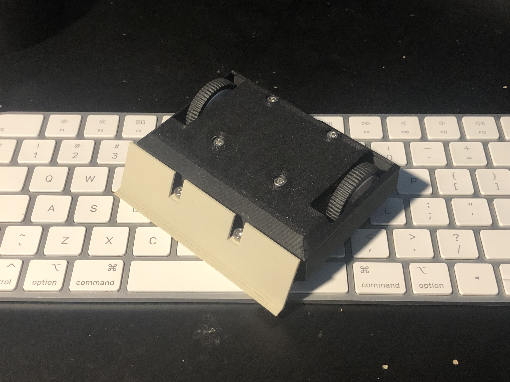
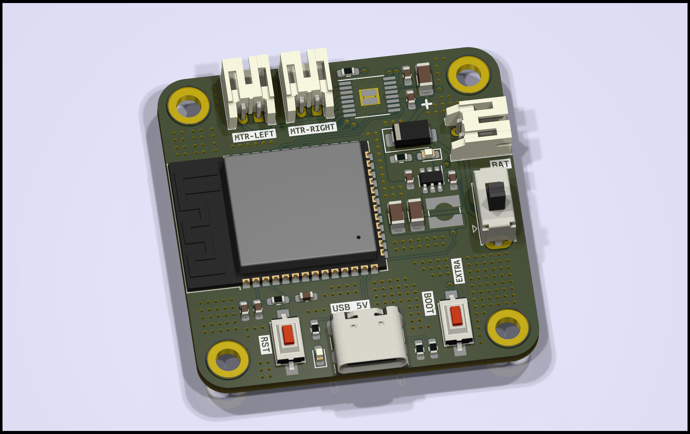
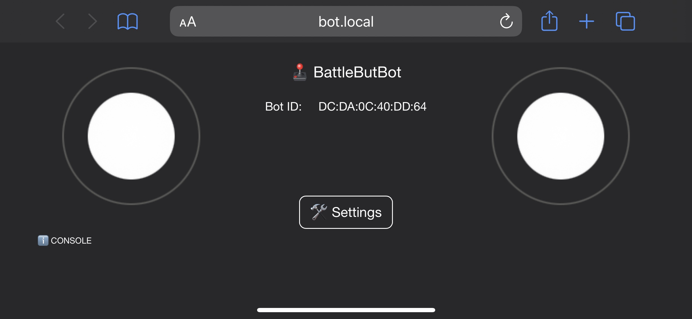
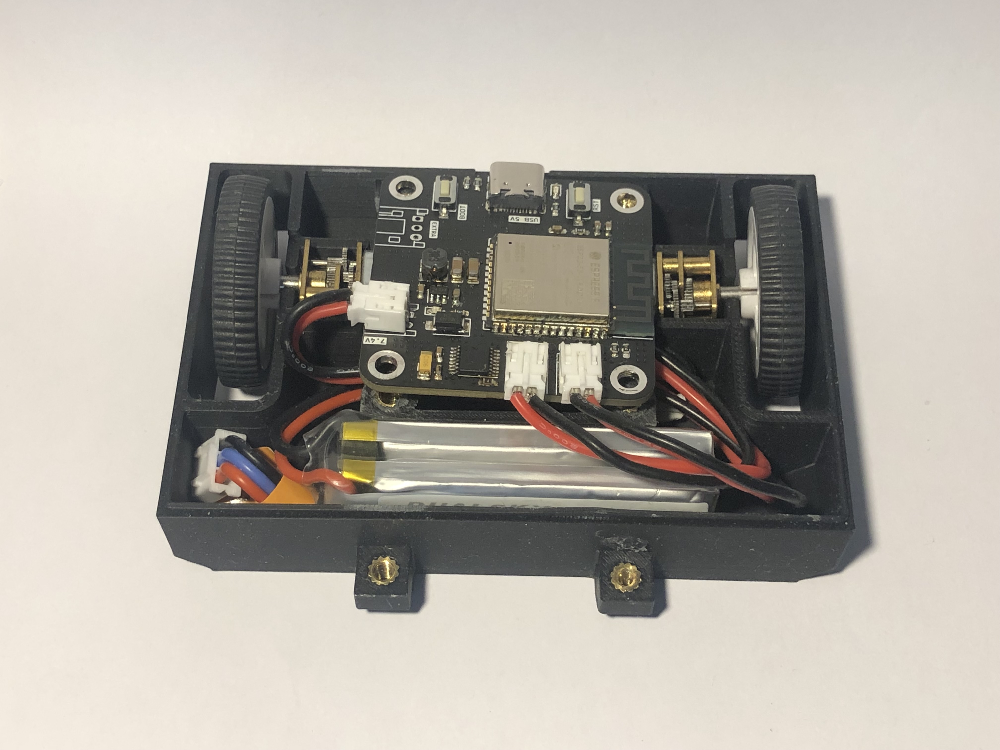

## Introduction

I've always been a big fan of anything related to battle bots and robotics. From TV shows, youtube videos, or even local competitions, the concept of a battle bot has had its popularity increased.

A few months ago, I had the idea of building my own antweight battle bot, including everything: the eletrical part, the CAD design and even the firmware (code).

The idea was to create a battle bot that could be easily controlled by most of the people. I wanted more people to be introduced into this hobby and to experience, in first hand, how cool it is. With a quick research I found a few things that could prevent someone from getting started:

- The big and heavy battle bots are the most popular. They require a decent investment from the user and, addtionally, a decent amount of knowledge to build, manage and maintain.
- Most of the battle bots use pre-built tools, e.g RF receiver or RF controller. These tools are normally expensive. For the common Joe, an investment of more than 100$ in a battle bot it is not reasonable.

I wanted something that YOU could build at your house, or something YOU could build at your school. Something YOU had the power to iterate, something YOU could change as much as you liked.

That being said, I aimed for the following features:

- Under 150g: to follow [Antweight class rules](http://www.antweights.co.uk/doku.php?id=antweight_world_series_rules)
- Under 10x10cm: to follow [Antweight class rules](http://www.antweights.co.uk/doku.php?id=antweight_world_series_rules)
- Cheap: can't cost more than 50$
- Double Sided: works upside down as well
- Upgradable: you can upgrade the firmware
- Maintable: parts are all easily available and can be shipped to the user
- Customizable: controller user interface offers customization according to the user's preferences
- Durable: the enclosure is printed with PLA filament
- Available: use your phone to control the battle bot
- Open: the code and part of the design is open-source

## Features

### Board (PCB)

I designed a small and rounded 40x40mm printed circuit board with, mainly, a microcontroller (ESP32-S3) and a motor driver (DRV8833).

The board is supplied with 7.4V from a 2-cell LiPo battery. The motors are supplied directly from the battery, but the microcontroller is supplied with 3.3V.

### Design (CAD)

I'm not trying to hide — I got a bit of inspiration from the low-poly style design of Tesla's [Cybertruck](https://www.tesla.com/cybertruck). I just think that's cool.

The [enclosure](https://www.thingiverse.com/thing:6645449) can be printed with PLA filament in ±2hours.

The idea is to provide different "fronts" of the robot enclosure. Each "front" could be changed to adapt according to the opponent.

### Controller

The microcontroller placed on the board creates a WiFi network that serves as a gateway for the battle bot controller.

### Firmware

The firmware is written in C on [PlatformIO](https://platformio.org).

## Assemble

### Board (PCB)

I order the board, the components and solder them into the board using a hot plate. One board might take around ±1 hour (from picking, placement and solder) to be ready to use.

### Design (CAD)

The enclosure is printed in 3 parts: the body, the lid and the front. The lib goes on top of the body and the front at the front.

The enclosure needs 6 M3 screws and 6 M3 heat inserts.

## Conclusion

TLDR: I built one battle bot from scratch and it is ready to battle in the Antweight class.

This project was definitly very fun to do. I've learned a lot, specially to decrease the amount of complexity it goes into prototyping.
