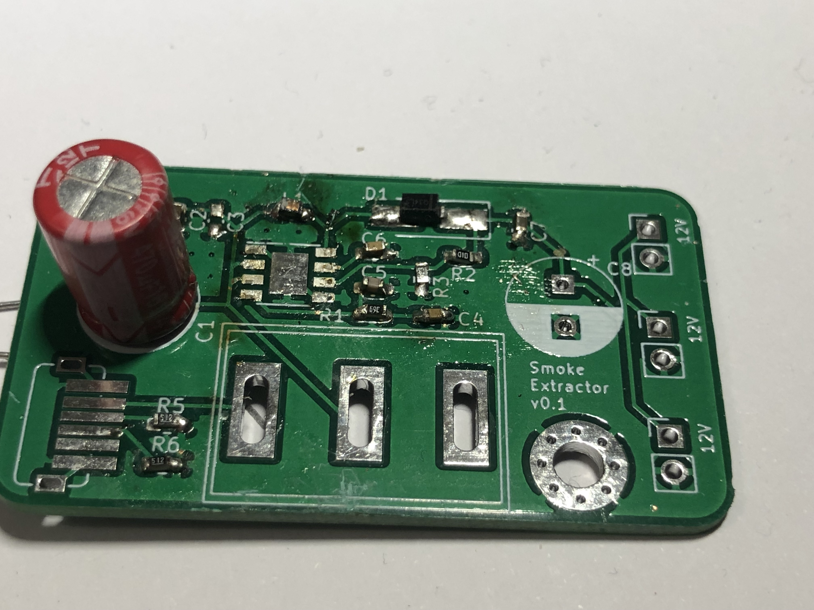
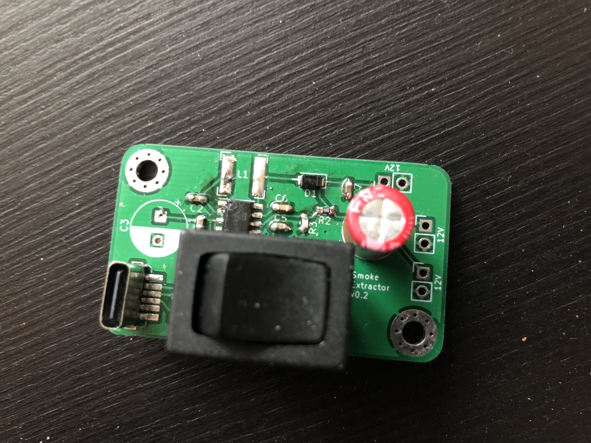
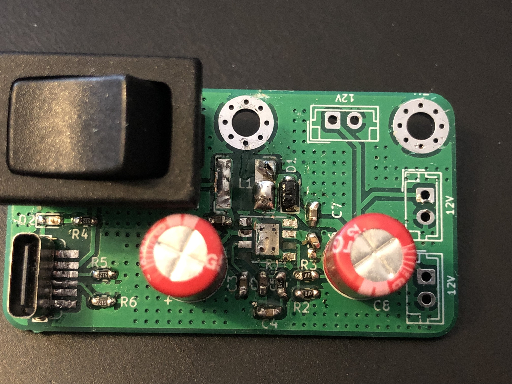
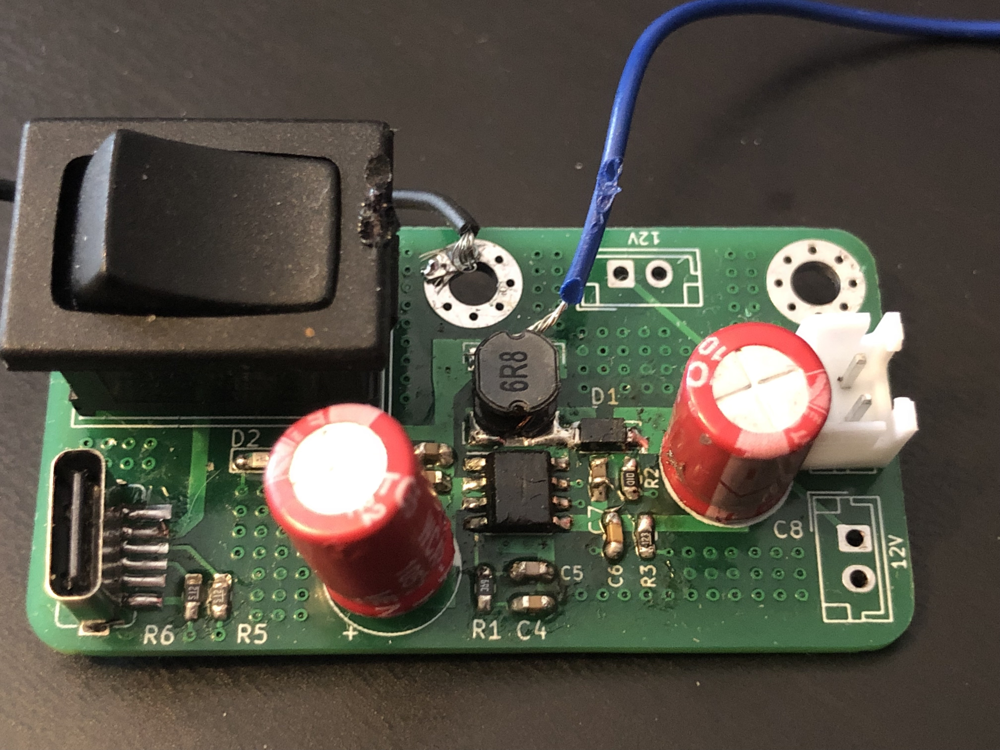
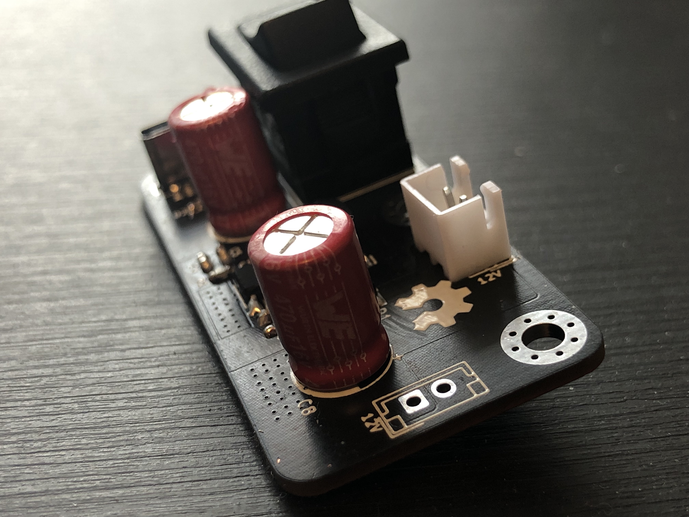
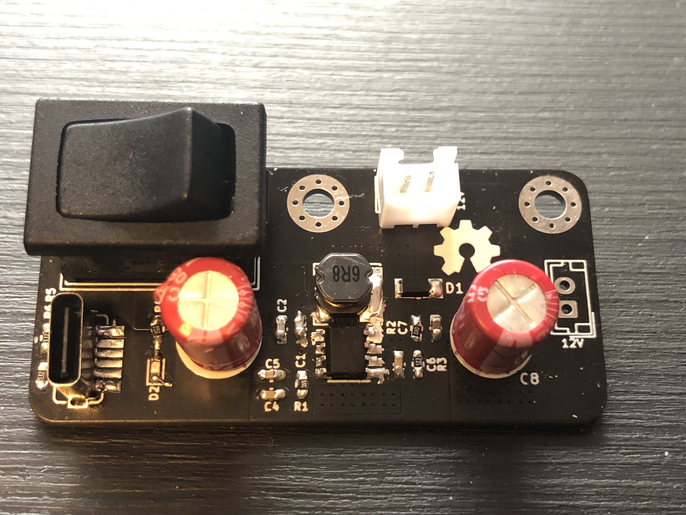

I do have some skills on KiCad but eveything I do is normally very basic - has no requirements and allows me to design the board with a lack of responsability or guidelines to follow.
However, to design a boost converter it is necessary to be careful in the way the design is made.

The idea was (and still is) to design a boost converter from 5V to 12V, and so it should match these criteria:

* Work with USB-C@5V.
* Have a switch On/Off.
* Find and use a boost converter with, at least, 90% of efficiency.
* Support two outputs.

### First designs

I did 4 different designs before making it work! Yes, **f o u r different ones**. It took a lot of time because I underestimate the amount of effort and time to place on this project in order to succeed. Noobie mistake.

This project started in July and only in November I had the desired 12V at the output of the board. It takes some time to design and order, and also, the shipping time, which is around 2 weeks. Normally, I would put 2 to 3 days during a mounth to work on this.

#### First board (v0.1)

First board was bad. Had design issues and the Bill of Materials was wrong.

One of the most important parts of a boost converter is the inductor. It is its responsability to charge and discharge, and therefore output a higher voltage. If the inductor cannot handle the amount of current passing through and used to charge/discharge, it will burn and the boost converter is useless without it.

You can clearly see in the image above, the inductor (top of the board, above the boost converter footprint) was dead 😛.
Also, the design is awful! Traces don't follow a pattern, quite random design.

#### v0.2

Board v0.2 was still to fix previous problems on the board.
The design was very much the same, I only changed the footprint for the inductor. Instead of using a regular 6.8uH 0603 inductor, I choose to use a new one based on [LM2621 DATASHEET](https://www.ti.com/lit/ds/symlink/lm2621.pdf):

> The LM2621’s high switching frequency enables the use of a small surface mount inductor. A 6.8-µH shielded
inductor is suggested. The inductor should have a saturation current rating higher than the peak current it will
experience during circuit operation (see Figure 10). Less than 100-mΩ ESR is suggested for high efficiency.
Open-core inductors cause flux linkage with circuit components and interfere with the normal operation of the
circuit. They should be avoided. For high efficiency, choose an inductor with a high frequency core material, such
as ferrite, to reduce the core losses. To minimize radiated noise, use a toroid, pot core or shielded core inductor.
The inductor should be connected to the SW pin as close to the IC as possible.

Therefore, I looked up for avaialble inductors in TME and got this one - [DLG-0504-6R8 FERROCORE](https://www.tme.eu/se/en/details/dlg-0504-6r8/smd-power-inductors/ferrocore/). Although the inductor is unshielded, the inductor is made for DC/DC conversions and supports a peak current up to 1.6A.

The next version of the board could definitly have a shielded inductor!

#### v0.3

Now that the BOM seemed OK, I thought the next board, the third one, would work. How wrong was I :)

I'm still not sure what was the problem with this version of the board - design was not great, but it should, at least, work inefficiently.

This time I included a LED to give me some feedback if power was comming from the USB-C cable. Still quite useless - in a user experience view, it is much more useful to have a LED to know if the board is On or Off (next board!).

Was also working on this design I started to ask people online (Reddit) about boost converter design guidelines. A gentle soul shared this document with me: [Five Steps to a Good PCB Layout of a Boost Converter](https://www.ti.com/lit/an/slva773/slva773.pdf?ts=1638615191009&ref_url=https%253A%252F%252Fwww.google.com%252F) and told me to look up for delevopment boards that used the same boost converter (which normally manufacturers have).

#### v0.4

This board was my last attempt to make this work. It actually worked, but I had to re-solder almost every component again. Added some cables to input 5V directly into the board using a lab power supply and check the amount of current drew.

With a fan in the output working at 12V with an output current of 200mA, the board draws ~600ma.
We can check if this value is reasonable by verifying if the effecency of the boost converter is close to the 90% stated on the [PAM242 datasheet](https://www.diodes.com/assets/Datasheets/PAM2421_22_23.pdf):

$$I_{in} * V_{in} * n = I_{out} * V_{out}$$
$$0.6A * 5V * n = 0.2A * 12V$$
$$n \approx 80\%$$

Not far from the desired and stated 90% but it could be better with an improved design 😁.

#### v1.0

Finally, a board with a great design and, in my opinion, quite aesthetic!

You can see the zones created around the components. Much better than using traces to connect everything!

Black PCBs look amazing!

<a class="button is-rounded is-primary" href="/download/BoostConverterV1_0.zip" download="BoostConverterV1_0.zip">Download PCB</a>

### Improvements for upcoming new versions

1. The USB C interface doesnt support Power Delivery, and so it doesn't work if connected to a MacBook Pro, for instance. This is quite concerning since the world is shifting into using PD more and more. I want to make this more universal.
2. Two 12V output are not as usefull as one 12V plus other one at 5V. Changing this would make the product support more types of fans.
3. Portability is key nowdays. If this is small I can make it portable as well. I don't mean it to walk around with this on my pocket, but for organizing purposes - it is way easier if the product is just _plug and play_.

(04/12/2021)

<!-- ### Update and foreshadowing of the new upcoming version of the board

I plan to go more premium and make it more fearture-rich. Of course, it will also increase the cost of the Bill of Materials and the complexity of the board.
But, in the end, according to my vision, the product will be way better and more useful.

**Power Delivery** is something that the board will **NEVER SUPPORT** - it is meaningless. The cost and complexity of the power delivery is way too high to pay off.

On the other side, portability is something that, done in the right way, omits the need to support Power Delivery. As it doesnt need to be plugged all the time, it doesnt really need to support so many _protocols_ or cables. Therefore, the plan is to use a capable battery to output, at least, 1Ah (maybe I'll go for the 18650 lithium batteries).

Based on tbe calcultations for the 3.7 to 5V boost converter, the choosen one (xxxx) should be able to output 5V at a maximum of 700mA (3.2V) or 900mA (4.2V). Eveything depends on the baterry output power (would like to go for the values stated before, close to 1Ah but might be necessary to be more depending on the efficency of the boost converter) but these are the absolute maximum values that the board is capable to provide at the respective outputs.
In short, it all depends on the inductor peak current, how low is the voltage at the input, how much power can the battery provide and how great is the efficency of the boost converter. -->

