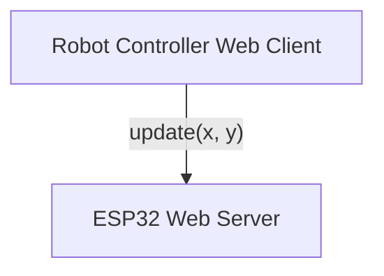
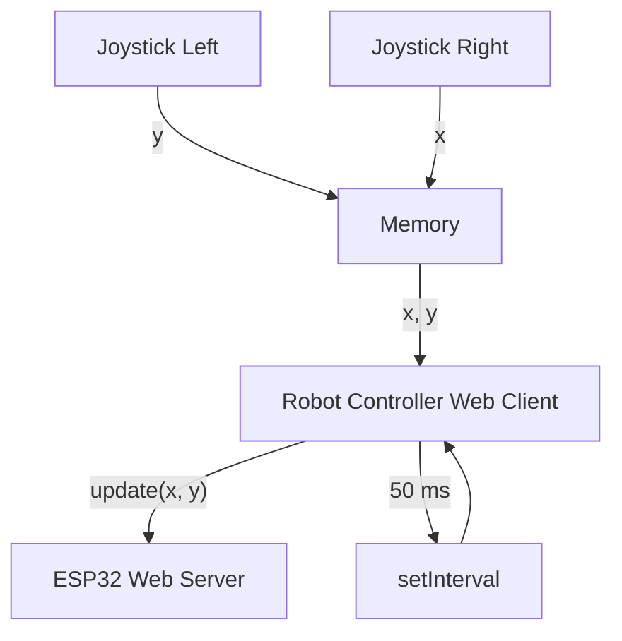
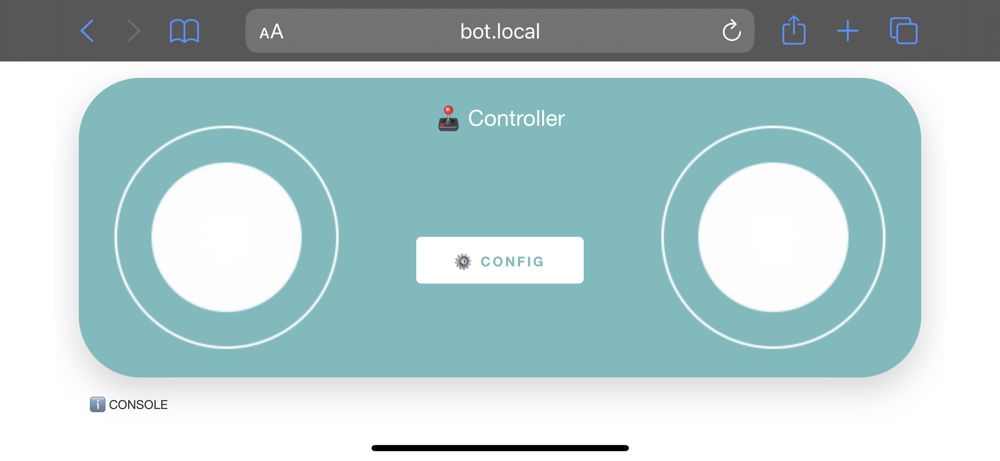

Since I'm now working on developing my own Battle Bot, I've been searching for ways to control it wirelessly. It needs to be simple, fast, cross-platform (phone, PC, etc) and should be reliable.
Most of the available options on the internet either use arrow buttons to orientate the robot, recommend a bluetooth app, or require overkill hardware (e.g. raspberry Pi) to run [ROS](https://www.ros.org):

- [Browser Controlled Bot](https://www.instructables.com/Browser-Controlled-Bot/)
- [PC Controlled Bluetooth Robot (With a GUI !)](https://www.instructables.com/PC-Controlled-Wireless-Bluetooth-Robot-With-a-GUI/)
- [Remote controller for Robot?](https://www.reddit.com/r/robotics/comments/11kf5yi/remote_controller_for_robot/)

I've continued to research about robot controller I could take inspiration from until I found a Sparkfun article about a [Wifi controlled robot](https://learn.sparkfun.com/tutorials/wifi-controlled-robot/all). Not only is simple and cross platform (every device has a browser) but also supports high data bandwidth, in constrast to [bluetooth](https://en.wikipedia.org/wiki/Bluetooth), so in case I decide to stream a Robot POV to a VR headset, it is possible.

Using Wifi came in handy, since I've used the [ESP Web Server library](https://github.com/me-no-dev/ESPAsyncWebServer) before as it works flawlessly.

### Control Logic

The plan is to have a two analog controller: one (left) which controls the speed (Y axis) and another one (right) which controls the direction (X axis). A ESP32 will host a [webserver](https://en.wikipedia.org/wiki/Web_server) using the previously stated [ESP Web Server library](https://github.com/me-no-dev/ESPAsyncWebServer) and the browser will act as client and dispatch an `update` request to the server.



Both, X and Y are the result of the position of the joysticks. The left joystick will update `x` whereas the right will update `y`. To avoid having two requests, the values are cached and sent together every 50ms to the ESP32.



On the client side, it is as simple as creating two joysticks, caching its data and sending a request every 50ms.

```js
const JoyLeft = new JoyStick('joystick-left', {}, function (thumb) {
  newY = thumb.y;
});
const JoyRight = new JoyStick('joystick-right', {}, function (thumb) {
  newX = thumb.x;
});

function _sendXandYToDevice() {
  if (isRequestOnGoing) {
    return;
  }
  if (
    (Math.abs(oldX - newX) > JOYSTICK_OFFSET) ||
    (Math.abs(oldY - newY) > JOYSTICK_OFFSET)
  ) {
    oldX = newX;
    oldY = newY;

    _request("/update?x=" + newX + "&y=" + newY);
  }
}

// Attempt to send the speed and the direction every 50ms
setInterval(() => { _sendXandYToDevice(); }, JOYTSTICK_REQUEST_INTERVAL);
```

On the server side, it is simple as creating a handler for the previous request:

```c++
server.on("/update", HTTP_GET, [](AsyncWebServerRequest* request) {
  if (request->hasParam(HTTP_MOTOR_X) && request->hasParam(HTTP_MOTOR_Y)) {
    machine_room_update(request->getParam(HTTP_MOTOR_X)->value().toInt(),
                        request->getParam(HTTP_MOTOR_Y)->value().toInt());
    request->send(200, "text/plain", "OK");
    return;
  }
  request->send(404, "text/plain");
});
```

### Graphical User Interface

Finally, the look of the controller. I'm terrible at managing CSS styling but managed to make something _presentable_.



In order to present an html page like this one, the ESP32 needs to support [SPIFFS](https://arduino-esp8266.readthedocs.io/en/latest/filesystem.html) and create another handle for the root path ('\').

```c++
server.on("/", HTTP_GET, [](AsyncWebServerRequest* request) {
  // https://arduino-esp8266.readthedocs.io/en/latest/filesystem.html
  request->send(SPIFFS, "/home.html", "text/html");
});
```

The file `home.html` has the code for the robot controller.
