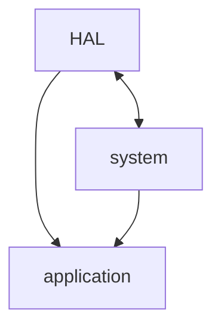

I've previosly written about [CMake](cmake.md) and its benefits. The truth is — CMake is a beast of a _technology_ and it takes some time to get good at it. However, it is possible to take advantage from it without being a complete pro. Below, I'll try to list and explain the most common CMake commands to use when [cross-compiling](https://en.wikipedia.org/wiki/Cross_compiler) for a embedded device.

You can read the entire code on my [github repository](https://github.com/nguterresn/stm32f0-boilterplate).

## Create the project

A common thing to do when it comes to setup a independent development workflow is to try to **mimic what the vendor provides**. In the following examples, I'll targeting the STM32F030R8 which is part of the [NUCLEO-F030R8](https://www.st.com/en/evaluation-tools/nucleo-f030r8.html).

The [STM32CubeIDE](https://www.st.com/en/development-tools/stm32cubeide.html) provides not only an Graphical User Interface (GUI) to develop for the ST devices, but also an abstraction from any build or flash process. The goal is to pull what's is useful from the STM32CubeIDE and move to CMake as soon as possible.

In order to do that, after creating a project for the target board, the necessary files are created. The project directory will look something like this:

```md
- /Core
- /Drivers
- STM32F030R8TX_FLASH.ld
```

The `Core` folder includes relevant system and application code (I'll later separate them).
The `Drivers` folder include the STM32 Hardware Abstraction Layer (HAL) and CMSIS libraries.

> [!info]
>
> CMSIS can be ignored.

Personally, I don't like the way the project is structured, so I changed to this:

```md
- /application
- /hal
- /system
- STM32F030R8TX_FLASH.ld
```

Application folder should be independent from the system (part of previous `/Core` ) and HAL IHMO.

I've also removed the `main.h` file, copied all the defines inside and moved to another file named `pin_list.h` . Again, personally, don't think that a system file should include application code, only the other way around.

```c
#ifndef PINLIST_H_
#define PINLIST_H_

#define B1_Pin GPIO_PIN_13
#define B1_GPIO_Port GPIOC
#define USART_TX_Pin GPIO_PIN_2
#define USART_TX_GPIO_Port GPIOA
#define USART_RX_Pin GPIO_PIN_3
#define USART_RX_GPIO_Port GPIOA
#define LD2_Pin GPIO_PIN_5
#define LD2_GPIO_Port GPIOA
#define TMS_Pin GPIO_PIN_13
#define TMS_GPIO_Port GPIOA
#define TCK_Pin GPIO_PIN_14
#define TCK_GPIO_Port GPIOA

#endif
```

> [!warning]
>
> If this all seems a bit hard, I would recommend going through the readme of this [github repository](https://github.com/MaJerle/stm32-cube-cmake-vscode) first.

## Move to your IDE

You can take the previous project and move it to your IDE of preference. Of course, nothing will compile, but we will tackle that soon.

After moving all the previous files into your IDE workplace, clone the [STM32F0 HAL repository](https://github.com/STMicroelectronics/stm32f0xx_hal_driver) as a submodule:

```SHELL
git submodule add https://github.com/STMicroelectronics/stm32f0xx_hal_driver
```

## CMake joins the room

Now that all the boring requirements are met, it is time to play with CMake.
In the root folder, you can start by creating a `CMakeLists.txt` file. If this doesn't sound familiar, please read [my previous post about it](cmake.md).

Let's start with the minimum amount of code:

```cmake
cmake_minimum_required(VERSION 3.22)

# Before setting up project.
set(CMAKE_TOOLCHAIN_FILE  ${CMAKE_CURRENT_SOURCE_DIR}/toolchain.cmake)

project(stm32-f0-boilerplate)

enable_language(C CXX ASM) # 'Enable' Assembly to load the startup file.
```

The `CMakeLists.txt` always starts with a `cmake_minimum_required` followed by a `project` .
Although it is possible to define the toolchain using the command line, I personally prefer to set it up inside a file `toolchain.cmake` and including it before the project is named. The toolchain is essential to be able to compile to whatever platform you are compiling to; in this case arm-gcc compiler.

The last command `enable_language` does exactly what you think — enables the following languagues: C, C++ and Assembly.

The next lines of CMake set the path of the folders or files necessary to build.

```cmake
set(APPLICATION_PATH           ${CMAKE_CURRENT_SOURCE_DIR}/application)
set(SYSTEM_PATH                ${CMAKE_CURRENT_SOURCE_DIR}/system)

## -------------- Change according to your STM32 -------------- ##

set(HAL_PATH                   ${CMAKE_CURRENT_SOURCE_DIR}/stm32f0xx_hal_driver)
set(LD_FILE_PATH               ${SYSTEM_PATH}/STM32F030R8TX_FLASH.ld)
set(STARTUP_FILE_PATH          ${SYSTEM_PATH}/startup_stm32f030r8tx.s)
set(CPU_OPTIONS                -mcpu=cortex-m0 -mfloat-abi=soft)
set(STM_DEFINE                 STM32F030x8)
include(stm32f0.cmake)         # File that includes the options and definitions

## ------------------------------------------------------------ ##

```

Note that the way the paths are added to CMake follow the same structure [as stated before](#create-the-project).

I've deviced to include the compilation options and definitions inside a file, the `stm32f0.cmake` (just another personal preference). Let's take a look inside:

```cmake

#### -------------- COMPILER -------------- ####

# Preprocessor defines!
set(COMPILER_DEFINES
  "USE_HAL_DRIVER"
  ${STM_DEFINE}
)

#### -------------- LINKER -------------- ####

set(LINKER_OPTIONS
  --specs=nosys.specs
  -mthumb

  ## -- MATH LIBRARY START -- ##
  -Wl,--start-group
  -lc
  -lm
  -Wl,--end-group
  ## -- MATH LIBRARY END -- ##

  # Print memory usage - flash, ram, etc
  -Wl,--print-memory-usage
)
```

The `COMPILER_OPTIONS` can change according to the user need. There different types of compilation optimization and you read more about [here](https://gcc.gnu.org/onlinedocs/gnat_ugn/Optimization-Levels.html).

For example, the `-Og` optimizes the code for debugging: good debugging experience while having a fast compilation time.

You can use the `COMPILER_DEFINES` to include different defines within the codebase.

The `LINKER_OPTIONS` will be later used to link all the objects together. The options come as default from STM32CubeIDE.

## CMake inheritance

After setting all the options, definitions and paths, it is time to device about the structure of the libraries and the executable.

The CMake will have a final target, the application, in which will include as many libraries as possible:

* `/HAL` needs files from `/system`
* `/system` needs files from `/HAL`
* `/application` needs files from both,  `/HAL` and `/system`

The dependencies can be viewed as such:



Although `/HAL` dependends from `/system` and vice-versa, `/HAL` needs to have its compilation options and definitions **private**. You don't want to print the amount of warning comming from the `/HAL` . Therefore, the CMake code continues as follow:

```cmake
# System

file(GLOB system_source CONFIGURE_DEPENDS ${SYSTEM_PATH}/source/*.c)
set(system_include ${SYSTEM_PATH}/include)

# HAL

file(GLOB hal_source CONFIGURE_DEPENDS ${HAL_PATH}/Src/*.c ${HAL_PATH}/Src/Legacy/*.c)
list(FILTER hal_source EXCLUDE REGEX ".*template\\.c$")
set(hal_include ${HAL_PATH}/Inc ${HAL_PATH}/Inc/Legacy)

add_library(hal ${hal_source})
target_include_directories(hal PUBLIC ${hal_include} ${system_include})
# Don't look up for warnings - compile options and defines as PRIVATE.
target_compile_definitions(hal PRIVATE ${COMPILER_DEFINES})
target_compile_options(hal PRIVATE ${CPU_OPTIONS})
```

In order to have its compilation options and defines private, it is necessary to create the static library `hal` . This library will include all the `/HAL` related files (e.g. `${hal_include}` ) and the default compiling options and definitions.

```cmake
# Application

file(GLOB application_source CONFIGURE_DEPENDS ${APPLICATION_PATH}/source/*.c)
set(application_include ${APPLICATION_PATH}/include)

add_executable(${PROJECT_NAME} ${application_source} ${system_source} ${STARTUP_FILE_PATH})
target_include_directories(${PROJECT_NAME} PRIVATE ${application_include})
target_link_libraries(${PROJECT_NAME} hal)

target_compile_definitions(${PROJECT_NAME} PRIVATE ${COMPILER_DEFINES})
target_compile_options(${PROJECT_NAME} PRIVATE ${CPU_OPTIONS} -Wall -Wextra -Werror)
```

The hal library is then linked to the application target and extra compilation options are added:

```SHELL
-Wall -Wextra -Werror
```

Since the `hal` library had its compilation options and defines set as private, the application won't inherit anything from it (nor vice-versa).

```cmake
target_link_options(${PROJECT_NAME} PRIVATE ${CPU_OPTIONS} -T${LD_FILE_PATH} -Wl,-Map=${PROJECT_NAME}.map ${LINKER_OPTIONS})

add_custom_command(TARGET ${PROJECT_NAME} POST_BUILD
  COMMAND ${CMAKE_OBJCOPY} -O ihex $<TARGET_FILE:${PROJECT_NAME}> ${PROJECT_NAME}.hex
)
```

To finalize, the application target is linked with the default options and a `.hex` is created after the target has been built.

## CMake most wanted

From the all the code snippets stated above, it is possible to verify a pattern:

1. Create a library and add sources to library

```cmake
add_library(test ${test_source_files})
```

2. Include directories

```cmake
target_include_directories(test PRIVATE/PUBLIC/INTERFACE ${test_include_files})
```

Set as `PRIVATE` to include the directories only for this library.
Set as `PUBLIC` to include the directories for this library and respective targets where this library is linked.

3. Define compilation options

```cmake
target_compile_options(test PRIVATE ${test_compilation_options})
```

Set as `PRIVATE` to define the options only for this library.
Set as `PUBLIC` to define the options for this library and respective targets where this library is linked.

Note that some of the compilation options might already be set according to build types, e.g. `CMAKE_C_FLAGS`.

4. Define compilation definitions

```cmake
target_compile_definitions(test PRIVATE ${test_compilation_definitions})
```

Set as `PRIVATE` to define the definitions only for this library.
Set as `PUBLIC` to define the definitions for this library and respective targets where this library is linked.

If you know this, you can do anything. CMake is all about libraries, targets and inheritance.
