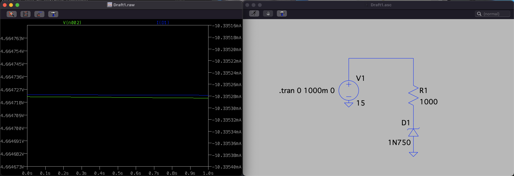

### Diode protection

A common way to protect a Input/Output Line is to have it in between two diodes.

The article from where I took the picture above, [Protecting Inputs in Digital Electronics](https://www.digikey.se/en/articles/protecting-inputs-in-digital-electronics), explains really well the problem - **inductive ringing** (or voltage oscillations) at the input of a data line **can damage a component.**

This way of protecting a data line is quite common in microcontroller or generic data line applications; there are even some chips that already have these two diodes ready to be used and plugged, like the [BAV23S](https://assets.nexperia.com/documents/data-sheet/BAV23_SER.pdf).

### Voltage Interval

The main goal of these two diodes is to create a **voltage interval in which the current is allowed to pass through** and prevent voltage oscillations. Mathematically speaking, something like:

$$V_{GND} - V_{forward} < voltage < V_{ref} + V_{forward}$$

First, it all depends on the **Diode Forward Voltage** ($V_{forward}$) and from the **Reference Voltage** $V_{ref}$. The $V_{ref}$ depends on the type of the diode and on the specifications even between diodes from the same type. Since I already used (as an example) the chip _BAV23S_, let's check its datasheet.

As stated above, the **Forward Voltage** ($V_{forward}$) is around 1.25V for the **Forward Current** ($I_{forward}$) of 100mA. This can be translated into - when 100mA of current pass through the diode, the voltage drop (same as the forward voltage) across the diode terminals is around 1.25V.

In a hypothetic scenario, where the Reference Voltage ($V_{ref}$) is 3.3V, what would be the voltage interval?

Well, if we consider the diode forward voltage ($V_{ref}$) to be 1.25V, then the interval would look like this:

$$0 - 1.25 < voltage < 3.3V + 1.25V$$
$$- 1.25V < voltage < 4.55V$$

This would mean that the circuit would be protected from temporary voltage spikes. The overvoltage would be absorbed by a load, in case the voltage exceeds the 4.55V.

If the voltage at the input terminal is 3.3V, the voltage at the output terminal is also going to be 3.3V.

But what if the voltage goes above or under the voltage interval?

In case we encounter a voltage spike, **the current will flow through the top diode until the $V_{ref}$**, where it is going to be absorbed, as stated previously.

And, finally, if the voltage goes under the voltage interval, the current flows until the ground.

This use of the diodes is actually simple, cheap and great if used with an **$V_{ref}$ capable to sink the current coming from the overvoltage**. In some cases, the lack of a proper load at the reference voltage, might lead to an unregulated power line. Thus, is important to limit the current going through the diodes, by increasing the resistance before them. In fact, if the line is being shared with a microcontroller, it shouldn't even go above the 10mA in most of the cases.

### How to decrease the voltage interval

The Voltage Interval can also be easily modified by choosing another **Forward Voltage** ($V_{forward}$). To decrease the interval, the ideal choice is to go with **Schottky  Diodes**, since their $V_{forward}$ is around 0.3V:

$$0 - 0.3 < voltage < 3.3V + 0.3V$$
$$- 0.3 < voltage < 3.6V$$

**Final note:** It is just not me supporting this _protection_, a [couple of companies/manufacturers also do and recommend](https://electronics.stackexchange.com/a/25692).

## Zener Diode

This is also a type of diode, but has a much lower reverse voltage threshold - the inverted voltage at the terminals of the diode working in reverse bias, that allows the flow of the current.

The Zener Diode can be used as an alternative to the clipping diode connected to the **Reference Voltage** $V_{ref}$. This way, we can avoid forwarding current to a power line (and bonus - also eases PCB routing, since it is connected to the ground).

But, before we jump into the circuit, an important thing to have in mind when dealing with Zener Diodes is that if a _lot_ of current goes through the diode, its voltage regulation fails (and it fries 😅). Let's take a simple example:

The **Input Voltage** ($V_{i}$) is 15V and the Breakout Voltage ($V_{bo}$) of the Zener Diode is 4.7V, which means the voltage across the terminals of the diode should be 4.7V. Let's take a look into the simulation:

It is not the expected result. Because the resistance is so small ($5\Omega$), the current passing through the diode turns it into an unstable component.

$$ I = \frac{V_{i} - V_{bo}}{5\Omega} A$$
$$ I = \frac{15V - 4.7V}{5\Omega} A$$
$$ I = 2,06 A$$

The theoretical current 2,06A is basically the same as the simulation, 1.92A. The decreased current results of the use of the unstable $V_{bo}$ of 5.38V, instead of the theoric 4.7V.

There is not a lot of information about the simulated diode ([1N750](https://www.microsemi.com/document-portal/doc_view/10928-sa5-7-datasheet)), but we know, from the datasheet, the
**Absolute Maximum Power Dissipation** is around 500mW. This is a limit we _must_ respect and choose a resistor according to this maximum rating.
The maximum current flowing through the diode without messing up with the its normal behaviour can be calculated as:

$$ I = \frac{500mW}{4.7V} A$$
$$ I = 100mA$$

The **absolute** maximum current is as smaller as 100mA (not using the internal series resistor of the zener diode!).

_Better safe than sorry_ - we can choose a resistor that allows the flow of 10mA:

$$ I = \frac{V_{i} - V_{bo}}{1000\Omega} A$$
$$ I = \frac{15V - 4.7V}{1000\Omega} A$$
$$ I = 10 mA$$

A resistor of 1k$\Omega$ fits perfectly!

Now, let's try to simulate these changes:

Matches previous values!

### Decrease the resistance and get cooler

As we have seen before, the power dissipation of the Zener Diode can be set as $P = V_{bo} * I_{r}$.
If your data line doesn't need that much current, it is possible to reduce it by increasing the resistance in series.
If the data line draws 10mA, the power dissipation is around 47mW.
But, what if we just need 1mA?

$$ P = V_{bo} * I_{r}$$
$$ P = 4.7V * 0,001A$$
$$ P = 4.7mW $$

By re-thinking the design, we can decrease the power dissipation of our design and turn everything more efficient!
