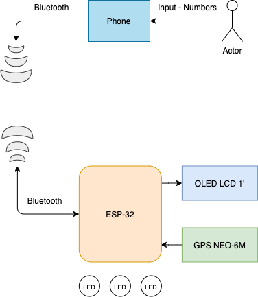
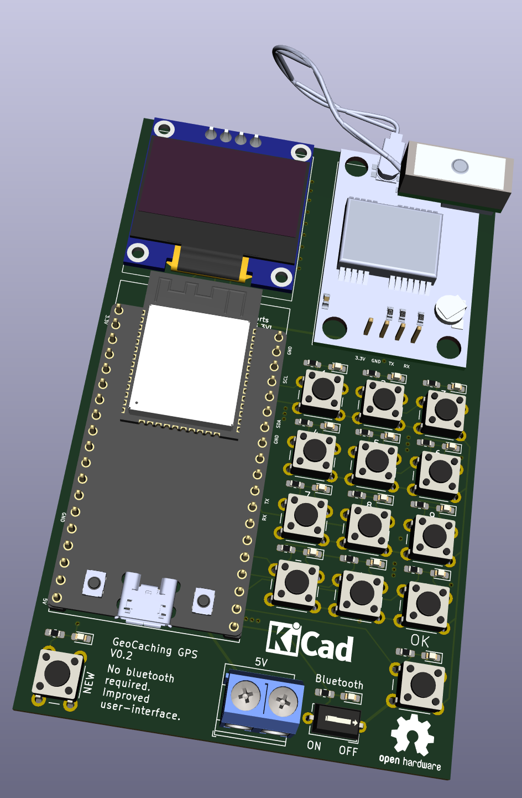

I really like [GeoCache](https://www.geocaching.com/play) but I have always thought that GPS are super expensive for something that should not cost that much money. Therefore, I came up with the idea to make one myself, trying to give it the maximum features possible that others provide while cutting the costs of the material as much as possible.

The idea is to create a DIY GeoCaching GPS:

- With significant good measures, less than 5 meters of accuracy.
- Cheap and popular electronic goods
- Powered by a 3.7V LiPo battery.
- Simple to use iOS/Android App but still working without app
- Finally, easy to build

---

### Starting by a first system architecture

In this starting phase, the ESP32 is powered by the serial connection (5V from PC) and powers the OLED panel and the GPS with 3.3V. The ESP32 is the device that draws more current, up to 150mA with Bluetooth active.

The system uses:

- A microcontroller, the [ESP32](https://www.espressif.com/sites/default/files/documentation/esp32-wroom-32d_esp32-wroom-32u_datasheet_en.pdf). [Very cheap and popular](https://www.ebay.com/itm/ESP-WROOM-32-ESP32-ESP32S-2-4GHz-WiFi-Bluetooth-Development-Board-for-Arduino/184310896504?hash=item2ae9c91778:g:vIsAAOSwBuVe0lRL), with a lot of flash and RAM compared with alternatives (like [PIC32](https://www.microchip.com/design-centers/32-bit/pic-32-bit-mcus/pic32mx-family) or [STM32](https://www.ebay.com/itm/STM32F103C8T6-ARM-STM32-Minimum-System-Development-Board-Module-For-Arduino-NEW/192956697201?hash=item2ced1d8a71:g:hhIAAOSw0PBdCvzE)). Besides, it has WiFi, Bluetooth and [Bluetooth Low-Energy](https://www.link-labs.com/blog/bluetooth-vs-bluetooth-low-energy). Perfect for this kind of project. (4€)

- [GPS NEO-6M](https://www.u-blox.com/sites/default/files/products/documents/NEO-6_DataSheet_%28GPS.G6-HW-09005%29.pdf). [Cheap](https://www.ebay.com/itm/1PCS-GYNEO6MV2-GPS-Module-NEO-6M-GY-NEO6MV2-Board-with-Antenne-fur-Arduino/193082355474?hash=item2cf49aef12:g:nucAAOSwqSRdbjmD) and very available GPS with a accuracy of 2.5 meters horizontally. (4€)

[UKHAS Wiki](https://ukhas.org.uk/guides:ublox_psm)

- [SSD1306 OLED](https://www.ebay.com/itm/0-96-IIC-I2C-Serial-128X64-OLED-Blue-LCD-Display-SSD1306-Arduino-ASS/264030264367?hash=item3d796e1c2f:g:aDkAAOSwFAtb5HjA) panel, low current draw and provides a GUI visualization. Useful if App is not installed. (4€)
- Some LEDs to increase user experience (<1€)

### Libraries

Luckily, there is a ton of open source libraries out there to this kind of *mcu* that really makes the job easier:

- To play with the GPS I used [TinyGPS++](http://arduiniana.org/libraries/tinygpsplus/).
- To manage SSD1306 128x64 through I2C I used Adafruit libraries - [SSD1306](https://github.com/adafruit/Adafruit_SSD1306), BusIO and GFX Library.
- To deal with serial ports I used [HardwareSerial](https://github.com/espressif/arduino-esp32/blob/master/cores/esp32/HardwareSerial.cpp).
- To use BLE I got the [ESP32 BLE for Arduino](https://github.com/espressif/arduino-esp32/tree/master/libraries/BLE) libraries

### Loop

In order to work, this system needs to follow some sequential loop logic.

1. Reads GPS coordinates
2. Measures distance between desired coordinates and actual coordinates
3. Returns measured distance to OLED panel or app

The desired coordinates are received through BLE.

From the above flowchart it's possible to see 2 two main loops responsible for the behavior of the system. GPS gets values, verifies it and updates current coordinates with new ones. Following, a device is connected through BLE and sends the desired destination coordinates, ending with a measured distance function executed inside the ESP32.

# DIY and OpenSource GeoCaching GPS v0.2

<h6>03/12/2020</h6>

When the first results were out I could see that I had failed in what I once had assigned.

The first prototype worked fine and, in the end, had a great result - it worked. Even only using longitude and latitude, the distance between two coordinates was fine and acceptable. Thing is, even if the prototype works, I can not call it a product without having a great user experience or a purpose.

Bluetooth connection was fine, even though it drained a lot of current (150mA). But, what if the phone controlling the coordinates to send reaches 0% battery? The board becomes useless. So even if the software and the hardware is top-notch, it fails on delivering a reliable user-experience.

To prevent this from happen I created a second version board which allows the user to manually input coordinates, change it or delete it. Also, in case the user doesn't want to use the phone, it is possible to disable Bluetooth by a switch.

Some minor improvements:

- Every button has a LED connected in parallel, therefore, each time a button is clicked a LED blinks.
- The input 5V pads were changed to screw terminals, more stable.

# DIY and OpenSource GeoCaching GPS v0.3

<h6>17/04/2021</h6>

Although last version (v0.2) already fulfilled a lot of use cases, I completely forgot about the number 0... 🤯 Making it useless to use, only useful to test. Also, the last version was using a pin per button (14 in total), which is something very newbie in electronics. This time, I decided to use a **4x4 matrix keyboard**, using only 8 pins to 16 buttons.

Each button has a RC filter, decreasing (by far) the chance of switch debouncing. Some buttons can debounce up to 20ms, so the challenge was to find a RC duo (R*C) with a time constant, at least, 4 times less. This value allows the capacitor to charge/discharge while debounce errors could occur. A value 4 times less of 20ms is 5ms, and using a 0.1uF capacitor, the resistance is about 50k ohms.

$$\tau = RC$$

This value is fine because a capacitor is 98% charged at 4$\tau$, so we can assume the logic is HIGH or LOW at that point ($t = 4\tau$).

This whole project is already fits in [my new directory structure which I stated in the last post](version-control-script.md).

Regarding all the information above, here is the Github repository link to this project:

🖥 [nguterresn/esp32gps_geocache](https://github.com/nguterresn/esp32gps_geocache)

