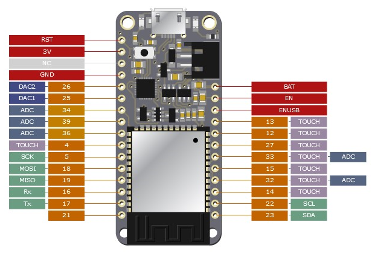

Somewhere and at some point during this month I saw this [Python library](https://pinout.readthedocs.io/en/latest/) called *pinout.*

So basically it allows you to create labels for your board according to the pinout of the board. In this case the board is an image you choose and try to allocate all the labels with code (Python).

[https://pinout.readthedocs.io/en/latest/](https://pinout.readthedocs.io/en/latest/)

So it is pretty straight forward  and the library already comes with examples, so you can try your own.

---

So why is this good? So basically I can now generate **pinout labels for my boards** and I hope this helps me to do **not lose so much time checking the connections/type/utility of the board pins**.

I wish I could join this library with this other one - [PCBDraw](https://github.com/yaqwsx/PcbDraw) - which allows you to create more beautiful image of the more, let's say. But unfortunately, I haven't figured it out how to do so.

So I took one of the SVG image generated by KiCad from a previous project and tried to play around this library. This was the result:

The board image is not the best but does the job. You can see that the labels can be placed everywhere and with custom distance from the board.

In the end, I think this could be a great tool to the ones I already have and should placed in the *svg* folder of the *pcb.*
