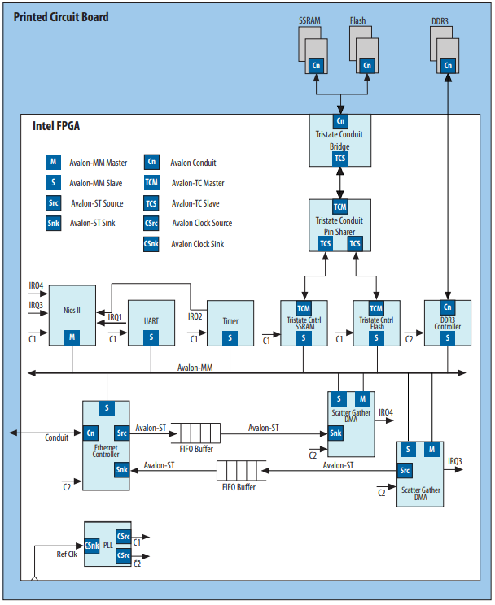

As I said in a previous post, I have been working with the Cyclone GX Starter kit FPGA, which has come up a really nice surprise as a *way* of development. I mean way of development because it is very different compared to the normal way of development of embedded software I'm used to.

Every manufacturer has its own IP (Intellectual Property) and, therefore, its own interface between them. Intel calls the interface **[Avalon](https://www.intel.com/content/dam/www/programmable/us/en/pdfs/literature/manual/mnl_avalon_spec.pdf)** which is responsible to connect the components in the Intel FPGA.

Avalon interface can be divided into seven types:

- **Avalon Streaming Interface (Avalon-ST) -** unidirectional flow of data, including multiplexed streams, packets, and DSP data.
- **Avalon Memory Mapped Interface (Avalon-MM) -** address-based read/write
interface typical of master–slave connections. Typically components like MCUs, memories, UARTs, DMAs and timers use this kind of interface.
- **Avalon Conduit Interface - o**thers connections which do not fit in any of above. Exported conduit
- **Avalon Tri-State Conduit Interface (Avalon-TC) -** interface that supports connections to off-chip peripherals.
- **Avalon Interrupt Interface -** interface that allows components to signal events
to other components.
- **Avalon Clock Interface -** interface that drives or receives clocks.
- **Avalon Reset Interface** - interface that provides reset connectivity

Every type of Avalon interface is very complex and this is just a brief of what they do. Plus, a cool thing about the Avalon interface is that they are an open standard, is ok to develop and sell products based on them.

So, in the image above it is possible to visualize the many types of Avalon Interfaces and its connections.

The Avalon Tri-state Interface is connected to SSRAM, Flash or DDRD3 RAM and each one has it own controller. The SSRAM and the Flash have a Conduit Bridge, which allows the interface to be connected to the board GPIOs when exported in the Platform Designer.

From this [Cornell university ECE web page](https://people.ece.cornell.edu/land/courses/ece5760/DE1_SOC/HPS_peripherials/Qsys_index.html) I found this image that exactly shows the relation between Avalon, Platform Designer (Qsys) and Verilog.

---

## Avalon Clock and Reset Interfaces

Components of FPGA can have clock inputs or clock outputs (or even both). As an example, Intel shows a PLL core:

A PLL is normally used to create new clocks in order to meet some time requirement. Having a input reset (reset) and a input clock (ref_clk), creates 1 to N clock sources. One example of the use of the PLL in the FPGA is to create a clock to meet the ADC time requirements. The FPGA clock is normally 50MHz, and the [LTC2308](https://www.analog.com/media/en/technical-documentation/data-sheets/2308fc.pdf) only works up to 40MHz on the SPI clock. So PLL is used to create a new clock source, at a frequency of 40MHz or less.

---

## Avalon Memory-Mapped Interface

These ones are much more complex than clock and reset interfaces. From the previous definition of MM Interfaces, I found one that suits better in order to understand:

> (...) Avalon Memory-Mapped Interface is a bus-like protocol that allows two components to exchange data. One component implements a master interface that allows it to request and send data to slave components.

The MM Interfaces have something called *signal roles.* The first *signal role* is the *address* that is used to know *where* to write data or to read data*.* Has a width between 1 and 64 bits. It's [easier to understand](https://www.google.com/url?sa=t&rct=j&q=&esrc=s&source=web&cd=&ved=2ahUKEwjC4YCf8sXtAhWRlFwKHWg6AqEQFjAAegQIAhAC&url=ftp%3A%2F%2Fftp.intel.com%2Fpub%2Ffpgaup%2Fpub%2FIntel_Material%2F16.1%2FTutorials%2FMaking_Qsys_Components.pdf&usg=AOvVaw2EDm-u8WpwqKzcgOdgyDm2) if a master has four 32-bit addresses to select four register in slave device.

Starting with a 32-bit address 0x1000_0000, to write to the most significant byte of the first register I would write to the address 0x1000_0003. Therefore each byte can be accessed choosing the corresponding address. For example, second byte of the third register can be accessed by the address 0x1000_0009.

From the [Avalon Interface Specifications](https://www.intel.com/content/dam/www/programmable/us/en/pdfs/literature/manual/mnl_avalon_spec.pdf), an example may also be:

> (...) For example, *address* = 0 selects the first word of the slave. *address* = 1 selects the second word of the slave.

This quote confirms what I wrote above, but in a more simple and abstract way 😃

Although *address* is very important between MM Interfaces, is not required. *Signal roles* like *readdata*, *write* and *writedata* are required. Based on the minimum requirements, *readdata* is required for a read-only interface or *write* and *writedata* for a write-only interface.

In the image above it is possible to visualize how masters and slaves work with their *signal roles*.
