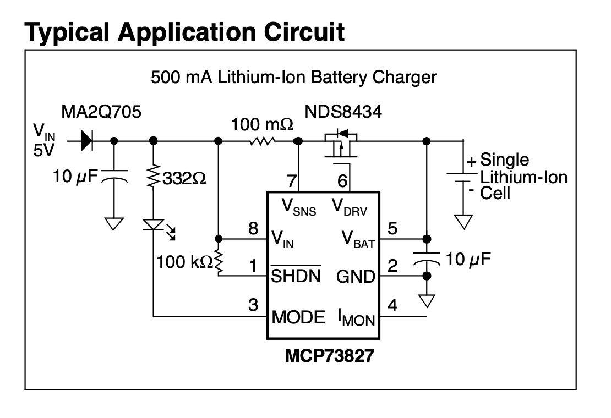
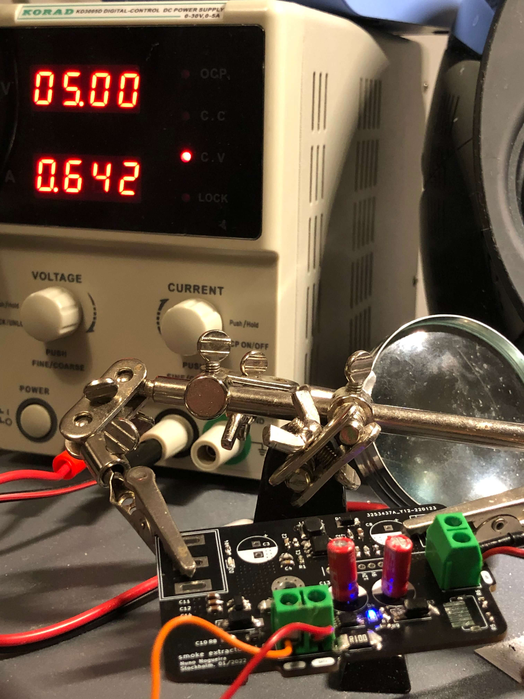
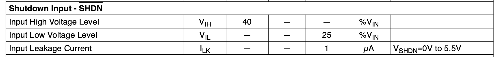
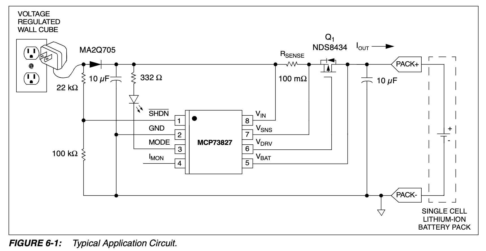

I had designed a board in which a battery charger chip was used - the [MCP73827](http://ww1.microchip.com/downloads/en/DeviceDoc/21704B.pdf). It is a very simple chip and a _typical application_ can be seen in the first page of the datasheet.

This first circuit is not wrong, but it is - it is not ideal and it should not be used in any application. **This figure led me to believe it was OK.**

### First check of the design

Fastforward to the moment I receive the final design in hands, I started to test it and plugged a LiPo 3.7V cell to it. After some checking here and there, everything looked OK.

### When the problem started

Some time had passed and the battery was fully charged ($~4.2V$). When I turned down the input voltage, the LED, responsible to give feedback about the charging state, **was still ON**. Weird, right?

My first thought was - something is shorted in the design. Checked again every node of the electronic circuit, nothing. The 100m Ohms resistor almost tricked me into thinking both ends were shorted, but no, nothing was shorted.

Next, I checked the voltage at every critical pin of the battery charger:

- $V_{gs} = -2.73V$
- $V_{in} = 4.2V$
- $V_{mode} = 1.72V$

The transistor was letting current pass from drain, battery, to the source, chip. So, the chip was being supplied by the battery it was supposed to control the charge. Weird!
How is this possible?

### Easy solution for someone who reads

**I had absolutely no idea what was the problem.** The chip was working but I did not want the battery to discharge and supply the battery charger, while it was not being charged - I knew there was a problem there, just couldn't find the reason.

Luckily, there are smart people in this world who are glad to help distracted people like me. I posted on reddit on why this happens, and the reason was clear - the **SHDN** pin is connected to $V_{in}$. **So, the chip would still work as long as the voltage at the edge of SHDN was bigger than 40% of $V_{in}$.**

Well, as previously seen, $V_{in}$ had $4.2V$ at its terminals, causing the chip to be enabled, even when it had nothing coming from the input supply. This is not a huge problem, as the MCP73827 will enter in a low power mode if the input voltage is less than the output voltage:

> In the stand-alone configuration, the shutdown pin is generally tied to the input voltage. The MCP73827 will automatically enter a low power mode when the input voltage is less than the output voltage reducing the battery drain current to 8 μA, typically.

The chip goes into a low power mode and it draws very low current from the battery, but the LED is still ON and draws way more current. This is something that is not ideal at all and should not have been used as a _typical application_!

### A new typical application circuit

At the middle of the datasheet, they present another _typical application circuit_, this time without the **SHDN** pin problem.

> By connecting the shutdown pin as depicted in Figure 6-1, the battery drain current may be further reduced. In this application, the battery drain current becomes a function of the reverse leakage current of the reverse protection diode.

And just like that, the problem is solved.

### Further reading

The use of the voltage divider on the **SHDN** pin is to limit the voltage on its terminals, as the pins can only deal with $V_{in} + 0.3V$. Since the **SHDN** is now connected before the diode, and the diode normally has a voltage droupout bigger than $0.3V$, it could easily exceed the maximum ratings.

> All inputs and outputs w.r.t. GND ................-0.3 to (VIN+0.3)V

