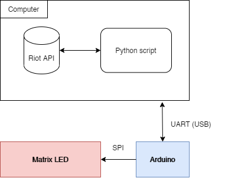
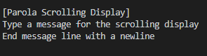

Recently I acquired one of the matrix led panels selling on [Aliexpress](https://pt.aliexpress.com/wholesale?catId=0&initiative_id=AS_20210120102931&SearchText=1088as) or Ebay and started to print some stuff.


Came to my mind that some people, including myself, need some kind of memo to remind how bad (or good huh) they are at League of Legends.

The idea is simple, **connect the matrix led to a microcontroller,** then **receive some data from a script running on the computer** and **connected to the League of Legends API**.



# **Arduino Side**

From the Arduino side, it is possible to connect the matrix like this:


After having the connections well established, it is time to code. The code used in this project is based on a library from this repository, named MD_Parola. Here is the code to use: [MD_Parola/Parola_Scrolling.ino at main · MajicDesigns/MD_Parol](https://github.com/MajicDesigns/MD_Parola/blob/main/examples/Parola_Scrolling/Parola_Scrolling.ino)a ([github.com](http://github.com/)).

<script src="https://gist.github.com/nguterresn/2a144160e0f683bc37b66ae85cdb3497.js"></script>

After running and testing, the matrix should print some like: “Hello! Enter new message?”.

# **PC Side**

If it runs smoothly, then everything is ready. **Connect the Arduino to the PC through USB cable.**

You can **open a serial session** in TeraTerm (or similar software) and this text is what you got from the Arduino. Now, write something and press *enter*, the matrix will show whatever you write!



If you can’t find which serial port is Arduino connected to, go to *Device Manager* and check *Ports*.

OK, now you are good to code in python!

# **Code in Python**

If you can output whatever you write in the serial port, you can now deal with the python code which gives us the ability to know how much time was spent in the last game played, and if the game was won or lost (we know but the computer doesn't!).

I’m not a python developer nor a expert in any way, but I think python is so straightforward that everyone is able to understand quickly!

First, you need python installed, then you need to install the *riotwatcher*:

```python
pip3 install riotwatcher
```

After installing riotwatcher, install [PySerial](https://pyserial.readthedocs.io/en/latest/pyserial.html) in order to control serial port:

```python
python -m pip install pyserial
```

Having a successful installation is mandatory to execute the python code we are going to use. Run python in the terminal to check if it is installed. Then create a file and import **riotwatcher** and **serial** — this allows to check if the libraries are available to be used:

```python
from riotwatcher import LolWatcher, ApiError
import serial
```

Then run:

```python
python yourfile.py
```

If this test is successful you are ready to make a small changes in the final code!

<script src="https://gist.github.com/nguterresn/5614d2391ceeae566932312d6c26660e.js"></script>

Change **Serial port** (serial_port), **API key** (api_key), **region** (my_region) and **summoners name** (my_summonername).

The program will update every 30 seconds, and, although it can be changed, you can not change it much more, there are some limitations using **Riot API — 100 requests every 2 min.** So, using 4 requests every 2 minutes we make sure everything works fine.

To change the text shown in the matrix led, change the data inside the *ser.write()* function, like:

```python
ser.write(b“Solobolo”)
# Note that the desired type is bytes.
```

If you are some expert in python you can add more exceptions to the code to make it more robust!

Hope you have as much fun as I had during this micro-project!
