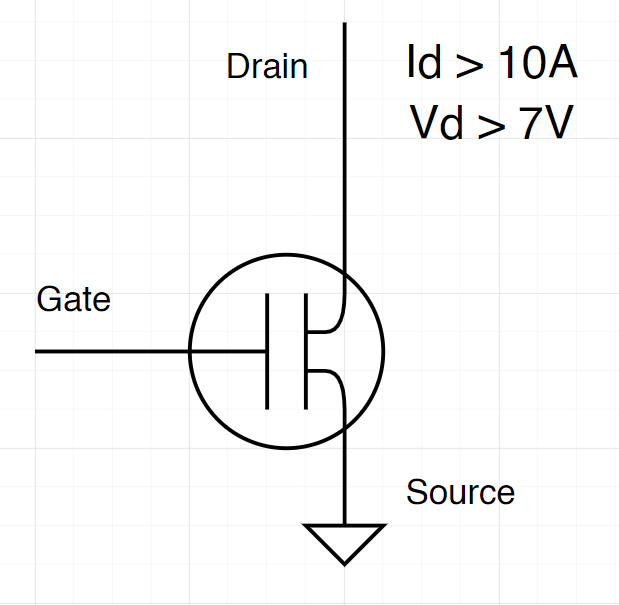
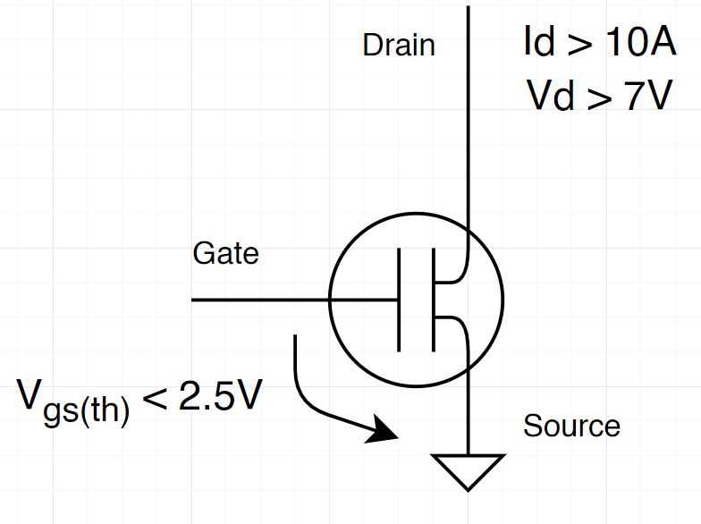
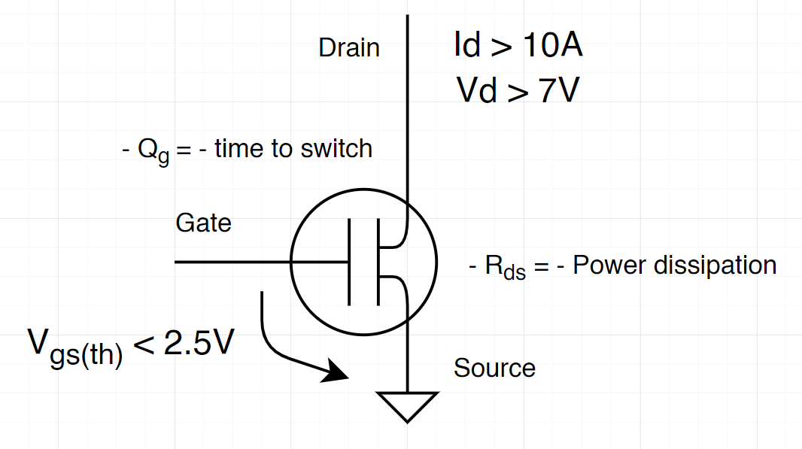
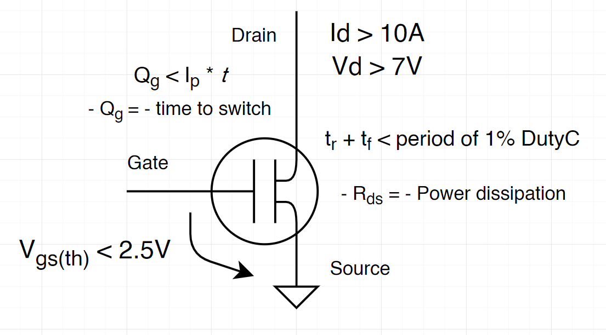
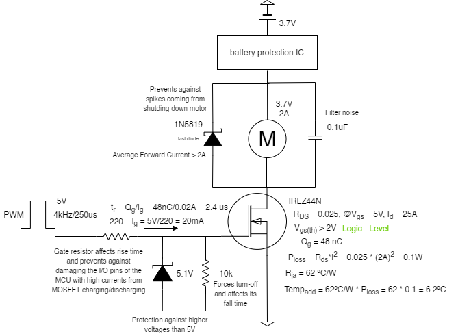
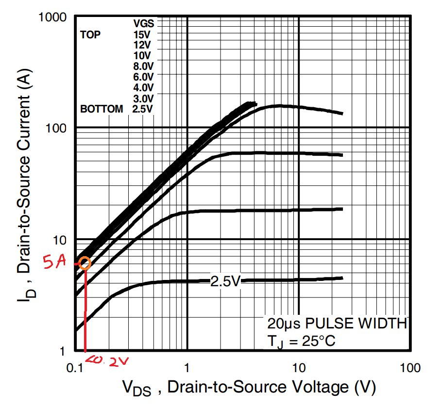

# Choosing MOSFET according to motor specifications

I want to test my 8520 3.7V coreless motor and see how much current it draws from a LiPo battery inside a motor driver made for drone usage. To do this I need to pick a MOSFET that enables the best switching to control de motor through PWM.

### Motor Specifications

A good starting point is to define the specifications of the motor;

- Works at 3.7 V
- Load current at 2A
- Stall current is around 5A

### $V_{DD},V_{GS}, I_{D}$

From these values is easy to say that $V_{DD} > 3.7V$ (Voltage from power supply) and $I_d > 5A$ (current at drain). [As a rule of thumb and to aim flexibility within the system](https://www.edn.com/mosfet-drivers-for-motor-drives-start-with-your-motors-specs/), let's double these values, so let's find a MOSFET that $V_{DD} > 7V$ e $I_d > 10A$

Note that $V_{DS}$  should be as low as possible!

The PWM outputs 5V using Arduino Uno to control the MOSFET gate but I would also like to use a 3.3V output PWM to be able to use other microcontrollers. Since the motors are powered by a 3.7V LiPo battery, it would make sense to use an LDO to 3.3V and then power whatever the controller it is used. Therefore, this is important to know the minimum value of $V_{GS}$ at which the MOSFET should be turned on. At $V_{DD} = 4.2V$ (maximum voltage within the motors terminals) and $I_d = 5A$, the voltage at which the MOSFET goes ON (threshold) should be $V_{GS(th)} < 3.3V$. Considering that should exist some voltage dropout a good value for the threshold would be around $V_{GS(th)} < 2.5V$.

### Power dissipation and charge

Another specification to have in count when choosing a MOSFET is the resistance between drain and source $R_{DS}$. This value is related directly to the power dissipation of the MOSFET, thus the lower the better!

To calculate the power loss of the MOSFET is necessary to know the value of $V_{DS}$ and the $R_{DSon}$:

$$P_{loss} = R_{DSon} * I_d^2$$

The MOSFET works as a capacitor that needs to charge and discharge in order to turn ON and OFF. As it behaviours as a capacitor, it has a charge time. The gate charge is the amount of charge the MOSFET needs to be turned ON or OFF and the charge time is the time it takes to do so. The lower the charging time, the better, since it switches better between ON and OFF states.

### Gate drive current

The amount of current provided to the gate of the MOSFET sets how much time the MOSFET needs to be fully ON. Therefore, depending on the PWM frequency available, it is possible to calculate and choose a rise/fall time for the MOSFET, and then the current provided to the gate.

Lets start with a 20kHz PWM frequency since is the [most recommended](https://dccwiki.com/Coreless_Motor) for this kind of motor. If frequency is $f = 20kHz$ then $T = 50 us$, for the minimum duty cycle of 1%, $T_{1\%} = 500ns$, therefore the rise/fall time must be less than 500ns, $t_r + t_f < 500ns$.

According to these results, the chosen MOSFET should be able to provide:

$$t_r + t_f < 500ns$$

Now to calculate the current according to the fall and rise time values:

$$\frac{Q_g}{t}$$

*Qg* is the amount of charge on the gate necessary to change the state of the MOSFET, and *t* is the time of rise/fall. Considering the maximum amount of current provided by the microcontroller from a pin $Ip < 20 mA$, it is possible to have a desired charge amount at the gate:

$$\frac{Q_g}{t} < 20mA$$

$$Q_g < 20mA * t$$

### The trade off

Although less $Qg$ and less *Rds* is better, there is a trade-off between them. Normally, to decrease one, the other increases, so it really depends on the system. In this system I would focus on getting the  **lowest Rds possible,** in order to reduce the power loss.

[Choosing MOSFET](https://www.notion.so/8f0f0ca41e79430695ca901f9faa5bcc)

The one whose actually seem the best for me was the **IRLZ44N**, and since I can buy it near the place I live, I will choose it as the MOSFET of this system. Apart from that, its package is also great to testing!

The Rds and the voltage drop along Vds is also **very low**. These values are great! I'm just worried about the **high charge gate**, this could be a problem to **high frequency motors**.

## Building the circuit

To simplify the explanation I created a schematic with a bunch of information, everything very short.

### Gate Resistor

The MOSFET needs two resistors connected to the gate. The first resistor, the gate resistor is very important! It protects the MOSFET gate and the signal provider (PWM pin) from getting seriously damaged. Because the MOSFET behaviours as a capacitor, at charging (to turn ON), it is pulling current from the controller. Well, we can check the worst scenario possible by using the total gate charge and its rising time:

$$I_{max}=\frac{Q_g}{t_r} =\frac{48}{84}=0.57A$$

If the MOSFET pulls 0.57A from the microcontroller, it will, for sure, damage it. It depends from MCU to MCU, but, for example, Arduino Uno pins can pull up to 40mA of current. To be safe, lets consider **20mA**! Measuring the rising time in the worst scenario....

$$t_r =\frac{48nC}{0.02A}= 2.4us$$

For a frequency of 4kHz (250us), considering falling time the same as the rising time, on transitions (ON to OFF or OFF to ON), the MOSFET spends:

$$tran_{4kHz} = \frac{2.4us}{125us}=1.92\%$$

**Approximately 2%, which is OK and reasonable for this frequency. However, this is not perfect. As seen before, t < 1% of the duty cycle time.**

In other hand, if we try to calculate to the recommended 20kHz (50us) frequency:

$$tran_{20kHz} = \frac{2.4us}{25us}=9.6\%$$

Almost 10% of the time would be spend on turning ON and OFF the MOSFET, this is terrible!

For now lets stay with the frequency of 4kHz.

### Pull-down resistor

This resistor is responsible by forcing the MOSFET to turn OFF when gate is floating. It also affects the falling time of the MOSFET.

Apart from this, there is a trade off. If we look closely, the two resistors form a voltage divider, the voltage in the Pull-down resistor will always be higher, as long as it is bigger than the gate resistor (as it is, normally!). We can calculate the voltage drop and check how much voltage goes through the gate of the MOSFET. Lets consider gate resistor as **Rg** and pull-down resistor as **Rpd**:

$$V_g = \frac{R_{pd}}{R_{pd}+R_g}*Vin = \frac{10000}{10220}*5V = 4.89V$$

If the MOSFET has 4.98V at his gate , it means that **there is a 11mV voltage drop along the gate resistor.** It is possible to reduce this value by increasing the value of the pull-down resistor, however this will increase MOSFET's fall time.

For a threshold (max) of 2V, it's fine to have 4.89V at the gate as long as it allows a current higher than 5A (stall current of the motor)

According to the graph, with a voltage between gate and source close to 5V is totally possible to reach 5A at drain with less than 0.2V of voltage drop from drain to source.

### Zener Diode

In order to prevent higher voltages than 5V at the MOSFET gate, a Zener diode of 5.1V is used connected between gate and ground. Simple and cool concept!

### Motor-related Protections

In order to protect the system, a schotty diode and a capacitor are placed in parallel with the motor. The schotty diode should be a *fast* diode, with low dropout voltage and a forward current bigger than the normal 2A (drawn by the motor).

## Final Thoughts

I think this is a good place to start. In a few days I will test this circuit and change some values if I don't like them. I will report it later 😷
