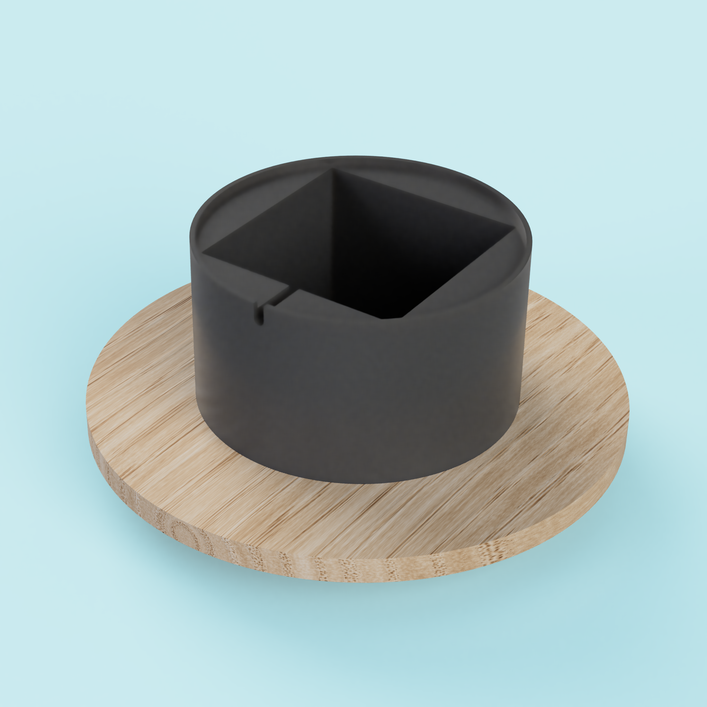
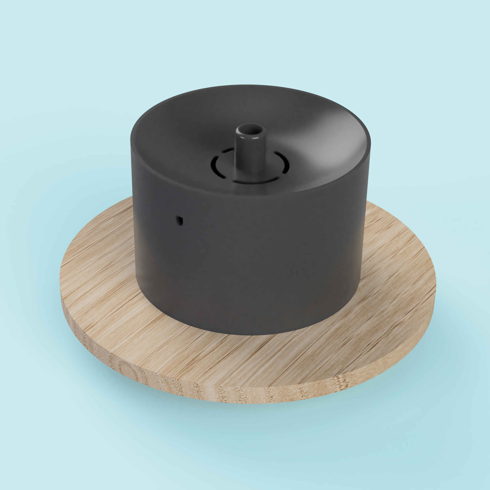

## Introduction

I love gadgets and I love pets, and I feel like in the last few years there has been an increase of new technology for pets, specially cats and dogs. One of the things that have become common in a pet store is something called a _pet water fountain_.

Product wise, it doesn't bring anything new (or value), it is pure aesthetics based. However, I can consider it looks pretty good and has become trendy lately.

 

Something like a [pet water fountain](https://www.amazon.se/-/en/AONBOY-Fountain-Silent-Active-Carbon/dp/B0937J3K1H/ref=sr_1_5?crid=WDYF8I1I4DX5&dib=eyJ2IjoiMSJ9.JybE-P8eaYghnS5gfBeZobjqk3PbTaNJHkB-PIeF0OtxZorcCckCY-J7W6fCYKRqVGE-pVPm8_h9uFXuPOv1rBtWTd9i66VZWJHln-LiCeq4gNS_q7-KAzUk4gEC-NMNoJlUGHtKezl7A1Fpm83Z4oCVAbotkaRgQNC6YAOtyz9CWW8d_CD7UCl4ogh-D7zMRhHfCfetXX3IisnovBGcWIo0mg7INFiuaphqs8PE-SPuTIea6Xv5DYQjoCqks4RNPT5Q56zR5Y35xZlPt6BRKMBCSjToB4idTq6osRI_gBo.WqEFSxKpH3heQ4hCBdV_eaXbA477XXWym5rsAD8_XtE&dib_tag=se&keywords=pet%2Bwater%2Bfountain&qid=1708856396&sprefix=pet%2Bwater%2Bfountain%2Caps%2C121&sr=8-5&th=1) costs around 30$ but I can't consider it a good investment agaisnt the old and reliable water bowls. I searched for 3D designs, aiming to print one at home, attach a motor and come up with cheaper and _diy_ solution. However, I couldn't [find much](https://www.thingiverse.com/search?q=pet+water+fountain&page=1).

After not finding anything good enough, I decided to design one myself; a super simple one. I imagine the fountain being split in two parts:

* A bottom body where the water and motor will be. It should also hold any cable coming out of the motor.
* A top body where the water will be poured and will drop.

The bottom body is essentially a water container that also has a motor inside.

The top body can be of different shapes. I choose a bowl approach design to mimic the tradicional bowl. However, I've seen other designs with a more fountain approach: the water falls slowly from the top to the bottom body, into the water container.

## Do it yourself

I list below the items I've used to build it:

* [Water Pump Motor](https://www.amazon.se/-/en/gp/product/B07TW39QXP/ref=ppx_od_dt_b_asin_title_s00?ie=UTF8&th=1): the water flow is adjustable.
* [Water Tube](https://www.amazon.se/gp/product/B075P49RK2/ref=ppx_yo_dt_b_asin_title_o03_s00?ie=UTF8&psc=1): The top body of the design is made specially for the characteristics of this tube, it respects the 12mm width. Any type of tube should suffice, as long as it respects the 12mm width.

You can find the CAD Design [here](https://www.thingiverse.com/thing:6502648). On a BambuLab printer it should take around 3h to print both bodies.

Once you got all the items and the bodies, follow the instructions to assemble the pet water fountain:

1. Cut the water tube around 5cm length.
2. Insert the tube into the top part.
3. Insert the tube into the motor.
4. Fill the bottom body with water.
5. Place the top body on top on bottom body and match with the motors cable gap.
