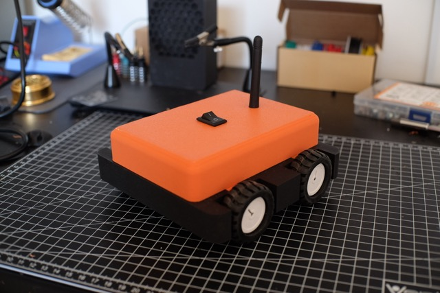
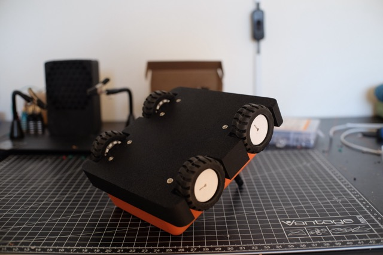
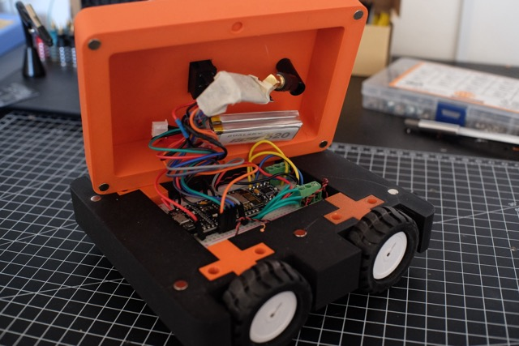
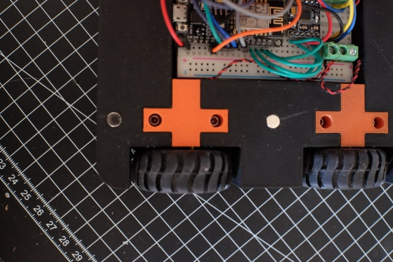

After building the [battlebutbot](battlebutbot/2wd-bot.md), I wanted to build something bigger, heavier and more powerful, while keeping a simple structure build system in mind.

I kept the [same N20 motors](https://www.aliexpress.com/item/1005005474559049.html?spm=a2g0o.order_list.order_list_main.30.dd701802lqD0Xo) and the same motor driver, the [DRV8833](https://www.aliexpress.com/item/1005006444609771.html?spm=a2g0o.order_list.order_list_main.20.dd701802lqD0Xo). System wise, it is exactly the same as before, but adds one more motor per each side (left and right).

The wheels had to be changed though — the [previous were too narrow](https://www.aliexpress.com/item/33026783171.html?spm=a2g0o.order_list.order_list_main.215.dd701802lqD0Xo). The [new ones had to be wider](https://www.aliexpress.com/item/1005006543847384.html?spm=a2g0o.order_list.order_list_main.10.dd701802lqD0Xo) in order to support more weight and provide a more stable drive.

The wireless communication had also to be changed. Bluetooth or WiFi are just not _that_ great to control any device over a distance of hundred of meters. I used a [nRF24 module with antenna](https://www.aliexpress.com/item/1005006179466246.html?spm=a2g0o.order_list.order_list_main.55.dd701802lqD0Xo) instead. It can achieve a range up to 1000 meters and it can be easily connected to any microcontroller over SPI.

As a final goal, I wanted to create some sort of robot body I could use as a boilerplate for other projects, with enough space to grow and add components.

Without further ado, here's the final design:

The lid includes space for a switch and an antenna. The switch controls whether the robot is powered ON or OFF.

The bottom includes a 6mmx3mm hole to fit a thread. A total of 8 are necessary, 2 per wheel.
The decision to include a screw + thread combo might sound odd for these kind of projects, since heat inserts tend to be more popular. However, I had way better experiences with such a combo. Plus, it requires zero "soldering".

The inside can contain whatever really. I've used a breaboard with a esp8266 dev board, a DRV8833 driver board and a few other components, like a screw terminal to facilitate holding everything together, nicely and tight.

The lid can be attached to the body via 6mmx2mm magnets. The magnets can be easily pushed in with the help of a screwdriver.

The motors are held in place with the help of a small component that pressures agaisnt the main body with the help of the pair of screws and threads.

As a power supply I decided to use something above the 3.7V, a 2-cell LiPo battery. Not only provides more power, but I can also directly connect it to the existing buck converter on the esp8266 dev board.

However, it shouldn't really matter — this design is meant to be used a boilerplate to create whatever with whatever you have at hand.

I've publish the final design on [thingiverse](https://www.thingiverse.com/thing:7047026), as usual.
