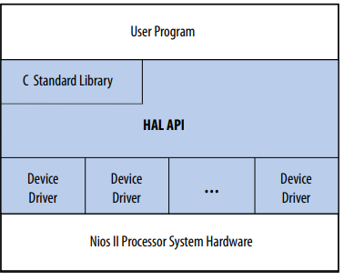
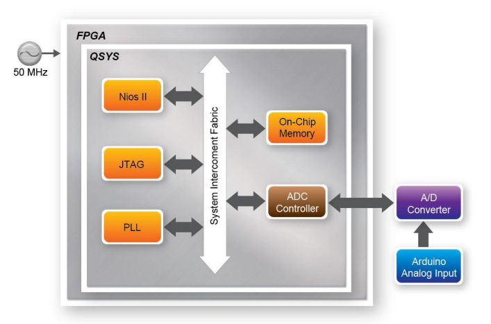
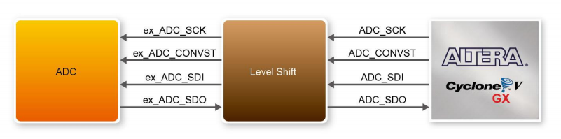

## From the Eclipse side...

From this side, the development is done in C. In order to make this possible, there is something named Hardware Abstraction Layer (HAL), that is basically a driver interface between the software and the hardware. For each Nios 2 implementation there is a Board Support Package (BSP) created, and, inside BSP, there is the HAL libraries.



HAL Layers

When writing code (C), it is possible to choose between the HAL API or the C stantard library available. The devices drivers are something more low-level and very different from the application side. The application has, for example, the main() routine. The drivers are responsible for making device resources available to application developers, as stated in *[Nios II Software Developer Handbook](https://www.intel.la/content/dam/www/programmable/us/en/pdfs/literature/hb/nios2/n2sw_nii5v2gen2.pdf).*



**ADC SPI interface** only **works up to 40MHz**, therefore PLL is used to create a new clock frequency (40MHz).



SPI signal is **delayed through the Level Shift** but it is fixed in the PLL.

---

**This is the code** I've used for reading the ADC values and measuring the time between readings.

```c++
#include <stdio.h>
#include <io.h>
#include <unistd.h>
#include <sys/alt_alarm.h>
#include <sys/alt_timestamp.h>
#include "system.h"
#include "altera_avalon_pio_regs.h"

#define MILI 1000
#define MICRO 1000000

// Write
#define WRITE_REG_START_CH 0
#define WRITE_REG_MEASURE_NUM 1

// Read
#define READ_REG_MEASURE_DONE 0
#define READ_REG_ADC_VALUE 1

unsigned int time1;
unsigned int time2;

int main()
{

	int ch;
	const int nReadNum = 1024; // max 1024
	int i, Value, nIndex=0;

	printf("ADC Test\r\n");

	FILE* fp;
	fp = fopen("/dev/uart_0","r++");

	if(fp)
		printf("fp opens!\r\n");
	else
		printf("Error opening the UART!");

	if (alt_timestamp_start() < 0)
	{
		printf ("No timestamp device available\n");
	} else {
		time1 = alt_timestamp();
		usleep(1000000);
		time2 = alt_timestamp();
		double f = (double)(time2-time1)/alt_timestamp_freq();
		printf("Measurement time: %f at frequency of %u\r\n", f, alt_timestamp_freq());
	}

	while(1){

		//Read adc channel from switch value
		ch = IORD_ALTERA_AVALON_PIO_DATA(SW_BASE) & 0x0F;

		printf("======================= %d, ch=%d\r\n", nIndex++, ch);

		//Set measure number for ADC to convert
		//This write is done with 4 bytes offset
		//#define ADC_LTC2308_0_BASE 0x41020 + 0x04(1word 32 bit) = 0x41024
		IOWR(ADC_LTC2308_0_BASE, WRITE_REG_MEASURE_NUM, nReadNum);

		//Start measure
		//Writes 1 into base address
		//#define ADC_LTC2308_0_BASE 0x41020
		IOWR(ADC_LTC2308_0_BASE, WRITE_REG_START_CH, (ch << 1) | 0x00);
		IOWR(ADC_LTC2308_0_BASE, WRITE_REG_START_CH, (ch << 1) | 0x01);
		IOWR(ADC_LTC2308_0_BASE, WRITE_REG_START_CH, (ch << 1) | 0x00);

		//starts timer
		time1 = alt_timestamp();
		// wait measure done
		// wait until it receives a one
		while ((IORD(ADC_LTC2308_0_BASE, READ_REG_MEASURE_DONE) & 0x01) == 0x00);

		time2 = alt_timestamp();
		double f = (double)(time2-time1)/alt_timestamp_freq();

		//Change MILI or MICRO
		f = f * MICRO;
		printf("Measurement time: %f at frequency of %u\r\n", f, alt_timestamp_freq());

		//From -> IOWR(ADC_LTC2308_0_BASE, WRITE_REG_MEASURE_NUM, nReadNum);
		//ADC measures are stored in a FIFO nReadNum times
		for(i = 0;i < nReadNum; i++)
		{
			Value = IORD(ADC_LTC2308_0_BASE, READ_REG_ADC_VALUE);
			printf("CH%d=%.2fV (%d)\r\n", ch, (float)Value/1000.0, Value);
			//fprintf(fp,"CH%d=%.2fV (%d)\r\n", ch, (float)Value/1000.0, Value);
			fprintf(fp,"%d\r\n", Value);
			IOWR_ALTERA_AVALON_PIO_DATA(LED_R_BASE, (Value/500));
		}

		usleep(1000*1000);
	}

}
```

Is worth mentioning that, in order to use the **alt_timestamp** it is necessary to add a Timer Interval IP core to the system in the **Platform Designer**. Choose a high timeout time so it doesn't interrupt much while CPU is executing (e.g. 1s).

Also, when **alt_timestamp** is initiated, a second is measured and its normal that a second using **usleep()** is higher than the actual time passing. The **usleep()** function guarantees that the delay happens but does not guarantee that the delay is not higher than it was supposed to be.
