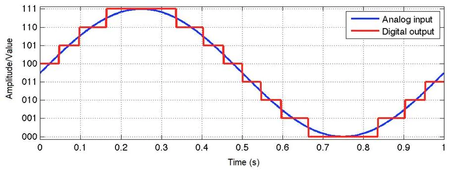
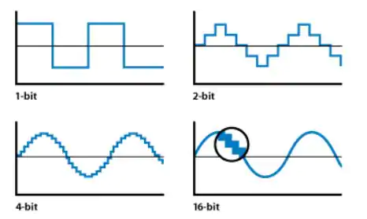
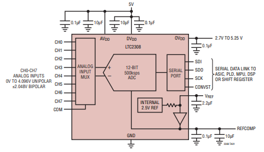
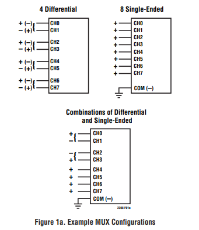

### (Or how to use the Cyclone V board's ADC - LTC2308)

---

## First of all...

The goal is to use the [ADC](https://www.analog.com/media/en/technical-documentation/data-sheets/2308fc.pdf) in the [Cyclone V dev board](https://www.digikey.pt/product-detail/en/terasic-inc/P0150/P0150-ND/4437934?utm_adgroup=Evaluation+Boards+-+Embedded+-+Complex+Logic+%28FPGA%2C+CPLD%29&mkwid=s0lPRfTCq&pcrid=294914797630&pkw=&pmt=&pdv=c&productid=4437934&slid=&gclid=Cj0KCQiAq97uBRCwARIsADTziyZ1LkkBkoJ1T5qDP-c0lC52miFpQGj6UNMtO8Wr7fuIuYmuFlnZ3VQaAjaJEALw_wcB) using [Quartus](https://www.intel.com/content/www/us/en/software/programmable/quartus-prime/overview.html) and Eclipse as software.

In order to start using the ADC, first, it is necessary to understand something about ADCs... In that case, let's start from the beginning.

## Analog to Digital Converter

ADC stands for Analog-to-Digital Converter and converts analog signals ("our world values", like voltage) into digital values ("computer world values", like binary values).

So, imagine that the analog signal is like a wave signal and the ADC needs to convert it, as precise as possible, to be readable at the microcontroller. Since the microcontroller only *reads* digital values, the ADC has the job to convert the signal from analog to digital and send it to the microcontroller, in order to be used in any kind of task.

Image from this [site](https://www.arrow.com/en/research-and-events/articles/engineering-resource-basics-of-analog-to-digital-converters#:~:text=ADCs%20follow%20a%20sequence%20when,its%20sampling%20rate%20and%20resolution.)

But how does it happen?

For each period, the signal is divided into some **samples** and within each **sample** there is a **resolution.** Let me explain... The ADC needs to **convert**, and so, in other words, needs to "redraw" the signal, as precise as possible. Therefore, to "redraw" the signal, the ADC needs to choose a couple of points within the signal to start drawing the new digital signal.

### Sample rate

To calculate the **sample rate**:

$$f_{s}=\frac{1}{T}$$

If $f_{s}$ is the **sample rate**, meaning the **sample frequency**, the **period** $T$ is the **period** of an individual **sample.**

In the image above, the period in which each sample triggers takes 0.05 seconds, or 50 milliseconds. Then $f_{s}$  is 20 Samples per second (S/s). This value feels small for a sample rate, but the original signal has a frequency of 1Hz, meaning the sample rate is 20 times bigger than the original signal, providing a acceptable reconstruction of the analog signal.

A rule to follow on this matter is the Nyquist Theorem. According to this theorem, the sample rate needs to be, at least, two times bigger than the original analog signal.

$$f_{Nyquist} \geq 2 \cdot f_{OriginalSignal}$$

Therefore, as stated before, the Nyquist Theorem and the image above, conclude that a higher sample rate allows the analog signal to be reconstructed into a digital signal in a better way.

### Resolution

Resolution is about precision. The bigger the resolution, the higher the precision. This is very important in very critical sensors, used in industry or automotive fields, but it is not a big deal in hobby usage. In short, the resolution is viewed as steps that is shown when a signal  is being reconstructed.

Image from this [site](https://www.arrow.com/en/research-and-events/articles/engineering-resource-basics-of-analog-to-digital-converters#:~:text=ADCs%20follow%20a%20sequence%20when,its%20sampling%20rate%20and%20resolution.)

To calculate the precision in terms of voltage, it is necessary to know the reference voltage and the resolution, then:

$$Step(V) = \frac{V_{reference}}{2^{Resolution}}$$

The Cyclone 5 board has Voltage Reference of 4.096V and the ADC has a 12-bit resolution. Then, the Step voltage is about 1mV.

## ADC LTC2308

Now that theory about ADCs is revisited, is possible to go deeper and analyse an ADC datasheet.

The [LTC2308](https://www.analog.com/media/en/technical-documentation/data-sheets/2308fc.pdf) is a 500kSps/12 bit ADC, which means that has a sample rate of 500 000 Samples per second with a resolution of 12-bit(!). This is amazing compared to the Arduino Uno (atmega328p) integrated ADC that has a sample rate of about 77kSps and a resolution of 10-bit, making the LTC2308 almost 7 times faster than the Arduino integrated one.

Layout of the LTC2308 ADC.

This ADC is controlled with a [SPI interfac](https://en.wikipedia.org/wiki/Serial_Peripheral_Interface)e and 8 channels, meaning it has 8 inputs.

The secret to control the ADC is stated, as obvious, inside the [datasheet](https://www.analog.com/media/en/technical-documentation/data-sheets/2308fc.pdf). In my case, I'm only interested in a *single-ended* configuration, as shown in the image below.

Types of configurations

The goal is to insert an analog signal into the CH0 and control the ADC through the FPGA.

As mentioned in the datasheet, the conversion is started when there is a rising edge on the **CONVST** input (cannot be restarted!). Between the conversion a 6-bit value is inserted into the **SDI** port to configure the operation mode.

6-bit input value that allows the configuration of the operation mode.

This 6-bit value follows a configuration table, as stated below:

While this 6-bit config value is shifted in, the data **from the previous conversion** is shifted out on **SDO**. After the 6-bit config value is shifted in, the ADC starts to acquiring the analog input at the input channels, getting ready for the next conversion. This phase takes a minimum time of 240ns.

According to the figure 9 of the datasheet, that is the regular behaviour of the SPI interface with the ADC. **CONVST** goes HIGH and then LOW to start a conversion, and $t_{CONV}$ is the time the conversion takes. Right when the conversion finishes, the **SDO** is filled with data (starting with B11) waiting to be shifted out. When the **SCK** starts *ticking*, data (6-bit config values) in **SDI** is shifted in and data (result of the previous conversion) in **SDO** is shifted out. Right after the sixth rising edge from **SCK** the $t_{ACQ}$ starts, meaning the ADC started the acquisition of the analog input signal (remember this time has to be higher than 240 ns for improved performance).

When the SCK reaches its 12 rising edge, the SDO has shifted out all the 12 bit from the ADC conversion. A next conversion may start when acquiring time is over.

## From the FPGA side...

Intel provides some examples and documentation about the LTC2308 and the FPGA.

In the manual of the [Cyclone V GX Starter Kit](https://www.intel.com/content/dam/altera-www/global/en_US/portal/dsn/42/doc-us-dsnbk-42-3812460810467-c5g-user-manual.pdf), right in the page 94, there is a section called "ADC Reading" which plans to demonstrate, step by step, how to connect and program the ADC through the FPGA using the Nios 2.

Image from the manual C5V

From their *demo,* almost everything is done in Platform Designer. This might be tricky is the user is not experienced with Quartus software. Therefore, I will try to explain as better as possible.

Platform Designer exists so the work around FPGA development is easier. Instead of *coding* in VDHL or Verilog, Platform Designer allows the user to pick from numerous **Intellectual Properties** (IPs) and  to only care about the IPs' connections with each other.

In this case, from a numerous list of IPs, it is necessary to pick a **processor** (Nios 2), **memory** (On-Chip Memory), **JTAG** connection, a **PLL** and a **ADC controller**. Everything else is done or used outside the Platform Designer.

**Nios2** + **on-chip memory** duo is necessary to code **C** inside the FPGA using the Eclipse tools. **JTAG** allows the user to communicate with the FPGA through the computer, and so, program the FPGA. The **PLL** is necessary to establish the ADC SCK to 40Mhz, since it doesn't work with higher frequencies and the original FPGA clock is 50Mhz and to introduce a delayed clock to fix **ADC controller** delay. At last, the **ADC controller** is a level shift as an Avalon MM Slave.

> (...) the SPI signals are delayed when going through the level shift. To correct the delay, we used PLL to generate two clock output for the ADC Controller, one for write path, the other shifted clock for read path.

Hardware connection between FPGA and ADC (ADC controller)

## Quartus Side + Platform Designer

Start by adding the IPs and the Platform Designer window should look like this:

The connections need to be done manually but the addresses can be assigned by clicking in "Assign Base Addresses". This option assigns addresses to each IP and makes sure there is no collisions.

Assign Base Addresses option

Aside from this, we should start by assign the clocks of the system - therefore, it is necessary to use **clk** and **PLL** IP core. The **clk_in** is connected to a 50MHz clock and this value will be the reference clock of the **PLL** connected to **clk**.

If **clk** is a 50MHz clock, **refclk** is 50MHz as well. Now, it is important to create other clocks that were stated above:

- SCK clock (**outclk0**)
- SCK delayed clock (**outclk1**)

PLL parameters

Apart from these two, another one is created - **outclk2** - working at 100MHz and connected to the rest of the system, stating that the system works at 100MHz instead of the input 50MHz.

System working at 100MHz from **outclk2**

When the time related IPs are connected, it is recommended to connect the duo **Nios2 + on-chip memory.** After the connections are made, it is necessary to change the parameters from both.

The **Nios 2 IP** core, in the Vectors section, must have the vectors selected with the memory slave. In this case is **memory.s1**

Nios 2 IP core parameters

In the **On-chip memory IP** core, the memory should be changed according the project requirements and the board constraints. The board I'm using has 610.5 Kbytes of embedded memory, so I could go as far as that. I choose to use only 131.072 Kbytes.

on-chip memory IP parameters

The **ADC controller** is connected to the three available clocks from the PLL. Remember that the SPI interface of the ADC works at 40MHz (**clock_sink_adc**), and one of the clocks must introduce a delay to fix the delay introduced in the level shift (**clock_sink_adc_delay**).

The **systemID** IP core is used to confirm that the FPGA compiled is the same being programmed in Eclipse. From the Intel documentation it is stated as:

> The system ID core with Avalon interface is a simple read-only device that provides Platform Designer systems with a unique identifier. Nios II processor systems use the system ID core to verify that an executable program was compiled targeting the actual hardware image configured in the target FPGA. If the expected ID in the executable does not match the system ID core in the FPGA, it is possible that the software will not execute correctly.

The other IP cores, like **JTAG** and **PIO** are used with the default configurations.
