### Introduction

One of my [2022 goals](year-2021-recap.md) was to _create_ something - a product or a service. Since then, I've been working on a personal, portable and small **smoke extractor**.

I started learning about [DC/DC Boost Converters](boost-converter.md) when I noticed the fans that required more power were not supplied with 5V, they were, instead, supplied with 12V or 24V. This finding pushed me into learning about boost converter's hardware design and requirements which would lead to my end goal.

### Design and challenges

After learning about the boost converters, the design part was the _next big thing_. Designed the entire case and tried to keep a minimalist look while minimizing any empty spot and creating a solid aesthetic object.

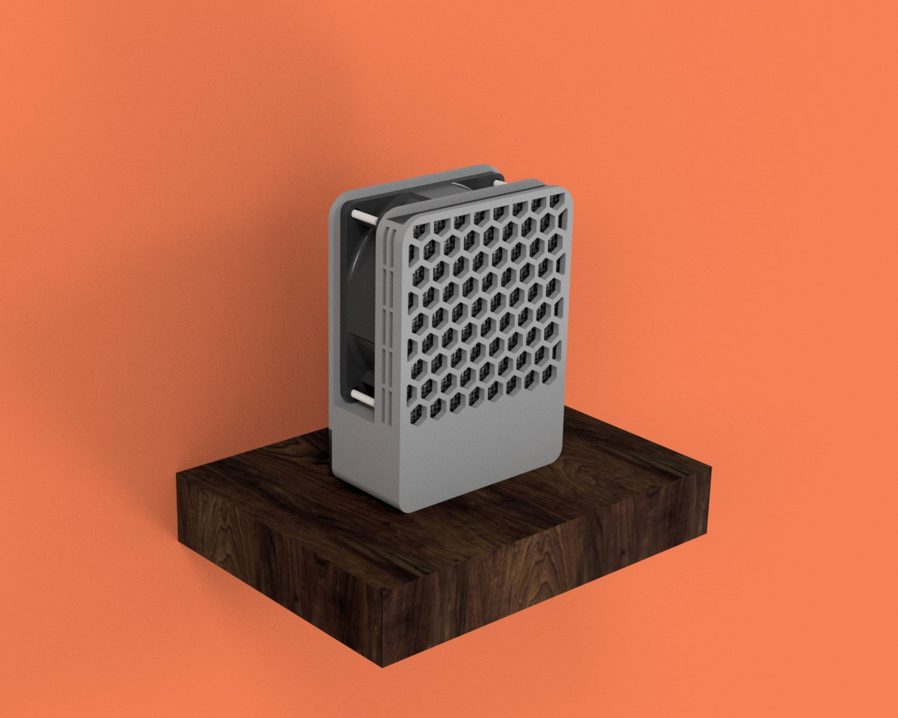

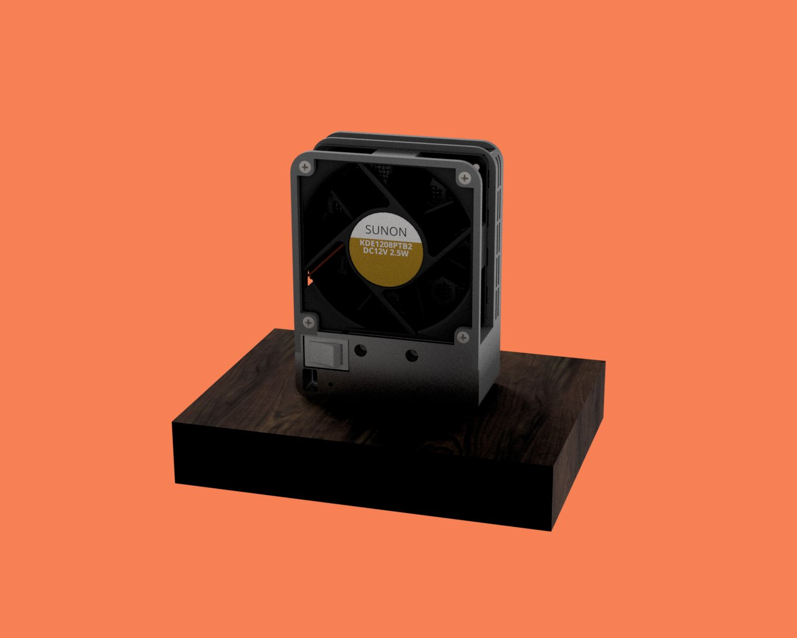

The renders above are from my the first attempt to finish the design. And, as always tends to happen, the design was far from finished. My first idea was to split the case in two:

- the front, which would take the pcb and the smoke filter.
- the back, which would act like a lid and would have some screws to attach the design together.

After the first printing attempt, I realized right away this was not the best idea - the front part was hard to print, specially on the side part where the smoke extractor is (even with printed supports, the print had a bad quality). Therefore, the solution was to split the design in three parts, adding a middle layer which holds both front and back together.

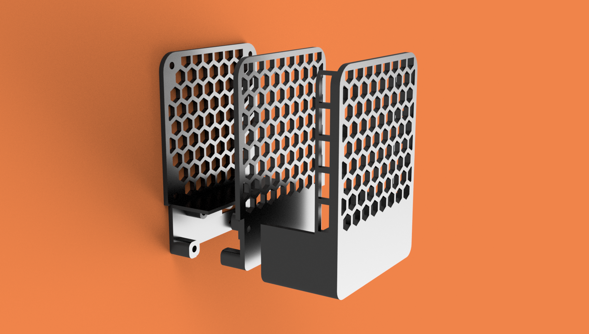

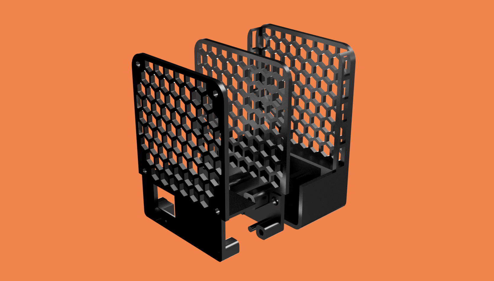

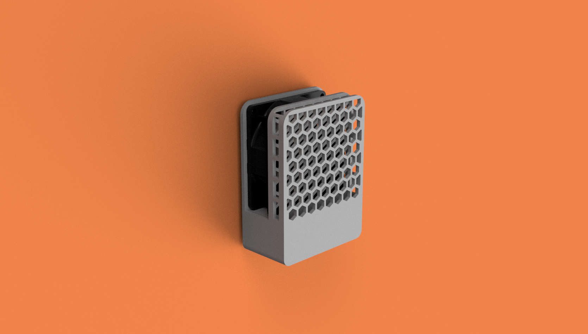

Also, if you were attentive, you could notice the back from the first renders didn't have the honeycomb pattern. The older back was way too weak and was causing the fan to bend backwards, mainly caused by the screws force on the bottom. The new back is robust enough.

### One smart fool
Until this point, the project looks awesome, right? I thought so. However, this project was (and is) supposed to be open-source but there are no files or documentation about it. Let me explain.

I've started this project with the [boost converter PCB](boost-converter.md), but eventually I aimed for more - I wanted to learn more about electronics and PCB design. Something which started to be a single boost converter board that would convert 5V to 12V, became a _battery-powered-charged-converter-from-3.7V-or-5V-to-9V-or-12V_ - **complex enough**.

I lost the motivation right away. Every right step, every successful design, I would add more complexity in each of them.

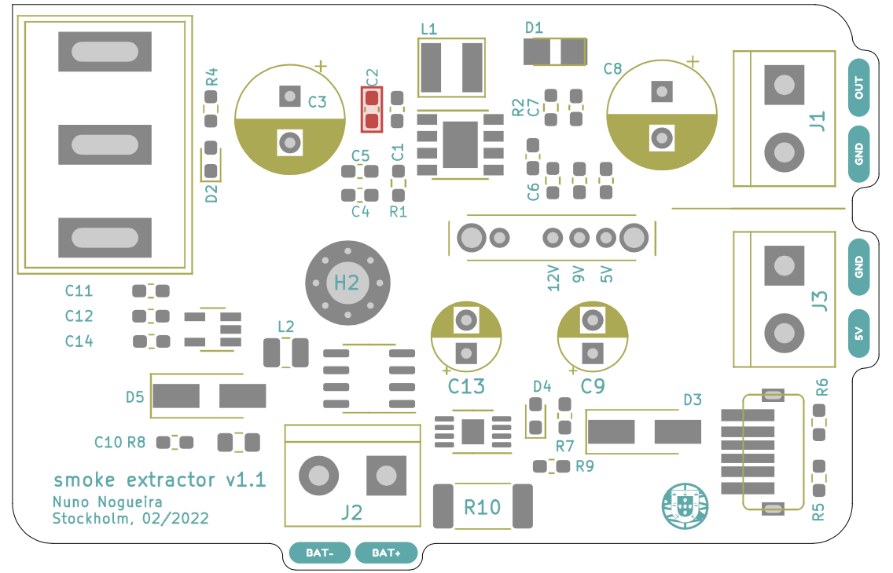

My worst enemy was no one but myself. Realized this when the design, together with the single boost board PCB, turned out to be an amazing prototype. However, as I had already added more complexity on top of it, no longer had the files to share.

In my opinion, **Albert Einstein** described this problem accurately:

> _Any intelligent fool can make things bigger, more complex, and more violent. It takes a touch of genius - and a lot of courage - to move in the opposite direction._

It is time to have this touch.

### Supply chain and product improvements saved me from self disappointment

Supply chain issues are usually very bad thing and everyone working at a tech company knows what I am talking about. This could be my case if I didn't have to redesign everything from scratch anyway.

Turns out, [the boost converter I have been using the whole time](https://www.digikey.se/en/products/detail/diodes-incorporated/PAM2421AECADJR/4033256), is, for everyone's surprise, out of stock. It _sucks_!... but, comes in the right time as well!

Let's also take this chance to look back and to polish the prototype edges.

### Electrical issues

As for today, the product, in order to work correctly, needs to **draw around 600mA at 5V**. This might change with the next boost converter chip, but this is a good starting point to aim for **80% of efficiency**.

600mA, at most of the USB default ports, is already too much, since most of the USB default ports can only provide current from 100mA to 500mA. When I connected the smoke extractor, fully assembled, to my computers USB dock, it was causing my desk light (also powered by the same dock), to flicker every half a second. Something was not right, pretty obvious huh!

To know more about this issue, I created a post on [Reddit](https://www.reddit.com/r/AskElectronics/comments/vs3w11/question_about_current_draw_from_usb_hub_and/). I wanted to know exactly what was happening and what was I missing. Luckily, an amazing person decided to help me and explain why my desk lamp was flickering:

> Probably overcurrent detection triggering, then resetting and waiting a reasonable time for inrush current to finish before triggering again.

Easy explanation, thanks [triffid_hunter](https://www.reddit.com/user/triffid_hunter/)!

As I was reading his explanation, I knew this had to be fixed. How could I fix this?

Nevertheless, this might not be the problem I think it is. The next board will be battery powered and charged through USB-C. Its normal operation does not include the USB-C input to be the main source power.

<!-- ### USB Battery Charging Specification

In short, these are the differences:

- **SDP (Standard Downstream Port)**: the _usual_ type of USB port in your computer. Outputs 100mA (when not configured) to 500mA (when configured).
- **CDP (Charging Downstream Port)**: also used in some computers but more advanced than SDP. Able to output more than 500mA.
- **DCP (Dedicated Charging Port)**: not capable to enumerate (no data). Used normally in wall-chargers. Able to output more 500mA.

As seen above, **only the CDP and the DCP type match the project current requirements**. Therefore, the next step is to find how to identify these types and distinguish them from the SDP.

**This is what we need now**:

(For non USB-C)

- The portable device **D+ line** should be able to **output between 0.5 and 0.7V** to the dedicated charging port. Use a voltage divider with the USB power input as the supply.

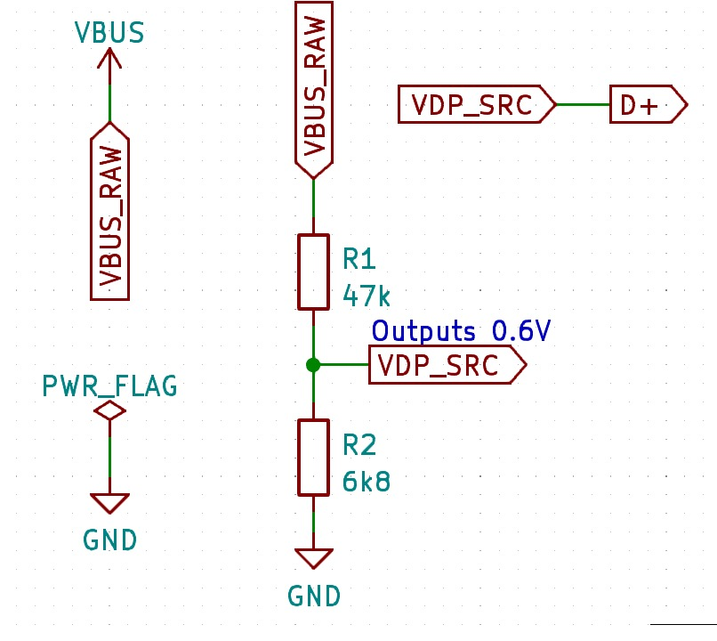

- The portable device **D- line** should be able to **sink between 25 to 175$ \mu $A**. Use a 47k resistor on the comparator inverting terminal.

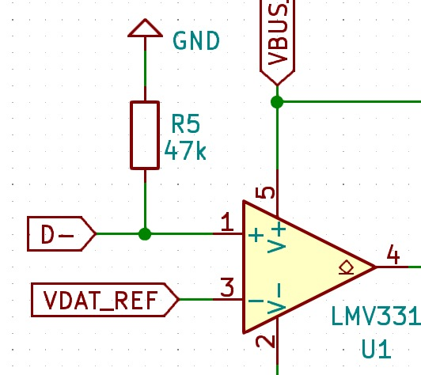

- A [comparator](https://www.diodes.com/assets/Datasheets/LMV331_393.pdf) with a pull-up resistor on the output, to grant a logic behaviour. Use a 4.7k resistor.

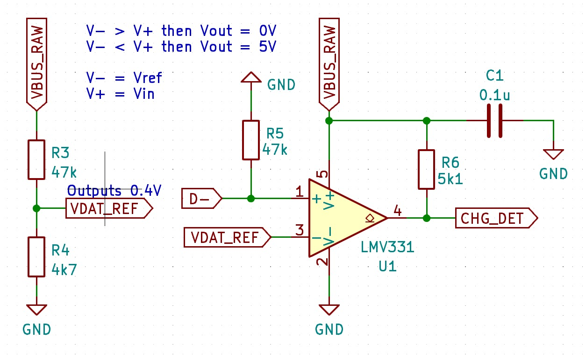

How to indentidy the **Dedicated Charging Port**:

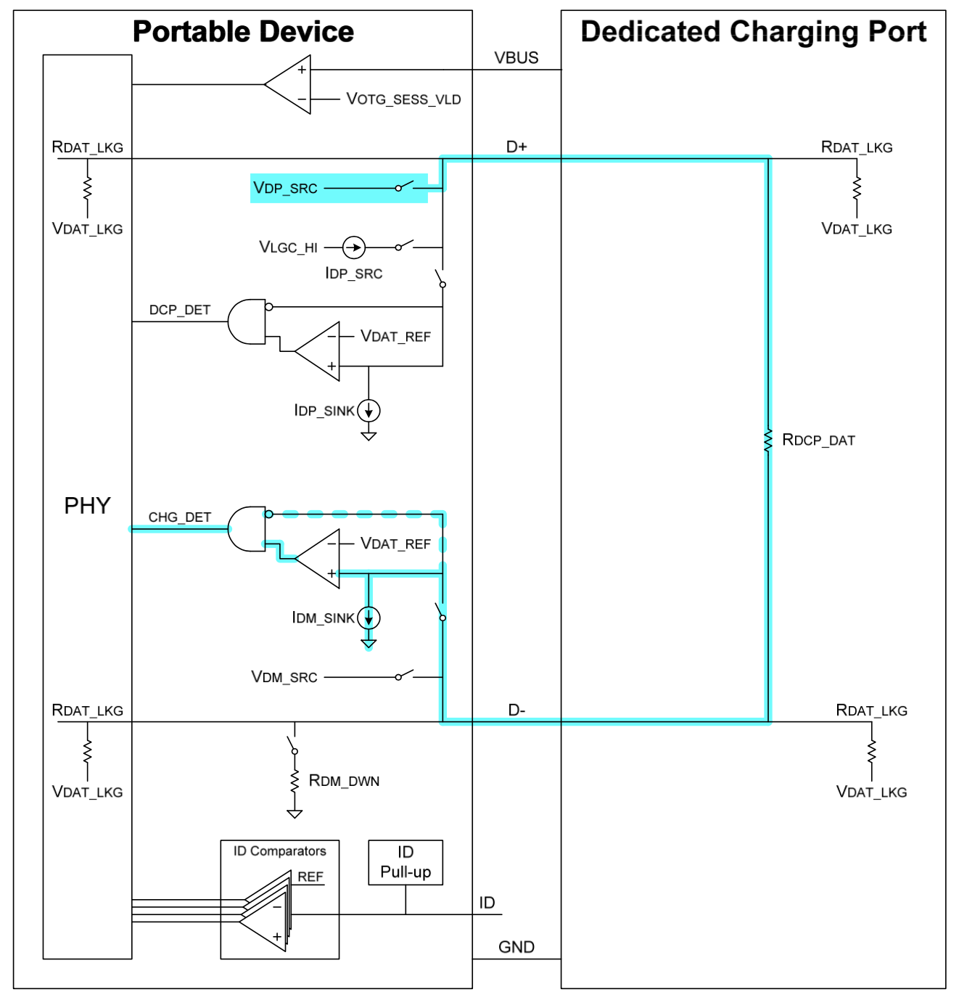

If the input voltage at the non-inverting terminal of the comparator is higher the the reference voltage (let's aim for 0.4V, since D+ line outputs 0.5 to 0.7V), then the comparator will output 5V. If this happens, we know the **portable device is not connected to a SDP**.

(For USB-C)

- One comparator (one for each **CC line**) with a pull-up resistor on the output, with the same goal as the previous one. Use a 4.7k resistor.

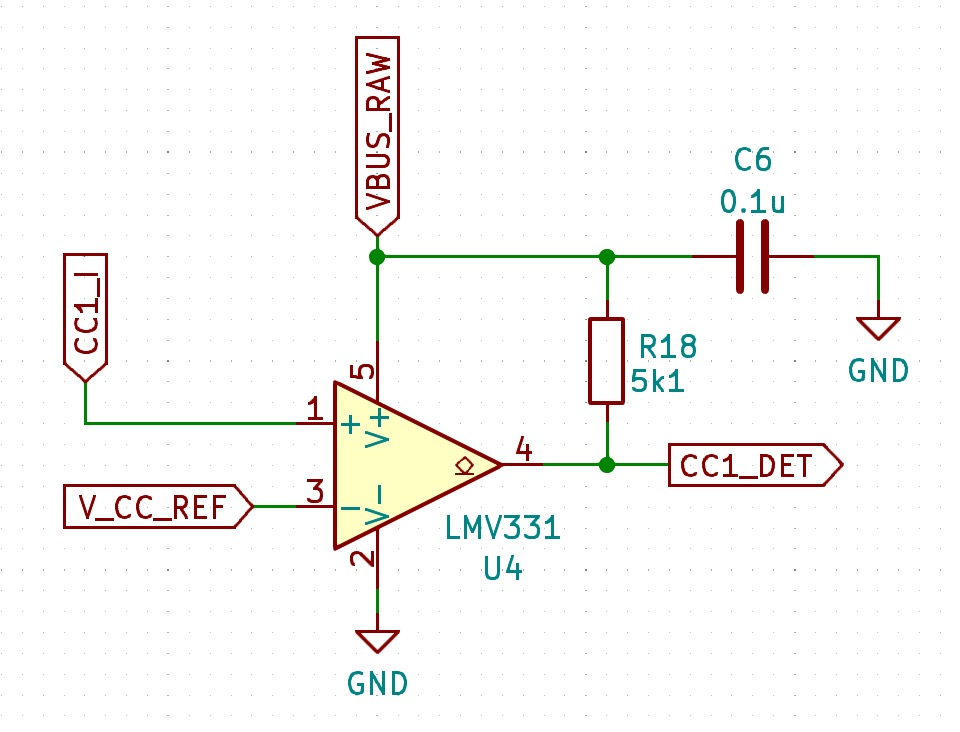

For USB-C we need to check both lines - **CC1** and **CC2**. They both need a 5.1k resistor connected to ground as usual.

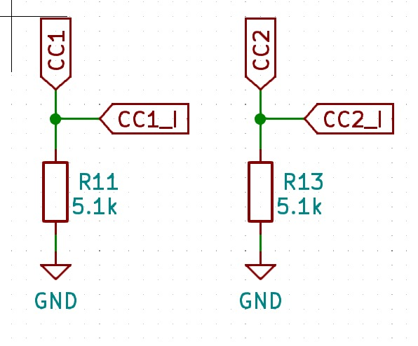

CC Pin voltage ranges:

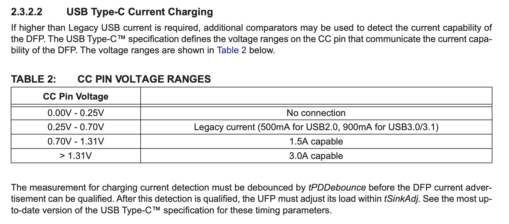

If the input voltage at the non-inverting terminal of the comparator is higher the the reference voltage (let's aim for 0.7V, since above this threshold, the port is capable of drawing 1.5A), then the comparator will output 5V. If this happens, we know the **portable device is not connected to a SDP**.

(For both)

- **Three diodes** to create a **OR logic circuit** in regard of the output of each of the comparators.
- One **[5V logic MOSFET](https://www.diodes.com/assets/Datasheets/ZXMN3F30FH.pdf)** that is connected with the OR diode circuit to its the gate.

If you are interested to know more, to check the design schematics or to contribute for the project, you can always check the [project's repository in Github](https://github.com/nguterresn/smoke-extractor/tree/master/pcb/smoke_extractorV1_1).

### Issues with version 1.1 and fixes for the version 1.2

Once I got the version 1.1 PCB in the mail, I noticed two things:

- I ordered the wrong size of comparators ([SOT-25](https://www.torexsemi.com/file/SOT-25/SOT-25-pkg.pdf) instead of SOT-753).
- The power switch circuit based on the n-channel MOSFET was entirely wrong.

Since I already ordered the comparators, I changed the footprint of them to fit into the SOT-25 package.

To fix the power switch circuit, I changed the previous circuit to the following:

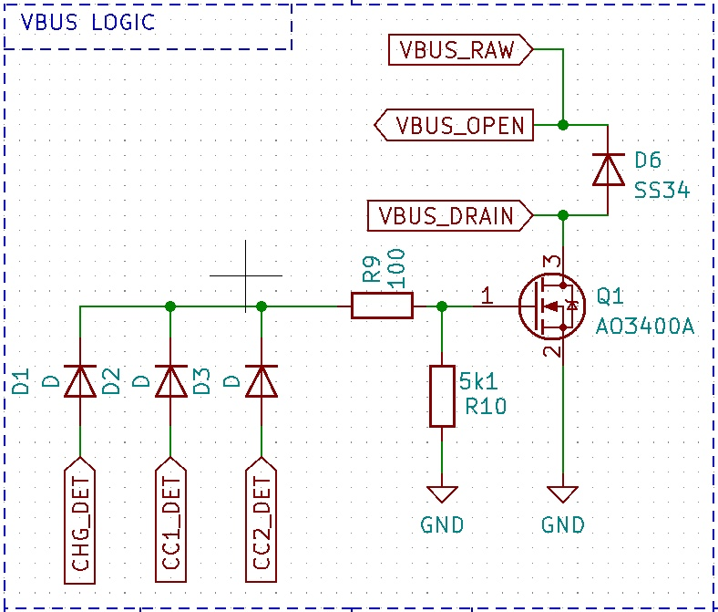

The fix is based on the [same approach as powering a motor using a MOSFET](https://www.nexperia.com/applications/interactive-app-notes/IAN50004_using-power-MOSFETs-in-DC-motor-control-applications.html).

### Nothing is always as we imagine

When I received this last version, 1.2, I've noticed my understading about the USB battery specifications was still very light and limited. To check whether the device was connected to a DCP or a CDP, I measured the voltage at D+, D-, CC1 and CC2 from a cable (USB-A to USB-C) from USB charging hub. These are the results:

- *D+*: 0.617V
- *D-*: 0V

D+ is, indeed, according to what I've expected (from 0.5 to 0.7V), but D- is completely wrong. D- should have been close to the D+ voltage.
I opened the `Battery Charging Specifications` again just to realize: the board has no battery (yet), so this document is not even meant for this kind of application.
And again - just as any other human being - I'm over thinking. If the future goal is to eventually add a battery to power the circuit, why not add it already, use a specific manufacturer battery charging chip that handles all these previous cases? -->

### Next changes on version 2.0

For the version v2.0, if I'm even allowed to call it that, the smoke extractor will include a lithium 18350 battery, the charger circuit and consecutive safety circuit (discharge, overcharge, etc) and a battery level button followed by some tiny lights to return feedback to the user.
Addionally, will add the option to purchase the Bill of Materials straight from [JLCPCB](https://jlcpcb.com/parts).

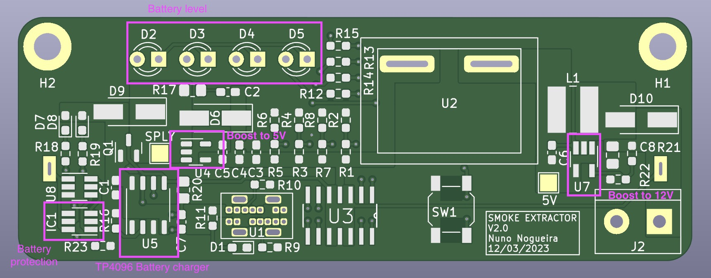

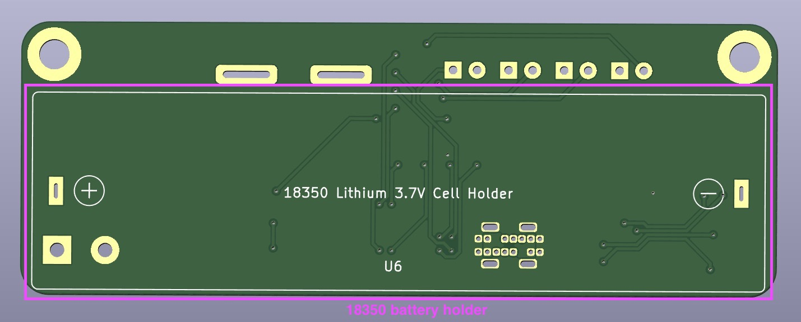

### Version 2.05

Two boost converters is stupid — single boost converter approach. USB-C can only charge. SMD button was from a really bad quality (hard to click), replaced by a classic TH 6x6mm. 3mm LEDs are a waste of space, current and money, replaced by simple 0603 SMD ones.

