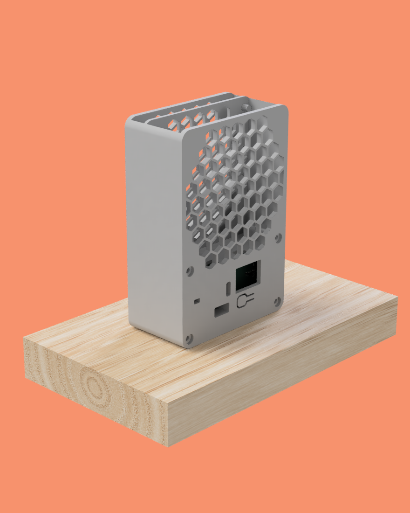

### Introduction

One of my [2022 goals](year-2021-recap.md) was to _create_ something - a product or a service. Since then, I've been working on a personal, portable and small **smoke extractor**.

I started learning about DC/DC Boost Converters when I noticed the fans that required more power were not supplied with 5V, they were, instead, supplied with 12V or 24V. This finding pushed me into learning about [boost converter's hardware design](boost-converter.md) and requirements which would lead to my end goal.

### Design and challenges

After learning about the boost converters, the design part was the _next big thing_. Designed the entire case and tried to keep a minimalist look while minimizing any empty spot and creating a solid aesthetic object.

The renders above are from my the first attempt to finish the design. And, as always tends to happen, the design was far from finished. My first idea was to split the case in two:

* the front, which would take the pcb and the smoke filter.
* the back, which would act like a lid and would have some screws to attach the design together.

After the first printing attempt, I realized right away this was not the best idea - the front part was hard to print, specially on the side part where the smoke extractor is (even with printed supports, the print had a bad quality). Therefore, the solution was to split the design in three parts, adding a middle layer which holds both front and back together.

Also, if you were attentive, you could notice the back from the first renders didn't have the honeycomb pattern. The older back was way too weak and was causing the fan to bend backwards, mainly caused by the screws force on the bottom. The new back is robust enough.

### Version 1.0

The first MVP was created, the version 1.0 of the smoke extractor.

Following changes involve turning the smoke extractor a portable device.

### One smart fool

Until this point, the project looks awesome, right? I thought so. However, this project was (and is) supposed to be open-source but there are no files or documentation about it. Let me explain.

I've started this project with the [boost converter PCB](boost-converter.md), but eventually I aimed for more - I wanted to learn more about electronics and PCB design. Something which started to be a single boost converter board that would convert 5V to 12V, became a _battery-powered-charged-converter-from-3.7V-or-5V-to-9V-or-12V_ - **complex enough**.

I lost the motivation right away. Every right step, every successful design, I would add more complexity in each of them.

My worst enemy was no one but myself. Realized this when the design, together with the single boost board PCB, turned out to be an amazing prototype. However, as I had already added more complexity on top of it, no longer had the files to share.

In my opinion, **Albert Einstein** described this problem accurately:

> _Any intelligent fool can make things bigger, more complex, and more violent. It takes a touch of genius - and a lot of courage - to move in the opposite direction._

It is time to have this touch.

### Supply chain and product improvements saved me from self disappointment

Supply chain issues are usually bad thing and everyone who is working at a tech company knows what I am talking about. This could be my case if I didn't have to redesign everything from scratch anyway.

Turns out, [the boost converter I have been using the whole time](https://www.digikey.se/en/products/detail/diodes-incorporated/PAM2421AECADJR/4033256), is, for everyone's surprise, out of stock. It _sucks_!... but, comes in the right time as well!

Let's also take this chance to look back and to polish some edges.

### Version 2.0

The [version 1.0](#version-10) worked great.

The version 2.0 will include:

* A lithium 18350 battery.
* A charger circuit and respective safety circuit (discharge protection, overcharge protection etc).
* A battery level indicator.

Addionally, will add the option to purchase the Bill of Materials straight from [JLCPCB](https://jlcpcb.com/parts).

The lithium battery will be placed on the PCB back and will be soldered likewise.

### Version 2.05

There were some changes since the [version 2.0](#version-20), but mostly just small improvements.

I've changed the design a bit. It covers the fan completely and makes the enclosure slightly more sturdy.

Two boost converters is stupid — single boost converter approach. USB-C can only charge. SMD button was from a really bad quality (hard to click), replaced by a classic TH 6x6mm. 3mm LEDs are a waste of space, current and money, replaced by simple 0603 SMD ones.

### Version 2.06

Previous version had an issue with the battery indicator — it would only work if the battery was charging. That's just a terrible UX.

After researching for a bit, [here](https://www.instructables.com/Li-Ion-battery-level-indicator/) and [there](https://www.youtube.com/watch?v=rZq2v7two1s), I've applied the following circuit:

The circuit below has 1 Red LED, 1 Yellow LED and 2 Green LEDs. The Red LED has a voltage drop of $2.3V$ which allows the circuit to have a _stable_ voltage to measure the battery against. The rest of the circuit follows two rules: the comparator and the voltage divider.

A comparator outputs 1 if the $V_{+}$ is higher than the $V_{-}$.
Afterwards, I just had to come up with a window of values between 0 and $2.3V$ which would fit well within the values of the $V_{-}$ voltage divider, between $1.32V @ 3.2V$ and $1.72V @ 4.2V$.

The resistor values might not be _ideal_ but I prefer to optimize the number of different resistors I need. This will reduce the BOM cost and the time it takes to assemble the board.

After holding it for a bit, I didn't like the [previous enclosure for the smoke extractor](#version-205). The fact that I could harm myself while trying to hold it, made me hate the design. I should be able to use with comfort.

I've added back the [original back part](#design-and-challenges).

### The end

The [previous iteration](#version-206) represents the final revision of the board. I do not intend to make further revisions beyond this point. It has been more than one year since I've started working on this, with a few breaks in the middle.
Overall, I've learned a lot. Not only skill wise but also about planning and organization. Planning is key and simplicity helps — it can save so much time.
I made this for myself, but I hope someone can look at this product and find it useful.
