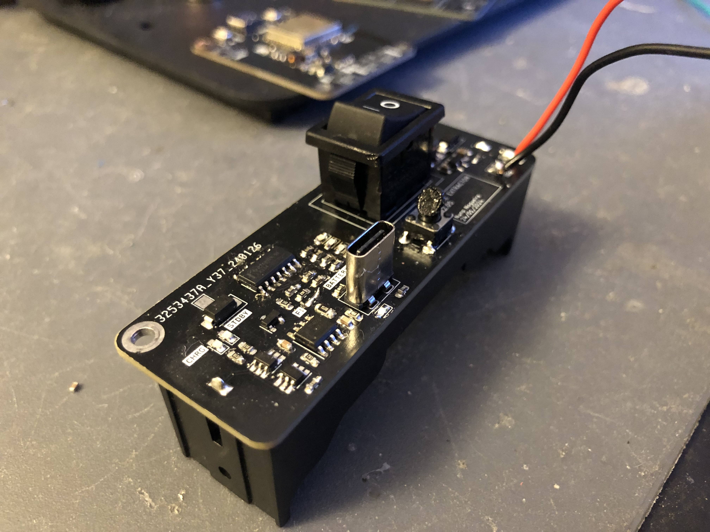

### Introduction

One of my [2022 goals](year-2021-recap.md) was to _create_ something - a product or a service. Since then, I've been working on a personal, portable and small **smoke extractor**.

> [!info] Before you continue reading
>
> If you came here looking how to build the smoke extractor, [skip the explanation and check how to do it youself.](#do-it-yourself)

I started learning about DC/DC Boost Converters when I noticed the fans that required more power were not supplied with 5V, they were, instead, supplied with 12V or 24V. This finding pushed me into learning about [boost converter's hardware design](boost-converter.md) and requirements which would lead to my end goal.

### Design and challenges

After learning about the boost converters, the design part was the _next big thing_. Designed the entire case and tried to keep a minimalist look while minimizing any empty spot and creating a solid aesthetic object.

The renders above are from my the first attempt to finish the design. And, as always tends to happen, the design was far from finished. My first idea was to split the case in two:

* the front, which would take the pcb and the smoke filter.
* the back, which would act like a lid and would have some screws to attach the design together.

After the first printing attempt, I realized right away this was not the best idea - the front part was hard to print, specially on the side part where the smoke extractor is (even with printed supports, the print had a bad quality). Therefore, the solution was to split the design in three parts, adding a middle layer which holds both front and back together.

Also, if you were attentive, you could notice the back from the first renders didn't have the honeycomb pattern. The older back was way too weak and was causing the fan to bend backwards, mainly caused by the screws force on the bottom. The new back is robust enough.

### Version 1.0

The first MVP was created, the version 1.0 of the smoke extractor.

Following changes involve turning the smoke extractor a portable device.

### One smart fool

Until this point, the project looks awesome, right? I thought so. However, this project was (and is) supposed to be open-source but there are no files or documentation about it. Let me explain.

I've started this project with the [boost converter PCB](boost-converter.md), but eventually I aimed for more - I wanted to learn more about electronics and PCB design. Something which started to be a single boost converter board that would convert 5V to 12V, became a _battery-powered-charged-converter-from-3.7V-or-5V-to-9V-or-12V_ - **complex enough**.

I lost the motivation right away. Every right step, every successful design, I would add more complexity in each of them.

My worst enemy was no one but myself. Realized this when the design, together with the single boost board PCB, turned out to be an amazing prototype. However, as I had already added more complexity on top of it, no longer had the files to share.

In my opinion, **Albert Einstein** described this problem accurately:

> _Any intelligent fool can make things bigger, more complex, and more violent. It takes a touch of genius - and a lot of courage - to move in the opposite direction._

It is time to have this touch.

### Supply chain and product improvements saved me from self disappointment

Supply chain issues are usually bad thing and everyone who is working at a tech company knows what I am talking about. This could be my case if I didn't have to redesign everything from scratch anyway.

Turns out, [the boost converter I have been using the whole time](https://www.digikey.se/en/products/detail/diodes-incorporated/PAM2421AECADJR/4033256), is, for everyone's surprise, out of stock. It _sucks_!... but, comes in the right time as well!

Let's also take this chance to look back and to polish some edges.

### Version 2.0

The [version 1.0](#version-10) worked great.

The version 2.0 will include:

* A lithium 18350 battery.
* A charger circuit and respective safety circuit (discharge protection, overcharge protection etc).
* A battery level indicator.

Addionally, will add the option to purchase the Bill of Materials straight from [JLCPCB](https://jlcpcb.com/parts).

The lithium battery will be placed on the PCB back and will be soldered likewise.

### Version 2.05

There were some changes since the [version 2.0](#version-20), but mostly just small improvements.

I've changed the design a bit. It covers the fan completely and makes the enclosure slightly more sturdy.

Two boost converters is stupid — single boost converter approach. USB-C can only charge. SMD button was from a really bad quality (hard to click), replaced by a classic TH 6x6mm. 3mm LEDs are a waste of space, current and money, replaced by simple 0603 SMD ones.

### Version 2.06

Previous version had an issue with the battery indicator — it would only work if the battery was charging. That's just a terrible UX.

After researching for a bit, [here](https://www.instructables.com/Li-Ion-battery-level-indicator/) and [there](https://www.youtube.com/watch?v=rZq2v7two1s), I've applied the following circuit:

The circuit below has 1 Red LED, 1 Yellow LED and 2 Green LEDs. The Red LED has a voltage drop of $2.3V$ which allows the circuit to have a _stable_ voltage to measure the battery against. The rest of the circuit follows two rules: the comparator and the voltage divider.

A comparator outputs 1 if the $V_{+}$ is higher than the $V_{-}$.
Afterwards, I just had to come up with a window of values between 0 and $2.3V$ which would fit well within the values of the $V_{-}$ voltage divider, between $1.32V @ 3.2V$ and $1.72V @ 4.2V$.

The resistor values might not be _ideal_ but I prefer to optimize the number of different resistors I need. This will reduce the BOM cost and the time it takes to assemble the board.

After holding it for a bit, I didn't like the [previous enclosure for the smoke extractor](#version-205). The fact that I could harm myself while trying to hold it, made me hate the design. I should be able to use with comfort.

I've added back the [original back part](#design-and-challenges).

### Challenges

It is possible to split the challenges into two types: PCB Design and CAD Design. In neither of them I'm excellent and this project has forced me into learning more and get better at designing.

As seen in the [first CAD design](#design-and-challenges), the enclosure is small and compact; the PCB fits perfectly below the fan. I wanted to keep this compactness a portable-battery-powered smoke extractor. In order to do this, I had to find a way to fit the 18350 battery holder, the USB-C Header and the Rocket switch in the same PCB. It sounds easy, but most of the PCB surface is covered with something in both sides, so through-hole components become a _no-go_ in most of the cases.

Because it is easier and cheaper, most of the USB-C connectors are horizontal. Due to the space contraints, I had to take a [vertical USB-C connector](https://www.lcsc.com/product-detail/USB-Connectors_Korean-Hroparts-Elec-TYPE-C-31-M-15_C223908.html), design the symbol and its footprint.

Second , the Rocket switch pins couldn't touch the lithium battery holder. Again — not so popular nor cheap — I had to find a [rocket switch](https://www.lcsc.com/product-detail/Rocker-Switches_ALPSALPINE-SDDJE10700_C358626.html) possible to fit in the same PCB as the battery holder.

Regarding the PCB design, these were the two biggest challenges. When it comes to CAD design I had to learn how to manage multiple bodies in the same project.
It does take a bit of time, but once all the bodies are in the same project, the design develops smoothly.

### Lessons

* Plan a MVP: a MVP needs X, do not add Y. Schedule X.
* Minimize the number of revisions, keep it simple. Don't 'try' revisions, create revisions only if needed, otherwise finish the project.
* While designing the PCB, minimize the amount of different components: instead of using 4k7 annd 5k1 resistors, use only 5k1 instead (when possible). Reduces the assembly time.
* Use [LCSC](https://www.lcsc.com) instead of Digikey. It is cheaper and KiCad has plugins to integrate JLCPCB and LCSC into it. Each component has an ID and that's it. Generate BOM and order in seconds.

### The end

The [previous iteration](#version-206) represents the final revision of the board. I do not intend to make further revisions beyond this point. It has been more than one year since I've started working on this, with a few breaks in the middle.
Overall, I've learned a lot. Not only skill wise but also about planning and organization. Planning is key and simplicity helps — it can save so much time.
I made this for myself, but I hope someone can look at this product and find it useful.

### Do it yourself

The entire project is open-source. You can find it [here](https://github.com/nguterresn/smoke-extractor).

Below is a list of what you need. Let's start with the PCB:

* Take the [Bill of Materials](https://github.com/nguterresn/smoke-extractor/blob/master/pcb/1v1/jlcpcb/production_files/BOM-smoke_extractorV1_1.csv) and order from [LCSC](https://www.lcsc.com).
* Take the [compressed gerber files](https://github.com/nguterresn/smoke-extractor/blob/master/pcb/1v1/jlcpcb/production_files/GERBER-smoke_extractorV1_1.zip) and order the PCB from [JLCPCB](https://jlcpcb.com)

To 3D print the [enclosure](https://github.com/nguterresn/smoke-extractor/tree/master/stl/1v1), I would recommend to print it vertically with supports only where the PCB fits and at the top.

* You can find the files for the enclosure at [Thinginverse](https://www.thingiverse.com/thing:6496883) or on the [repository](https://github.com/nguterresn/smoke-extractor/tree/master/stl/1v1).
* You can find the sliced model and ready to print file for BambuLab printers here.

And finally, necessary items you can find in Amazon:

* Buy the Fume's filter. I took a [filter used on cat litter boxes](https://www.amazon.se/gp/product/B07WJ1Y1CH/ref=ppx_yo_dt_b_asin_title_o08_s00?ie=UTF8&psc=1) and trimmed it to 80x80mm.
* Buy a [80x80x25mm 12V fan](https://www.amazon.se/-/en/1-06W-80x80x25mm-56-1m³-2600U-EE80251S31000U999/dp/B07ZBNZQ2S/ref=sr_1_3?crid=MVLR8KCZBU2A&dib=eyJ2IjoiMSJ9.yyIoiUBXEqPdx7PXhLvxQ6DgrM7XN99XWWnRf-wjLIC2jV-B3UQ4XywT_NGIYMAKHvOpfRhJtW1-Edui-ORV4xDNA9OV7_BThwgb9X33OIwgTvXAGk9CamoQANMFjjYQfQlXwd1fQ9uBfTSz37shrT1HXBxxIDawscOyjEqbqhflptzGCS32OoU-07Krv_tXsq_2aFJ8kRP7iFG2Fm3--l_kvcWPGcEGKE2OmgzGbOBmr5wPGlOs1hTMt8ZC6lYbEhc1kAilJPhcBsXh4ESUahyO5wKTHMeF1VTbrVZGBB4.kkiZ6oj-aX831UgWn2JdLQOQZ6zxw4aFCHIgBYpVpvM&dib_tag=se&keywords=fan+80x80+12v&qid=1708787756&sprefix=fan+80x80+12v%2Caps%2C92&sr=8-3). Any fan should suffice (as long as is within 80x80x25mm), however some fans are specially built for increased air flow and low noise, such as [Noctua ones](https://www.amazon.se/-/en/Noctua-NF-R8-Redux-1800-PWM-performance/dp/B00KF7MVI2/ref=sr_1_3?crid=1FC5ZC8PZ4Y1V&dib=eyJ2IjoiMSJ9.nR2-oZtf9V-GN4B_sLLcsZsVkm8SOGSnasAzNeWOD6hcB3mSpQLWiwCVTJMJFPlbKCy_ke6oPzXiC_dCjItMRWk4W2Ovn52BVgXElBXkFmTP6l7XVI3kmm0ca1A7RbpRjykKHF7tixTPcCfjPfQAZWGbW_Z9oki_9TZgYak1CsVwYHUm23W-Hg3x731fiD-MuwIXEwUoA63P653yK8mSEY_l5Cigo0ODth0iAE_t3bkkZqnOJmHH7ZiWD8j_RxoCN1rxiMu7Us7g22hvU4B-fkI_2iGjdmFk5K9EcHZOC7k.gXca1K5ZeESalsrob-K74d8LU7yIyzcaKxv8FWTVuFg&dib_tag=se&keywords=noctua+80mm&qid=1708787907&sprefix=noctua+80m%2Caps%2C99&sr=8-3).
* Buy a [18350 battery holder from Amazon](https://www.amazon.se/-/en/3-7V-18650-Battery-Plastic-Storage/dp/B07MM1NHHL/ref=sr_1_3?crid=2S11BRPI1SFDN&dib=eyJ2IjoiMSJ9._ZvHPBCAkFADy9zm7AwcSj7BRWLtre4sQFriTdwADeFz38LD4PHVUqlo92Mr_qlHYvC9n_Wa976J5boEqPog5omuMcZvPQ4p1LHz4h0jg6txf33FL-gPQxLrHZZhL4yq8NlFmkt63MQLfnwRS_1h4xymLn59qeygErN50ODLHJ0hU8t5k7_wpVhyZUxli8YBID3BzOhYgPiTP1B--dGFmmnfPB8NTCn6rncl5h0IL3-LFAp2EmgDpC0F7w4vtddbEfQfdrLjZNarntx32AIs1I1Aa09CHDQLrP6kLzb9kvw.BXkkd7rySFMaa2OdXrMOJ7WG7TBaLJAFz9LXq7sVjNo&dib_tag=se&keywords=18350+battery+holder&qid=1708787362&sprefix=18350+battery+holder%2Caps%2C109&sr=8-3).

Once you have received everything you ordered, I recommend to use an hot air gun or a soldering plate to solder the PCB.

After the soldering process, I recommended soldering the fan power cables into the 12V and GND pads on the PCB, such that the fan is left connected to the PCB.

Start by adding the fan into the top part and match with the bottom pins.
Place the PCB; use two M3-5mm screws to fix it if the PCB is loose.

The cables are hidden below the fan and behind the PCB.

To assemble the back lid you will also need 2x M3-5mm screws and 2x M3-10mm screws.

Happy hacking!
