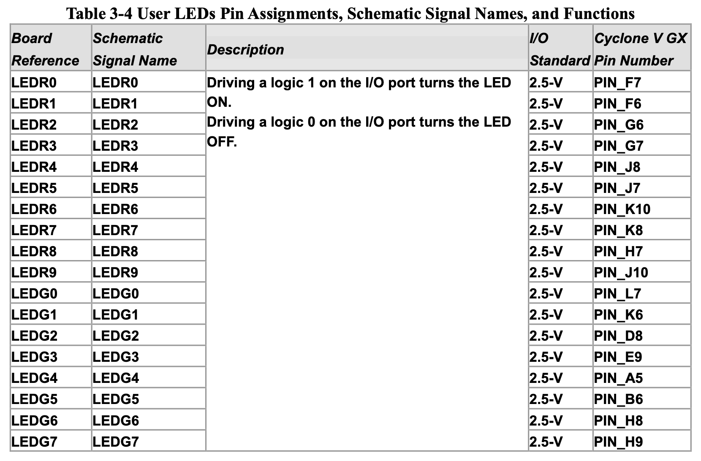
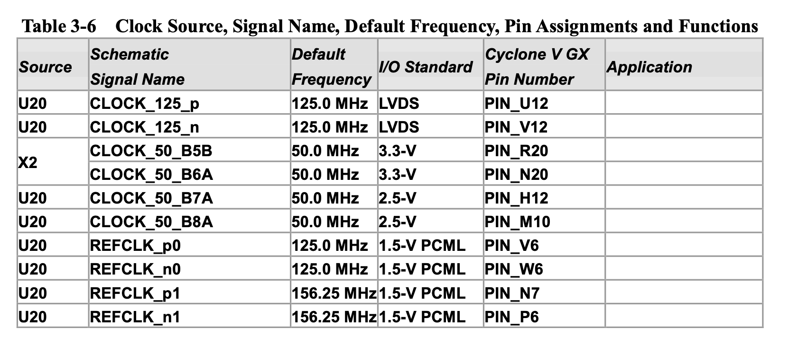

I'm now starting dealing with FPGA on my daily basis, so I thought it would be the perfect time to keep my journey with this technology all documented.

Since I'm using a [Cyclone V GX](https://www.digikey.pt/product-detail/en/terasic-inc/P0150/P0150-ND/4437934?utm_adgroup=Evaluation+Boards+-+Embedded+-+Complex+Logic+%28FPGA%2C+CPLD%29&mkwid=s0lPRfTCq&pcrid=294914797630&pkw=&pmt=&pdv=c&productid=4437934&slid=&gclid=Cj0KCQiAq97uBRCwARIsADTziyZ1LkkBkoJ1T5qDP-c0lC52miFpQGj6UNMtO8Wr7fuIuYmuFlnZ3VQaAjaJEALw_wcB), I use the Quartus II Lite software (20.1v) from Intel to design and program the FPGA. From my MacOS device, I'm running a virtual machine (Parallels 13) with [Lubuntu](https://lubuntu.net) 16.04 LTS 64-bit installed. For FPGA development it's advisable to [have high speed CPU with multiple cores and fast RAM](https://www.reddit.com/r/FPGA/comments/6md9el/computer_specs_for_fpga_development/), therefore I didn't want to use a lot of RAM and CPU power - I choose Lubuntu for being well known for its low-power needs and still providing a reliable OS, trying to make the best of the situation, since running a OS above other OS is not the ideal scenery.

Although, in Linux, there is no need to install any driver to the USB Blaster, it's necessary to set the permissions related to the usb serial port. Intel has its own documentation about this, but I found [a better a smaller one which provides solutions for any problem about the USB Blaster](https://github.com/vidor-libraries/USBBlaster#linux) (I had the stated `jtagd` problem and fixed it by closing the Quartus, kill any `jtagd` process and open it again).

During my research to setup the FPGA development software, I came up with a ton of useful and very important tutorials from Intel explaining how to program the FPGA and tutorials about HDL basic design:

- [How to Program Your First FPGA Device](https://software.intel.com/content/www/us/en/develop/articles/how-to-program-your-first-fpga-device.html)
- [How to Begin a Simple FPGA Design](https://www.youtube.com/watch?v=bwoyQ_RnaiA)
- [Verilog HDL Basics](https://www.youtube.com/watch?v=PJGvZSlsLKs)

Also, some useful additional links:

- [EEC 180 Tutorial: (Strongly) Recommended File Organization](https://www.ece.ucdavis.edu/~bbaas/180/tutorials/file.organization.html)
- [Verilog Tutorial](http://www.asic-world.com/verilog/veritut.html)

---

### Pin Planner and First Modules

As I finished the tutorials I started playing around with the FPGA, trying to create some logic design and program it to the FPGA. From the [How to Program Your First FPGA Device](https://software.intel.com/content/www/us/en/develop/articles/how-to-program-your-first-fpga-device.html) I copied the template and made this simple blink code that uses a 32-bit counter, a switch and 2 Leds:

```verilog
// create module
module blink (
	input wire clk, // 50MHz input clock
	input wire switch,
	output wire [1:0] LED // LED ouput
);

// create a binary counter
reg [31:0] cnt; // 32-bit counter

initial begin
  cnt <= 32'h00000000; // start at zero
end

always @(posedge clk) begin
	cnt <= cnt + 1; // count up
end

//assign LED to 25th bit of the counter to blink the LED at a few Hz
assign LED[0] = switch ? cnt[25] : cnt[22];
assign LED[1] = switch ? cnt[22] : cnt[25];

endmodule
```

Then, after creating this simple module I connected the I/O to actual PINs in the development board.


To the `switch` I choose the first one, Slide switch[0], **PIN_AC9.**



To the `LED[0]`, set the first red LED, **PIN_F7**.

To the `LED[1]`, set the first green LED, **PIN_L7.**



And finally, to the `clk` , set the **PIN_R20**.

Be careful setting the I/O standard voltage.

This is a very simple program but allows to check the peripherals inside the development board.

### Current situation...

I'm now trying to establish UART communication between the FPGA and the Computer. Along my search I came across with two possibilities:

- Creating a [Qsys](https://www.intel.com/content/www/us/en/programmable/support/training/course/oqsys1000.html) with Nios 2 [soft processor](https://en.wikipedia.org/wiki/Soft_microprocessor) and using C to bridge the communication

  Easier and provides C programming capabilities but Nios 2 is not open-source and the provided version of it for Lite License is very slow. Also takes FPGA capacity.

- Using custom Verilog modules to design UART to RS232 communication

  Not so easy to implement, requires deep learning of UART technology and Verilog. Relies only in HDL.

---
