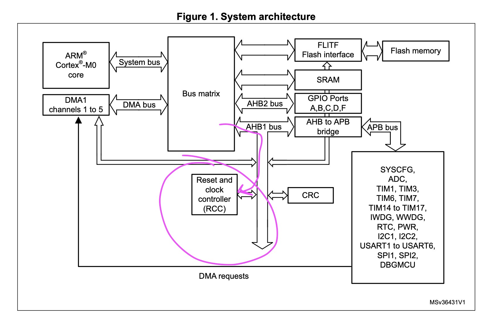
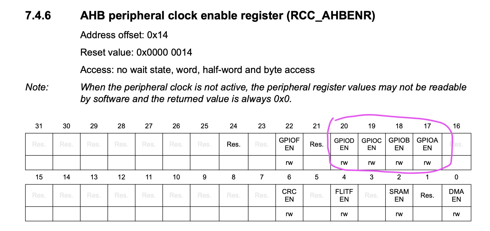
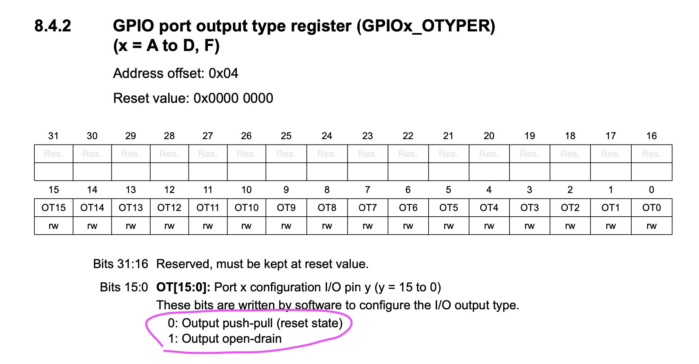
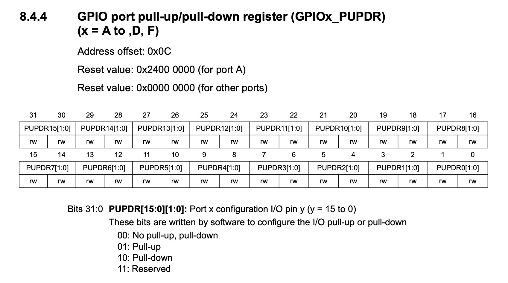
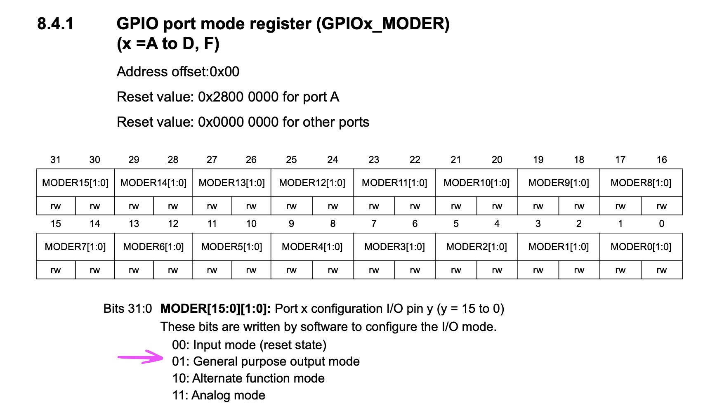
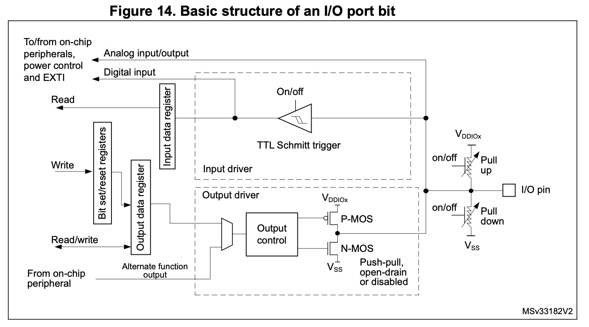
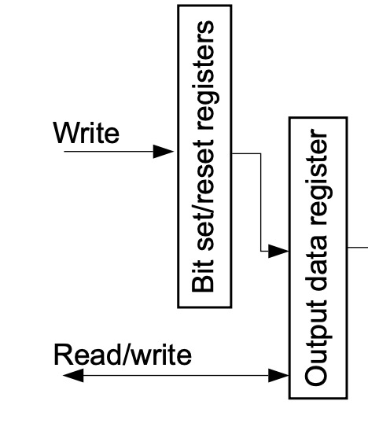
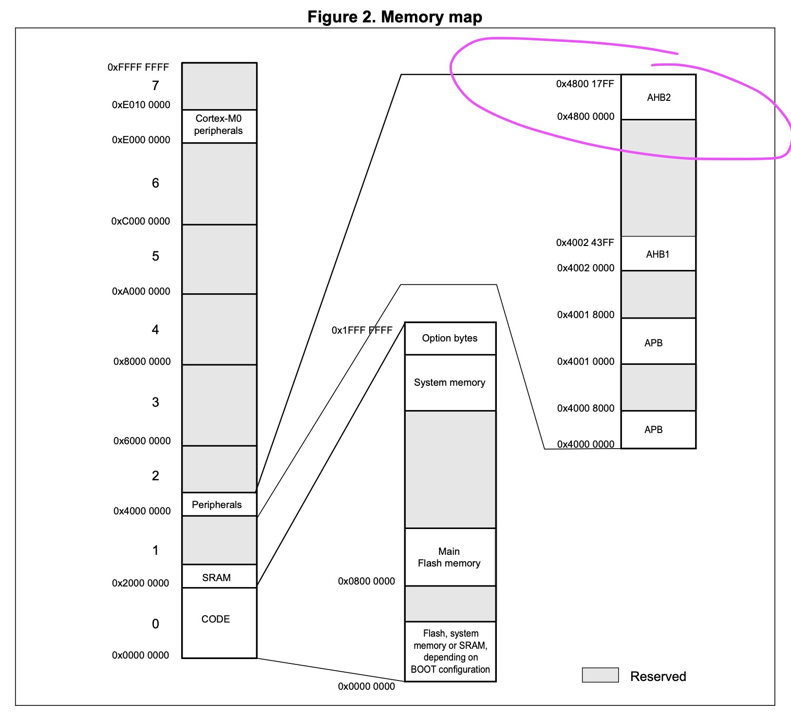
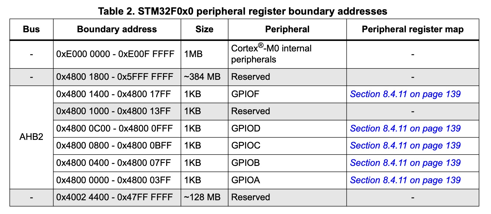

## Introduction

Setting up a 32-bit ARM based MCU GPIO might be more tricky than you think. There are packages, such as the [Hardware Abstraction Layer](https://github.com/STMicroelectronics/stm32f0xx_hal_driver), one can use to quickly setup a GPIO as an output. But — what really happens behind the scenes?

I'll try to list down all the things I've learned using the [STM32F030R8](https://www.st.com/en/microcontrollers-microprocessors/stm32f030r8.html).

## HAL

The easiest thing to do is to learn from examples. Luckily, ST provides a bunch! The default code generated from the STM32CubeIDE contains a few functions that group a few [HAL](https://github.com/STMicroelectronics/stm32f0xx_hal_driver) calls:

```c
static void MX_GPIO_Init(void)
{
  GPIO_InitTypeDef GPIO_InitStruct = { 0 };

  /* GPIO Ports Clock Enable */
  __HAL_RCC_GPIOC_CLK_ENABLE();
  __HAL_RCC_GPIOA_CLK_ENABLE();

  /*Configure GPIO pin : B1_Pin */
  GPIO_InitStruct.Pin  = B1_Pin;
  GPIO_InitStruct.Mode = GPIO_MODE_IT_FALLING;
  GPIO_InitStruct.Pull = GPIO_NOPULL;
  HAL_GPIO_Init(GPIOC, &GPIO_InitStruct);

  /*Configure GPIO pin : LD2_Pin */
  GPIO_InitStruct.Pin   = LD2_Pin;
  GPIO_InitStruct.Mode  = GPIO_MODE_OUTPUT_PP;
  GPIO_InitStruct.Pull  = GPIO_NOPULL;
  GPIO_InitStruct.Speed = GPIO_SPEED_FREQ_LOW;
  HAL_GPIO_Init(GPIOA, &GPIO_InitStruct);
}
```

So, what really happens above?

- A clock is setup per GPIO PORT (e.g GPIOA or GPIOC)
- Every GPIO has its own configuration

Let's start with the clock.

### Reset and clock control (RCC)

Note the first thing done is to setup the clock for each `PORT` used:

```c
/* GPIO Ports Clock Enable */
__HAL_RCC_GPIOC_CLK_ENABLE();
__HAL_RCC_GPIOA_CLK_ENABLE();
```

That's it. Easy, right? The clock part is done. Now, let's jump into the GPIO configuration.

### Init

The HAL provides a struct of type `GPIO_InitTypeDef` to ease the process of initializing a GPIO:

```C
typedef struct
{
  uint32_t Pin;
  uint32_t Mode;
  uint32_t Pull;
  uint32_t Speed;
  uint32_t Alternate;
} GPIO_InitTypeDef;
```

The `Pull`, `Speed` and `Alternate` integers are variables we don't need to pay attention now. On the other hand, both `Pin` and `Mode` integers are important. The two integers are quite explicit for what they serve.

To initialize, a struct of type `GPIO_InitTypeDef` is created and is filled with the desired data. Since we want to set up the GPIO as an output, we need to have something (more or less) like the snippet below:

```c
GPIO_InitTypeDef GPIO_InitStruct = { 0 };

// ...
// #define GPIO_PIN_5  ((uint16_t)0x0020U)  /* Pin 5 selected */
// ...

GPIO_InitStruct.Pin   = GPIO_PIN_5;
GPIO_InitStruct.Mode  = MODE_OUTPUT | OUTPUT_PP;
GPIO_InitStruct.Pull  = GPIO_NOPULL;
GPIO_InitStruct.Speed = GPIO_SPEED_FREQ_LOW;

HAL_GPIO_Init(GPIOC, &GPIO_InitStruct);
```

The `GPIO_PIN_5` is defined by the HAL ([stm32f0xx_hal_gpio.h](https://github.com/STMicroelectronics/stm32f0xx_hal_driver/blob/master/Inc/stm32f0xx_hal_gpio.h)).
The mode is defined as `MODE_OUTPUT`. This enables a few things internally. The mode also specifies `OUTPUT_PP`, which sets the GPIO in a _push-pull_ mode (sources Vcc when 1 and Gnd when 0).

### Write

To write to a GPIO Pin, one simply needs to use one of the HAL available functions:

```c
HAL_GPIO_WritePin(GPIOA, GPIO_PIN_5, GPIO_PIN_SET);
```

That's all folks!...

If that's what you were looking for, you are good to go! However, if you want to learn more, I'd recommend to keep reading! 😉

## Underneath the HAL

The HAL is great and most of the times is enough. However, it is important to know how to do it manually, register by register, so that one can understand better how things work and develop away from any vendor tool.

### Reset and clock control (RCC)

Digging `__HAL_RCC_GPIOC_CLK_ENABLE`, we can check a define as such:

```c
__IO uint32_t tmpreg;

SET_BIT(RCC->AHBENR, RCC_AHBENR_GPIOCEN);
tmpreg = READ_BIT(RCC->AHBENR, RCC_AHBENR_GPIOCEN);
UNUSED(tmpreg);
```

Which translates to:

```c
RCC->AHBENR |= 0x00080000; // RCC_AHBENR_GPIOCEN = 0x00080000
```

The `RCC` points to a memory mapped address register, the Reset and Clock Control (RCC). In this case, we deal with the AHB peripheral clock enable register (RCC_AHBENR 7.4.6).

The AHB peripheral, for those who don't know, is a bus that connects the GPIOs to the Bus Matrix (which is also connected to the AHB2 bus).



The _AHB peripheral clock enable register_ enables/disables the clock for all the GPIO ports.



Therefore, by previously setting the `PORTC` bit to 1, we are actually enabling the clock.

### Init

What registers need to be set to initialize a port? Let's check.

Inside `HAL_GPIO_Init`:

```c
/* Configure the IO Output Type */
temp = GPIOx->OTYPER;
temp &= ~(GPIO_OTYPER_OT_0 << position) ;
temp |= (((GPIO_Init->Mode & OUTPUT_TYPE) >> OUTPUT_TYPE_Pos) << position);
GPIOx->OTYPER = temp;

// ...

/* Activate the Pull-up or Pull down resistor for the current IO */
temp = GPIOx->PUPDR;
temp &= ~(GPIO_PUPDR_PUPDR0 << (position * 2u));
temp |= ((GPIO_Init->Pull) << (position * 2u));
GPIOx->PUPDR = temp;

// ...

/* Configure IO Direction mode (Input, Output, Alternate or Analog) */
temp = GPIOx->MODER;
temp &= ~(GPIO_MODER_MODER0 << (position * 2u));
temp |= ((GPIO_Init->Mode & GPIO_MODE) << (position * 2u));
GPIOx->MODER = temp;
```

Starting from the top to the bottom, the register `OTYPER` stands for _output type register_:



The register `PUPDR` stands for _pull-up/pull-down register_ but doesn't necessarly need to be set. The default value is 0: no pull-up or pull-down resistor.



And finally, the `MODER`. It stands for _mode register_ and is responsible for setting a GPIO pin to one of the four available options:



From the code example above, both `MODER` and `OTYPER` are dependant on `GPIO_Init`, which is the same struct as seen [before](#init).

Simplifying a bit all the bitwise operations and the abstractions, the code may look like this:

```c
/* For Pin 5 on PORTA */
#define pin 5

/* Configured as push-pull (set as 0) */
GPIOA->OTYPER &= ~(1 << pin); // OT5

// ...

/* No pull-up or pull-down (set as 0) */
// 3u = 11: Reserved
// * 2 = 2 bits per pin
GPIOA->PUPDR = &= ~(3u << (pin * 2)); // PUPDR5[1:0]

// ...

/* Configured as an output (set as 0x1) */
// 1u = 01: General purpose output mode
// * 2 = 2 bits per pin
GPIOA->MODER |= (1u << (pin * 2));
```

After a port is correctly initialized as an output, there are a few things that happen on the hardware level:



Everything starts with the `MODER` set as an output. The `OTYPER` register controls how the MOSFETs are used and the `PUPDR` enables or disables the resistors accordingly.

In contrast to what some may think, the input data register is still being sampled with data. However, there is one major diference:

- **The input data register (IDR) has the I/O state (data presented at the GPIO)**
- **The output data register (ODR) has the last written value**

It's important to know the diference, as they are not exactly the same!

### Write

Inside `HAL_GPIO_WritePin`:

```c
if (PinState != GPIO_PIN_RESET)
{
  GPIOx->BSRR = (uint32_t)GPIO_Pin;
}
else
{
  GPIOx->BRR = (uint32_t)GPIO_Pin;
}
```

In this specific case, due to both, `BSRR` and `BRR`, having only access to write and being placed before `ODR`, they can be used without bitwise operations:

```c
/* For Pin 5 on PORTA */
#define pin 5

GPIOA->BSRR = 1 << pin; // To write
GPIOA->BRR = 1 << pin; // To clear
```



## The bottom

Every GPIO has its own address mapped into the MCU memory. For example, the AHB2 Bus has the adress of `0x48000000`.



GPIOA sits at its base address, GPIOB exists with the offset of `0x00000400`, so `0x48000400`.



Therefore, it's possible to define the GPIOs as such:

```c
#define pin 5

volatile uint32_t* GPIOA = 0x48000000;
uint32_t volatile* GPIOA_SET   = (uint32_t*)(0x48000000 + 0x18); // Note: BSRR memory offset is 0x18
uint32_t volatile* GPIOA_RESET = (uint32_t*)(0x48000000 + 0x28); // Note: BRR memory offset is 0x28

*GPIOA_SET   = (1 << pin); // Write 1
// ...
*GPIOA_RESET = (1 << pin); // Write 0
```

Maybe there are more ways (and even better) to setup a GPIO, but these options should cover most of the cases.


