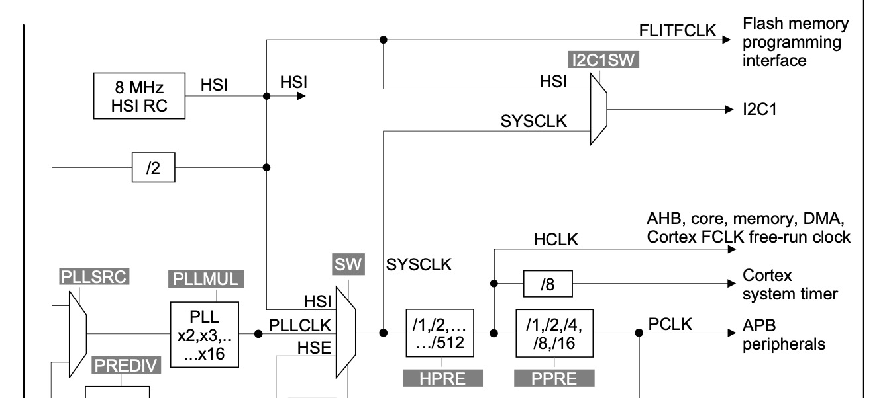

### SysTick as an exception

The SysTick, or SYSTICK, is a built-in 24-bit count down system timer presented in every Cortex-M microcontroller. As a consequence, it is also available in every STM32 microcontroller with the same architecture.


*[Source](https://microcontrollerslab.com/nested-vectored-interrupt-controller-nvic-arm-cortex-m/)*

The SysTick also acts as an exception, in parallel with, for example, an _Interrupt Request_ (IRQ). The exception, when _triggered_, is then managed by the _Nested Vectored Interrupt Controller_ (NVIC) and dispatched according to its priority.

### The importance of SysTick calibration

This system timer happens to be extremely important due to its goal — to be used by an RTOS or as a portable basic timer. According to the datasheet of the STM32F030R8:

> The SysTick calibration value is set to 6000, which gives a reference time base of 1 ms with
the SysTick clock set to 6 MHz (max fHCLK / 8).

A reference time of 1ms is a perfect match for RTOS context switching!

> [!note]
> The calibration value differs between different Cortex-M, and so does fHCLK.

By default, the STM32F030R8 has its HCLK or [HSI](https://www.embeddedhow.com/post/understanding-clock-source-in-arm-cortex-m) (High Speed Internal) clock, set as 8MHz.



Reading from the left to the right, the HSI is then divided by 8 to output the Cortex system timer, the SysTick. This flow results in a timer of 1MHz, or 1us.
However, the frequency at which the SysTick runs, can change by:

- Selecting (SW) the PLLCLK or HSE.
- Setting a different HPRE (a prescaler) for SYSCLK.

In a case where SYSCLK is 64MHz, the frequency of the SysTick clock is 8MHz (assuming the prescaler doesn't change).

### HAL_InitTick

Let's take a first look at a simple HAL implementation and its use of SysTick.

The function `HAL_Init` is the first function to run to initialize the ST HAL. Interesting enough, even before the peripherals are initialized, the SysTick is set:

```c
HAL_StatusTypeDef HAL_Init(void)
{
  /* Use systick as time base source and configure 1ms tick (default clock after Reset is HSI) */

  HAL_InitTick(TICK_INT_PRIORITY);

  /* Init the low level hardware */
  HAL_MspInit();

  /* Return function status */
  return HAL_OK;
}
```

Let's then take a deeper look inside `HAL_InitTick`:

```c
__weak HAL_StatusTypeDef HAL_InitTick(uint32_t TickPriority)
{
  /*Configure the SysTick to have interrupt in 1ms time basis*/
  if (HAL_SYSTICK_Config(SystemCoreClock / (1000U / uwTickFreq)) > 0U)
  {
    return HAL_ERROR;
  }

  /* Configure the SysTick IRQ priority */
  if (TickPriority < (1UL << __NVIC_PRIO_BITS))
  {
    HAL_NVIC_SetPriority(SysTick_IRQn, TickPriority, 0U);
    uwTickPrio = TickPriority;
  }
  else
  {
    return HAL_ERROR;
  }

   /* Return function status */
  return HAL_OK;
}
```

The HAL introduces a bit of bloated code, but essentially, the `HAL_InitTick` sets the number of ticks necessary to result in a 1ms SysTick interrupt. Inside `HAL_SYSTICK_Config` the priority of the _SysTick_IRQn_, the SysTick _Interrupt Request_, is set to the lowest priority possible (in the case of STM32F030R8 is 3, where 0 is the highest priority).

```c
__STATIC_INLINE uint32_t SysTick_Config(uint32_t ticks)
{
  SysTick->LOAD  = (uint32_t)(ticks - 1UL);                         /* set reload register */
  NVIC_SetPriority (SysTick_IRQn, (1UL << __NVIC_PRIO_BITS) - 1UL);

  (...)
}
```

However, the priority is then changed from lowest to highest priority in the next step of `HAL_Init`, since _TickPriority_ is 0:

```c
if (TickPriority < (1UL << __NVIC_PRIO_BITS))
{
  HAL_NVIC_SetPriority(SysTick_IRQn, TickPriority, 0U);
  uwTickPrio = TickPriority;
}
```

This is quite important! This change of priority means that the SysTick will suspend any Interrupt Service Routine (ISR) from running as long as SysTick is being executed.

> [!note]
> The frequency of the system clock might change after the SysTick is first set. For example, the HAL of STM32F030R8 sets first the SysTick at a frequency of 8MHz and follows by changing it to 48MHz later. The priority remains.

Finally, anytime SysTick is triggered, `SysTick_Handler` is called:

```c
void SysTick_Handler(void)
{
  HAL_IncTick();
}
```

And `HAL_IncTick` increments a milisecond:

```c
__weak void HAL_IncTick(void)
{
  uwTick += uwTickFreq;
}
```

### Priorities

The priority of the SysTick IRQ is key here. The ST HAL uses the SysTick for its own delays and timeouts, hence the importance of a correctly set prio.

```c
#define  TICK_INT_PRIORITY            ((uint32_t)0)    /*!< tick interrupt priority (lowest by default)  */
/*  Warning: Must be set to higher priority for HAL_Delay()  */
/*  and HAL_GetTick() usage under interrupt context          */
```

The languague is odd, but the `TICK_INT_PRIORITY` is actually set to the highest priority (numerically the lowest). Having a high priority for the SysTick is effective for maintaining precise time tracking, but it can result in frequent interruptions of lower-priority tasks.

In case precise time tracking is a requirement, the setup of another timer could be a solution.

### Priorities with freeRTOS

The popular freeRTOS uses SysTick as its tick interrupt and it is [recommended](https://forums.freertos.org/t/systick-priority-vs-all-cortex-m-priorities/9289/2) to keep the priority **low**.
This might result in some timing jitter but will ensure the remaining tasks work as expected.

The Cortex-M interrupts priorities always need to be explicitly defined when [using freeRTOS API functions](https://www.freertos.org/Documentation/02-Kernel/03-Supported-devices/04-Demos/ARM-Cortex/RTOS-Cortex-M3-M4#relevance-when-using-the-rtos-2):

> Cortex-M interrupts default to having a priority value of zero. Zero is the highest possible priority value. Therefore, never leave the priority of an interrupt that uses the interrupt safe RTOS API at its default value.

Another very important aspect of priorities with freeRTOS, is which priority to provide to freeRTOS to create a critical section:

> The RTOS interrupt nesting scheme splits the available interrupt priorities into two groups - those that will get masked by RTOS critical sections, and those that are never masked by RTOS critical sections and are therefore always enabled.
> The RTOS kernel creates a critical section by writing the configMAX_SYSCALL_INTERRUPT_PRIORITY value into the ARM Cortex-M BASEPRI register. As priority 0 interrupts (the highest priority possible) cannot be masked using BASEPRI, configMAX_SYSCALL_INTERRUPT_PRIORITY must not be set to 0.

In short, `configMAX_SYSCALL_INTERRUPT_PRIORITY` cannot be set to zero and should be set to a priority in which any priority below is expected be masked (suspended).

As an example, in a case where there are 4 priority degrees (0, 1, 2 and 3) and `configMAX_SYSCALL_INTERRUPT_PRIORITY` is equal to 1, it means any interrupt below priority 1 (2 and 3) will be masked.

In some cases, when porting freeRTOS, a new `SysTick_Handler` is given. For example, for a Cortex-M33:

```c
void SysTick_Handler( void ) /* PRIVILEGED_FUNCTION */
{
    uint32_t ulPreviousMask;

    ulPreviousMask = portSET_INTERRUPT_MASK_FROM_ISR();
    {
        /* Increment the RTOS tick. */
        if( xTaskIncrementTick() != pdFALSE )
        {
            /* Pend a context switch. */
            portNVIC_INT_CTRL_REG = portNVIC_PENDSVSET_BIT;
        }
    }
    portCLEAR_INTERRUPT_MASK_FROM_ISR( ulPreviousMask );
}
```

This means the SysTick is only used for freeRTOS and not for the ST HAL anymore!
The function `HAL_InitTick` needs to be defined again and must use another timer.

That being said, a common scenario is:

- freeRTOS uses SysTick with a/the low/lowest priority.
- HAL uses another basic timer to manage delays and timeouts
- Another timer might be necessary to achieve precise timing tracking

