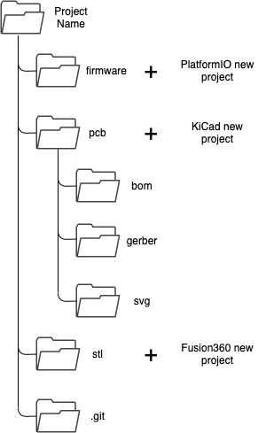
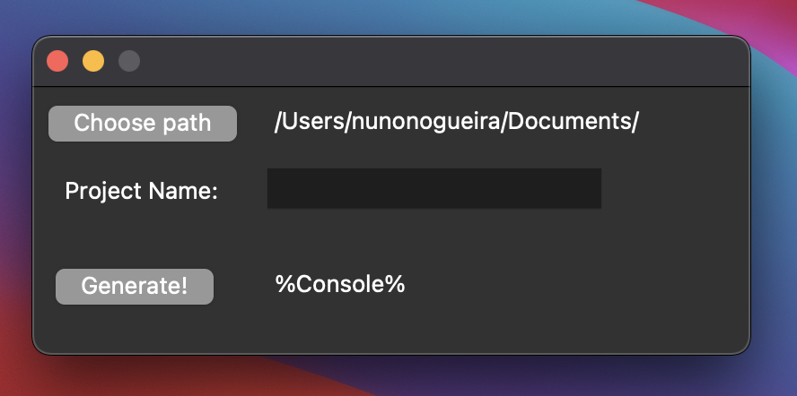

Ever since I remember, I've always struggle with the fact that I couldn't manage very well my own ideas. The version control was there on the code files, but not on the others, like 3d design files or gerber files. This mess results in outdated files, while others were updated since the start. I would end up with an updated firmware with an outdated pcb, causing friction between my brain cells 🤧

So I came up with a *solution.* So simple but yet so useful - create a folder with multiple folders meant to store information about the field.



Four folders, each one with a different use.

The **Firmware** is stored in a folder where the PlatformIO will create the project code.

The **pcb** is where the KiCad project is going to be, and even has three others folder to store the **bill of materials** in html (seen in the previous post), images of the pcb in **svg** and a final **gerber**, ready to be orderer!

To store the Fusion360 project files or Cura `.gcode` files, the **stl** folder is there to fulfill this need.

Finally, the .git is where the control version is done and stored 😉

Now, to do this I used Python. Easy and simple as usual.

Since I tend to use both operation systems, windows and MacOS, the code is adapted to both.

<script src="https://gist.github.com/nguterresn/644697d7a3aa20a63a6f996572efa706.js"></script>

The code seems to work pretty great and it is fast as well.

# How to create a directory generator with Python for your ideas v0.2

Last post was about using a directory generator kind of thing. So I thought about making it more user friendly and recently I saw **tkinter** which is a lib that creates a GUI for Python 🖥️

The requirements were the following:

1. Choose save directory and print text
2. Choose directory name from an input text
3. Create [README.md](http://readme.md) files for each folder.
4. Generate directory
5. Print some debug stuff

First of all, **tkinter** is super easy to use. Python 3.9.2 does not come with it, but it is only required one single line to install it.

The import of `filedialog` enables the user to choose the save path directory. This event is triggered by a button.

Afterwards, the last button, the "Generate" one, triggers the creation of the desired directories. The [README.me](http://readme.me) can be edited inside the python code.  Regarding `createFile(path, readme content)` it is possible to create a README.me and edit as this:

```python
createFile(direc, "This is the main README of the project. ")
```

A **default directory path** is set to facilitate the use of this application, but the same can be changed in:

```python
## DEFAULT DIRECTORY
self.var.set('/Users/nunonogueira/Documents/')
```

The final result has been tested in macOS 11.2.3 and not yet in Windows... But I'll test it soon!



Finally, here the code I used:

<script src="https://gist.github.com/nguterresn/7ca2594c0af92b677616544ec22ace5f.js"></script>

