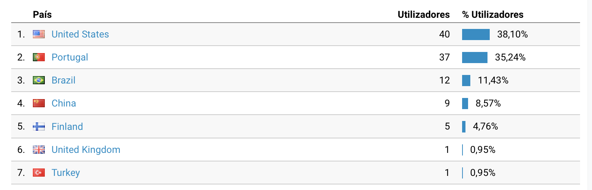

## Intro

2021 was, indeed, a **crazy year**.
Finished my masters, applied for the first time to full-time jobs and got one in Stockholm, Sweden.
Met amazing and smart people - learned so much during this year, it is hard to believe.

At the end of March I left my home country (Portugal) and got in the crazy adventure of living in Sweden. As an European, the process is quite easy, but it is such a **huge responsability.**

Living alone it is not easy, specially when you left your family, girlfriend and friends behind - everything that you were used to before. A portuguese writer, José Saramago, used to say that we never actually leave the home country, we just take a piece of it with us. I believe this is very true, and this kind of thought helps me to stay alone and never lose focus on what's important for myself and for those who care about me.

One important thing is to remind yourself of why are you doing it and what you plan to achieve.

I'm not going to name the reasons I'm doing it, but I plan to achieve happiness. That's why I moved to Sweden, that's why I'm writing this right now. I know this is super vague, but it is my final achievement - it is not money or luxury. I don't like cars, I don't like anything fancy. But, I like to live well and make others who live close to me to experience a pleasant life as well.
It is so messed up that such a simple (single word) achievement is so hard to get. People try to achieve it during their entire life, some die and never find, or even, find too late.

Nevertheless, let's start to group all the 2021 achievements 😁

## Achievements

* Finished ECE Masters
* Got a full time job as an IoT Engineer. Which I love!
* Learned to live alone and manage to pay all the bills by myself in the beautiful country that is Sweden!
* Travelled to Finland, Helsinki, and Estonia, Tallinn, first time in a cruise!
* First time ice skating, it is fun!
* Bought some electronics equipment - cheap solder station, lab power supply, better monitors (looking for new equipment next year).
* Ordered the crazy amount of 8 different PCB designs from JLCPCB 😆. In the mean time, learn buck-boost converter designs and learned some great design guidelines!
* Learn so much - devOps, IoT, firmware, development to production, how to release, how to build stable and solid code, Google Cloud Platform, software architecture...
* Left Karate and started to do bouldering (Will start to do karate again soon, tried to do Karate close to where I live but it wasnt my thing).
* Applied for Swedish classes (Starting 2022 🇸🇪).
* Read: [Launch by Jeff Walker](https://www.google.com/url?sa=t&rct=j&q=&esrc=s&source=web&cd=&ved=2ahUKEwjOucno4_X0AhUtQjABHcldBEwQFnoECAMQAQ&url=https%3A%2F%2Fwww.amazon.com%2FLaunch-Internet-Millionaires-Anything-Business%2Fdp%2F1630470171&usg=AOvVaw34wuTijbWFSTJ0b9mOSkM-), [Rework by Jason Fried](https://www.amazon.com/Rework-Jason-Fried/dp/0307463745/ref=sr_1_2?crid=3TY6BQ6BVUFWM&keywords=rework+change+the+way+you+work+forever&qid=1640120279&s=books&sprefix=rework%2Cstripbooks-intl-ship%2C205&sr=1-2), [Meditations of Marcus Aurelius](https://www.amazon.com/Meditations-Annotated-Marcus-Aurelius/dp/1541673859/ref=sr_1_1?crid=22UPO8HHM15QT&keywords=marcus+aurelius+meditations&qid=1640120327&s=books&sprefix=Marcus+aurel%2Cstripbooks-intl-ship%2C149&sr=1-1), [Discourses and Selected Writings by Epictetus](https://www.amazon.com/Discourses-Selected-Writings-Penguin-Classics/dp/0140449469/ref=sr_1_1?crid=2PW5AISW6AMY8&keywords=epictetus+discourses&qid=1640120374&s=books&sprefix=Epictetus%2Cstripbooks-intl-ship%2C222&sr=1-1).

Crazy!

## For 2022

* Be fluent in Swedish.
* Finish ONE project (for good!) - stop creating tiny projects.
* Less website posts, but bigger with higher quality.
* Travel Sweden alone as I train the language (one time a month).
* Leave digital photography and embrace analog.
* Last but not the least, end up 2022 with a proper product/service to sell or make it public (probably the smoke extractor).

## Website growth

When I first launch this, August 2020, had no plan to slow down - two posts per month. When I left Portugal and started working, I did not have the time nor the energy to write so much. Meaning the number of posts started to slowly decreased over time. The plan is to write less but better!

Using Google Analytics I can notice my website has been visited mostly by people in US and Portugal, some in Brazil and China! Awesome!

***

This one is pretty personal, behind this website there is an human trying to live the best life. See you in 2022.

(Writing this from Varadero, Cuba @ 21/12/2021)
