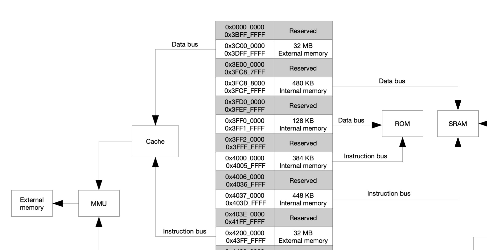

## Zephyr flash management

Another blog post about Zephyr. This time about flash and how to access an ESP32s3 flash at run-time.
Before proceeding it's important to notice two things:

* Zephyr has two main flash drivers: [flash](https://docs.zephyrproject.org/latest/hardware/peripherals/flash.html#flash-api) and [flash-map](https://docs.zephyrproject.org/latest/services/storage/flash_map/flash_map.html).
* The ESP32s3 external memory is memory mapped behind the MMU cache.

### Is the external flash memory mapped?

When it comes to dealing with memory (volatile or not), I tend to think in an _ARM way_ — everything is memory mapped. However, that's not always the case for other architectures. When I picked the ESP32s3 for a small project, I assumed the CPU could access the any memory by address, and, although, it is possible, there are a few "**ifs**".

There are two buses: a _data_ bus and a _instruction_ bus. Regardless of their architecture goal and responsibility, data accessed from the instruction bus needs to have a 4-byte alignment, otherwise it will raise an exception.



The CPU can access:

* The internal memory via data and instruction bus.
* The peripherals through the data bus.

And finally, the external flash memory.
This one is managed by a Memory Management Unit (MMU) in a transparent way. Data, such as strings, may be stored within the external memory and possible to read from `0x3C00_0000` .

### Recap Zephyr flash partitions

I previously wrote about [partitions](./zephyr-is-convenient.md), but here's a quick recap.

Zephyr already comes with a few partitions loaded into the device tree. Here's an example:

```dts
boot_partition: partition@0 {
  label = "mcuboot";
  reg = < 0x0 0x10000 >;
  read-only;
};
slot0_partition: partition@10000 {
  label = "image-0";
  reg = < 0x10000 0x100000 >;
};
slot1_partition: partition@110000 {
  label = "image-1";
  reg = < 0x110000 0x100000 >;
};
```

This is a sample that can be read as such:

* `boot_partition`: managed by mcuboot.
* `slot0_partition`: holds the default code binary where the esp32 will boot from.
* `slot1_partition`: same size as `slot0_partition` but its goal is to store a OTA update before it is verified and copied into `slot0_partition`.

The keyword `reg` can be read as `< offset length >` . Each slot has 2mB.

### Create flash partitions

To create a flash partition simply create a new `.overlay` file and add the respective desired slot.

```dts
boot_partition: partition@0 {
  label = "mcuboot";
  reg = < 0x0 0x10000 >;
  read-only;
};
slot0_partition: partition@10000 {
  label = "image-0";
  reg = < 0x10000 0x100000 >;
};
slot1_partition: partition@110000 {
  label = "image-1";
  reg = < 0x110000 0x100000 >;
};
app0_partition: partition@210000 {
  label = "app-0";
  reg = < 0x210000 0x200000 >;
};
```

Here. I've added the partition `app0_partition` that comes after the `slot1_partition` .

### Reset flash partitions

Sometimes the default flash partitions are just ideal. For those cases, simply create a `.overlay` file and add:

```
/delete-node/ &boot_partition;
/delete-node/ &slot0_partition;
/delete-node/ &slot1_partition;
```

After you can specify `boot_partition` , `slot0_partition` and `slot1_partition` as you wish.

### Flash erase

Due to the nature of the Flash memory, in most cases, before it is written to, it needs to be erased by sector.

Imagine the flash memory as a row of "1s". Data can be written by toggling those "1s" into "0s". So naturally, to be able to write multiple times, the previously toggled "0s" need to turn into "1s".

Additionally, different flashes have different rules, but normally a flash is erased by sector.
For example, in the case of the esp32s3 flash memory a sector is 4kB. This means that the flash will be erased by every 4kB sector, regardless if the data has size of 1 or 4095 bytes.

```c
int error = flash_area_erase(app0, 0, 4096);
```

This will erase the first sector of the flash area `app0` which can be mapped to `0x3C00_0000` (External memory start address) + `0x210000` ( `app0_partition` flash offset).

### Other flash tips

Another way to access the esp32s3 flash memory address, or of a partition, is to use the `spi_flash_mmap.h` library.
Since it integrates with the flash-map API, it reduces the chance of error when pointing to an existing address.

```c
#include <spi_flash_mmap.h>

const struct flash_area* app0 = NULL;
const void* app0_mem    = NULL;
int error = 0;

error = flash_area_open(FIXED_PARTITION_ID(app0_partition), &app0);
if (error < 0) {
  return error;
}

error = spi_flash_mmap(app0->fa_off,
                       app0->fa_size,
                       SPI_FLASH_MMAP_DATA,
                       &app0_mem,
                       &app0_handle);
```

This will store the start of `app0` flash-map area into the `app0_mem` pointer.
